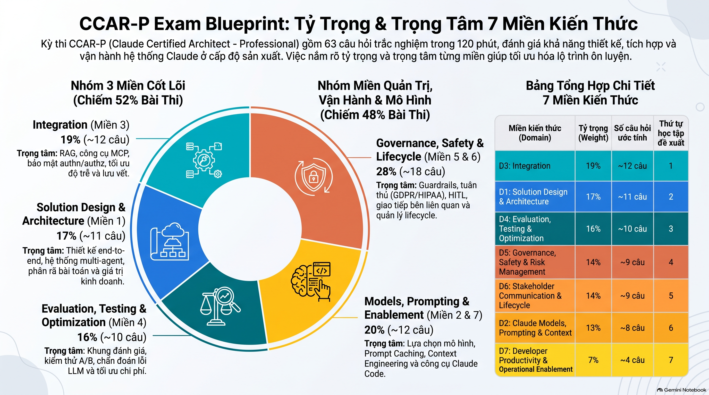

# CCAR-P Study Notes

> **Root of trust: the official Exam Guide** (`docs/Claude Certified Architect - Professional Exam Guide.pdf`).
> Secondary: `docs/cca-p-exam-guide.pdf` (study-plan guide). When any other source disagrees with the Exam Guide, **the Exam Guide wins**.
> **Target:** pass with **800+/1000** (cut score is 720).

---
# CCAR-O Exam Blueprint




> [Claude Certified Architect Professional Exam Guide](https://notebook.google.com/notebook/da17db88-3c13-4591-b756-cd537ef05698/artifact/211e9f1c-8bc7-4343-9f7f-bffa324596f0?utm_source=nlm_web_share&utm_medium=google_oo&utm_campaign=art_share_1&utm_content=&utm_smc=nlm_web_share_google_oo_art_share_1_)
# 🎯 EXAM-DAY CHEAT SHEET — Tricks, Tips & Traps (from 112 practice questions)

> Read this section the night before and again 30 minutes before the exam. Every rule below is taken from a practice question (Q#) in the session notes further down.

## 0 · My practice-test result & weak spots

| Domain | Weight | ✅ | ❌ | Accuracy | Status |
|---|---|---|---|---|---|
| D1 Solution Design & Architecture | 17% | 4 | 5 | 44% | 🔴 **Weakest — review first** |
| D7 Developer Productivity | 7% | 12 | 6 | 67% | 🟠 Scopes/precedence, "before pilot" |
| D3 Integration | 19% | 8 | 4 | 67% | 🟠 Heaviest domain — capability bloat, MCP/API/A2A factors |
| D4 Evaluation, Testing & Optimization | 16% | 12 | 2 | 86% | 🟢 |
| D5 Governance, Safety & Risk | 14% | 18 | 4 | 82% | 🟢 |
| D6 Stakeholder Comm & Lifecycle | 14% | 15 | 2 | 88% | 🟢 |
| D2 Models, Prompting & Context | 13% | 4 | 0 | 100% | 🟢 |
| **Total (scored questions)** | | **73** | **23** | **≈ 76%** | Target 80%+ |

_(Counts are taken from the ✅/❌ marks in the section headers; questions where I only viewed the answer or where my choice is unknown are not counted.)_

**My recurring mistakes (fix these and I pass comfortably):**
1. **BEFORE/AFTER phase confusion** (Q2, Q9, Q82, Q100): I picked "document/train/iterate" as a *before* step.
2. **Right idea, wrong criterion** (Q38, Q58 ×2, Q70, Q102): the option is true, but it doesn't answer the criterion the stem asks about.
3. **Value pillars / use-case fit in D1** (Q19, Q20, Q32, Q106).
4. **Scope precedence reversed** (Q107) and user-scope misuse (Q69).
5. **Generic methodology critique** (sample size/duration) when the stem already gives specific evidence (Q61).

---

## 1 · The universal 4-step solving method

1. **Find the question type:** BEFORE/AFTER? "which are gaps" (polarity)? "most directly"? "choose 2"? "why"?
2. **Name the thing precisely:** the failure mode, requirement, audience or scope named in the stem.
3. **Eliminate by distractor class** (8 classes below), and remove *extreme words* first.
4. **Among what's left, pick** the option that is *preventive + deterministic + proportionate + evidence-based* **and** matches the stem's exact criterion.

### Red-flag words → almost always WRONG
`always` · `never` (as a claim) · `regardless` · `all tools` · `entirely` · `from scratch` · `disable [control]` · `rely on the model` · `placed in the prompt` (for enforcement) · `the model will refuse` · `post-hoc / after the fact` · `spot-check` · `team feels` · `defer to later phase` · `without verifying` · `for consistency` / `to avoid complexity` (a rationalization, not a reason) · `maximize` · `lock decisions` · `archive only` · `honor self-declared authority`

### Green-flag words → usually RIGHT
`least privilege` · `allowlist` · `deterministic` · `before retrieval / before the model sees it` · `at the action boundary` · `layered` · `baseline + same eval set` · `gate before promotion` · `risk-stratified` · `metric + threshold + window + consequence` · `proportionate to the type of risk` · `written, owned, versioned` · `carry forward / reuse`

---

## 2 · The 8 distractor classes — how they show up

| # | Trap | Looks like | Example Q |
|---|---|---|---|
| 1 | Guard-Instead-of-Remove | "Add approval/monitor around" a tool the role doesn't need | Q1, Q36, Q84 |
| 2 | Blunt Instrument | Bigger model, more tokens, ban everything, review 100% | Q34, Q109, Q110 |
| 3 | Wrong-Layer Diagnosis | Tune the prompt when retrieval/config is broken; "type faster" | Q18, Q26, Q110 |
| 4 | Detective-for-Preventive | Logging/alerts/user reports instead of blocking | Q54, Q58 |
| 5 | Over-Engineering | Multi-agent/router/message bus for a simple, stateless need | Q51, Q66, Q71 |
| 6 | Capability Bloat | "Broader toolset just in case" | Q36, Q84, Q92 |
| 7 | Vibes-Based Evaluation | Spot-check, prior experience, "users seem happy" | Q33, Q108 |
| 8 | Compliance-as-Afterthought | "Add governance/constraints later" | Q42, Q108 |

---

## 3 · Question-type playbooks

### 3.1 BEFORE / AFTER / FIRST (my #1 weakness)
Timeline: **Define goals & criteria → Scope/inventory → Design → Build minimal → Pilot/Run → Analyze → Iterate → Document/Operationalize → Scale → Monitor**
- **BEFORE** = *define what/why/measured how* + *pick scope/inventory/candidates*.
- **AFTER** = anything that needs results: *gaps, residual, score, aggregate, tune thresholds, iterate on findings, dashboards, remediate, retest, rollout*.
- ⚠️ **Documentation, runbooks, training and heavy governance** *operationalize* a design; they are **not** "must-do-first" before a pilot (Q82, Q100, Q105).
- Compliance order: **Applicability → Inventory → Map to clauses → Gap analysis → Sign-off → Remediate → Monitor** (Q42).
- Risk order: **Identify assets/threats → Analyze (likelihood × impact) → Treat → Accept residual → Monitor** (Q9).

### 3.2 Polarity: "Which are gaps / NOT / problems?"
Mark every option ✓ (good) / ✗ (flaw) **first**, then pick according to polarity (Q6, Q95).

### 3.3 "Against criterion X" / "Factors that drive X"
Judge **only** by X. A true statement about another criterion is a trap (Q38, Q70, Q102).
Factors that *differentiate* the options (interaction shape, statefulness, latency, portability, who owns the logic) ✅; baseline requirements every option must meet anyway (encryption, auth) and soft factors (team familiarity) ❌.

### 3.4 "Is this evidence sufficient?"
Find the **specific hole in each piece of evidence** (proxy ≠ outcome metric, biased reference set, missing metric). Don't pick generic complaints like "sample too small" when the stem hands you specific evidence (Q33, Q61).

### 3.5 "Most directly addresses / which control targets X"
**Name the failure mode**, then pick the control that acts on **its mechanism** (table §4.1). Don't be pulled in by a context keyword (Q72, Q86).

### 3.6 Y/N matrices
Decide the **clearest rows first**, then eliminate option strings. Absolute claims → No; measured/trade-off-aware claims → Yes (Q17, Q20, Q23, Q37, Q49).

### 3.7 "Choose 2" — the pair rule
The two answers are usually **complementary halves**: *define + scope*, *ownership + single source*, *enforce + verify*, *technical + knowledge continuity* (Q108, Q111, Q112, Q58).

---

## 4 · Core decision tables (memorize)

### 4.1 Risk ↔ Control
| Failure mode | Control that acts on its mechanism |
|---|---|
| Hallucination / unsupported claims | Grounding (RAG) + required citations + claim verification |
| Indirect prompt injection | Treat retrieved content as untrusted data + injection classifier + output/action validation |
| Data exfiltration | Outbound **allowlist** on tools/destinations (break the lethal trifecta: untrusted input + private data + outbound channel) |
| Silent drift after upgrade | Stable adversarial **regression** set + baseline + gate before promotion |
| Unauthorized data access | Per-user OAuth + **RBAC at retrieval** (before the model sees it) |
| Malformed output | Schema validation gate |
| Bias / unfairness | Outcome-disparity eval on a **representative** set, before deploy |
| "I'm an admin, bypass" | Deterministic permission layer; never honor self-declared authority |

### 4.2 Integration mechanism
| Signal in stem | Pick |
|---|---|
| Procedure, template, checklist, style, identical across workflows, domain-owned | **Skill** (one, owned by the domain team, referenced everywhere, Q111) |
| Live data, external system, auth, write-back | **MCP server** |
| Single, stateless, low-latency call to an existing HTTP API | **Direct API** (Q71) |
| Independent agents owned by different parties | Agent-to-agent |
| Recurring + specialized + own tool scope/model/prompt | **Subagent** (Q97) |
| Many tools, context bloat, keep capability | **Progressive discovery / Tool Search** (Q5, Q92) |
| Many tools, **multiple separate domains**, accuracy dropping | **Decompose** before adding a router (Q67) |

### 4.3 Architecture pattern
Fixed/well-defined steps, predictable cost, batch → **workflow**. Open-ended, unknown steps → **agentic**. Q&A with citations from an authoritative corpus → **augmented LLM + RAG** (Q51, Q66).
Pipeline split: *OCR/redact/normalize* → Pre · *classify/extract/summarize* → Model · *validate schema/reconcile/route* → Post (Q32).

### 4.4 Cost / latency optimization
- Static & repeated context → **prompt caching** (Q34, Q39, Q77). Dynamic & too big → trim to relevance / RAG.
- "Without affecting quality" → only caching/reordering; **no** truncation, fewer chunks or unevaluated smaller model.
- "Reduce BOTH cost and latency" → caching + **routing** simple queries to a smaller tier (not switching *everything*) (Q41).
- High-volume + low-latency + simple classification → **smallest tier (Haiku)** (Q53).

### 4.5 Test types
attack/injection → **adversarial** · across components → **integration** · "previously passing now fails" → **regression** · after deploy, quick → **smoke** · single function → **unit** (Q40, Q74).

### 4.6 Claude Code configuration (D7)
- Precedence: **Managed > CLI args > Local > Project > User**; **deny beats allow** (Q107).
- Team on the same repo → **project** (committed) · personal/cross-project → **user** · personal on this repo → **local** · must not be overridable → **managed** (Q12, Q68, Q83).
- Secrets → secret manager / env vars, **never** a settings file or CLAUDE.md (Q69).
- Repeated context every session → **project CLAUDE.md** (Q110). Repeated procedure → Skill or slash command.
- Debugging: `/context` (what's loading tokens), `/permissions`, `/mcp` (server registered?), `/doctor`; first step = least invasive: verify registration → restart (Q91).
- Prod DB → read-only default + narrow scope + human confirmation for writes (Q103).

---

## 5 · Domain-specific quick rules

### D1 Solution Design (🔴 review!)
- **Value pillars:** *time/effort per unit* → **Efficiency** · *total realized output / business outcome* → **Productivity** · *role/process redesign* → **Transformation** · *API/infra spend* → **Solution cost** · *latency/uptime vs committed threshold* → **Performance SLA**. Rework = negative efficiency (Q19, Q90).
- **Is Claude the right fit?** Red flags: ms-level real-time latency, "replace" an infrastructure component (DB/index/search), pure deterministic arithmetic → No. Language work + review/schema → Yes (Q20).
- **Choosing between architectures:** (1) drop options that fail a **hard constraint** (SLA/compliance) → (2) quantify the remaining pillars (Q15, Q106).
- "Requires/must/mandated" = hard constraint; "wants" = objective to optimize (Q15).

### D2 Models & Prompting
- Model selection: requirements → candidates → eval on a representative sample → decide. Never "always the largest" or "benchmark alone" (Q37, Q45).
- Contradictory system prompt → **fix the prompt directly**, keep the grounding/safety side (Q65).

### D3 Integration
- Enforce access **as early as possible, deterministically, before data reaches the model** (Q52).
- Role says "draft/for review" → keep read tools + write-to-review-queue; remove send/approve/pay/delete (Q36).
- Multi-agent observability gaps: **end-to-end correlation ID** + **model/prompt version per turn** (Q95).

### D4 Evaluation
- Diagnose along **input → retrieval → prompt assembly → model → output**; strike out the layers the stem rules out (Q18).
- Isolate root cause = compare with a baseline (diff, replay, last-known-good), not change another variable (Q26).
- Metrics must match the requirement's **quantity + unit + threshold**; "must never" → measure on a red-team set (Q75).
- High acceptance rate + overrides/complaints → attack the **proxy metric** and name the root cause (Q33).

### D5 Governance & Safety
- Robust guardrail = **ENFORCE** (allowlist/permission/schema before execution) + **VERIFY** (adversarial eval + regression) (Q58).
- Skill/prompt = content & procedure; app/infra = enforcement & record (authz, audit logs, rate limits) (Q93).
- HITL: can't review everything → **risk-stratified sampling** (all high-risk + random low-risk) (Q59). Escalation = confidence threshold + high-impact category + classifier flag + user request (Q73).
- Delegation scope follows **risk type**, not transaction size (Q109).
- HIPAA: enterprise tier + **BAA** + minimum necessary + RBAC + audit logs + ZDR. GDPR: **DPA** + minimization + retention + data-subject rights (Q81, Q94, Q101).
- Transparency: disclose to the affected people + offer a human path (Q78).

### D6 Stakeholders & Lifecycle
- Vague request → **structured discovery** first (problem + metric); stakeholder workshops for constraints + written success criteria that gate production (Q60, Q108).
- SLA = **metric + threshold + window + consequence** (Q80).
- Scope change → acknowledge, quantify impact, offer options, let the stakeholder choose (Q55).
- Mixed audience → decision + business value + trade-off up front, then layered detail (Q50, Q88). Security reviewer → threats, controls, residual risk, evidence (Q96).
- Document decisions → **ADR** (context, decision, alternatives + criteria, consequences, date/authors, owner + review cadence) (Q85, Q102).
- Handoff is sufficient when it works *without the architect*: contracts/schemas + ADRs + eval set + runbook (Q28, Q64).
- Re-enter design only when **component responsibilities or core contracts** change; otherwise iterate in place (Q98).
- Continuity = **carry forward** the eval set + lessons learned (Q112).

---

## 6 · Final exam-day habits
- ~1.9 min per item. Flag and move on after 2.5 min.
- Read the **last sentence first** (what is asked + how many to pick), then the stem.
- Circle the **criterion word** (most directly / BEFORE / gaps / against X).
- Eliminate the extreme options first; between two finalists, pick the one closer to **P1 (fix the failing component)** and **P2 (remove, don't guard)**.
- Answer every item (no penalty stated, so never leave one blank).


### Exam facts (verified against the Exam Guide, §5 "Exam Details at a Glance")

| Item | Value | Verified |
|---|---|---|
| Exam code | CCAR-P | ✅ §5 |
| Items | 63 | ✅ §5 |
| Format | Multiple-choice and multiple-response (each item states how many to select) | ✅ §5 |
| Time | 120 minutes (~1.9 min/item) | ✅ §5 |
| Passing score | Scaled 720 on 100–1,000 | ✅ §5 |
| Scoring model | Criterion-referenced (formal standard-setting study) | ✅ Scoring section |
| Fee / validity | $175 USD / 12 months | ✅ §5 |
| Score report | Pass/fail + scaled score + % correct by domain | ✅ §5 |
| Unanswered = wrong → always answer | Not stated explicitly in the Exam Guide | ⚠️ Treat as a safe habit, not a cited rule |
| No 6-scenario bank (that is the Foundations exam) | Study by domain and by decision-making | Study rule |

### Content outline (Exam Guide §6 — Blueprint)

| # | Domain | Weight | ≈ Items | Study order |
|---|---|---|---|---|
| 3 | Integration | 19% | ~12 | 1 |
| 1 | Solution Design & Architecture | 17% | ~11 | 2 |
| 4 | Evaluation, Testing & Optimization | 16% | ~10 | 3 |
| 5 | Governance, Safety & Risk Management | 14% | ~9 | 4 |
| 6 | Stakeholder Communication & Lifecycle Management | 14% | ~9 | 5 |
| 2 | Claude Models, Prompting & Context Engineering | 13% | ~8 | 6 |
| 7 | Developer Productivity & Operational Enablement | 7% | ~4 | 7 |

The three heaviest domains (D3 + D1 + D4) = **52%** of the exam.
Sample questions in the Exam Guide: **Sample 1 → D3 Integration · Sample 2 → D2 Models/Prompting/Context · Sample 3 → D4 Evaluation & Optimization.**

---

## The 6 Master Principles (teach every concept through these)

| # | Principle | One-line test |
|---|---|---|
| **P1** | Fix the failing component, not a proxy | Does the option change the thing that is actually broken? |
| **P2** | Least privilege: remove, don't just guard | Can the capability be taken away instead of monitored? |
| **P3** | Structural optimization beats blunt instruments | Is there a design fix (caching, routing, chunking) before "bigger model / more tokens"? |
| **P4** | Proportionate & business-value-aligned | Is the solution sized to the risk and the business goal? |
| **P5** | Governance & evaluation by design | Are controls and evals built in from the start, not bolted on? |
| **P6** | Evidence over intuition | Is the decision backed by metrics, eval datasets, or logs? |

## The 8 Distractor Classes (name the class when reviewing a wrong option)

| # | Distractor class | What the wrong option looks like | Violates |
|---|---|---|---|
| 1 | **Guard-Instead-of-Remove** | Adds a filter/monitor/approval around a capability that shouldn't exist | P2 |
| 2 | **Blunt-Instrument Optimization** | "Use a larger model", "raise max tokens", "add more context" | P3 |
| 3 | **Wrong-Layer Diagnosis** | Tunes the prompt when retrieval is broken (or vice versa) | P1 |
| 4 | **Detective-for-Preventive** | Logs/alerts after the fact when a preventive control is needed | P5, P2 |
| 5 | **Over-Engineering** | Multi-agent system / custom infra for a simple need | P4 |
| 6 | **Capability Bloat** | Grants broad tools/permissions "just in case" | P2 |
| 7 | **Vibes-Based Evaluation** | "Spot-check a few outputs", "team feels it's better" | P6 |
| 8 | **Compliance-as-Afterthought** | Ship first, add governance/PII handling later | P5 |

**Every answer must connect to trade-offs:** cost · latency · accuracy · safety · SLA.

---

## Coach commands

| Command | What it does |
|---|---|
| `$overview` | Read the Content Outline → table of 7 domains with weights and objective counts; recommended study order by weight; the 3 sample questions' underlying principles |
| `$domain [1-7]` | Read that full domain → every objective with: one-line meaning, master principle, one real architecture example, most-associated trap. Tag `[Domain N]` |
| `$learn [topic]` | Read the PDF → teach in order: **What it is** (1 sentence) → **Why it matters** (principle) → **How it works** (concrete example: RAG chunking, prompt caching, `tool_choice`, HITL gate, eval metric, authn/authz boundary) → **What breaks without it** (trap) → `[Domain N]`. Then ask *"Does this make sense before we look at trade-offs?"* and wait |
| `$tradeoff [decision]` | Table for an architectural decision (model selection, RAG vs long-context, MCP vs API, sync vs batch): options · what each optimizes · cost/latency/accuracy/safety/SLA impact · when the exam prefers each · the trap that picks wrong |
| `$compare [A] vs [B]` | Read both from the PDF → side-by-side: what each does · when CCAR-P prefers A over B and why · distractor class that uses the wrong one · a concrete example of each |
| `$case [domain/topic]` | 3–5 sentence enterprise situation → reasoning: requirements → constraints → options → chosen design → trade-off accepted |

### Coach behaviour rules

- Read the PDF section before teaching and state which section was read.
- Tag every concept `[Domain N]`; always connect to cost/latency/accuracy/safety/SLA.
- Never advance a step without confirmation. Answer mid-session questions fully before resuming.

### Start prompt

```
What do you want to learn today?
  $overview        - all 7 domains, weightings, study order
  $domain [1-7]    - all objectives in a domain
  $learn [topic]   - one concept end to end
  $tradeoff [x]    - compare architectural options
  $case [x]        - reason through an enterprise situation
```

---

## Session notes

_(Add $learn / $tradeoff / $case results below, one section per topic, tagged [Domain N].)_

---

## Q1 · Least-Privilege Tool Scoping `[Domain 3 – Integration]` ✅

> **Exam Guide link:** §6 Domain 3 objectives *"Evaluate tool/agent configuration for capability bloat"* and *"Analyze authentication and authorization requirements to identify security gaps"*. Same pattern as **§8 Sample 1** (answer B): *"Least privilege means removing capabilities the role does not require, eliminating the attack surface rather than monitoring or guarding it."*

**Question:** You are configuring tool permissions for a Claude-based assistant. Its defined responsibilities require read access to a knowledge base and write access to a draft queue, and nothing else. Which scoping design best applies least privilege?

- A. Allow read access to all tools globally; restrict write to the draft-queue tool (no per-task tool scoping).
- **B. Per-role allow-list of exactly the read-knowledge-base and write-draft-queue tools, enforced at the orchestration layer.** ✅
- C. Allow every tool in the catalog and rely on the model to decline tools it should not use.
- D. Disable all tools entirely, accepting the assistant can no longer do its designed tasks.

| Option | Verdict | Why | Distractor class |
|---|---|---|---|
| A | ❌ | Limits *permission type* (read/write), not *which tools*. Global read still exposes every other system (HR, finance…). "Globally" is the red flag. | #6 Capability Bloat |
| **B** | ✅ | Exactly matches "nothing else". Enforced in infrastructure (code/config), not by model choice, so it is deterministic and injection-resistant. | Applies P2 + P4 |
| C | ❌ | Model behaviour is probabilistic and injectable. Guarding by the model instead of removing. Like Sample 1 (D), the model is *"unrelated to authorization scope"*. | #1 Guard-Instead-of-Remove + #3 Wrong-Layer |
| D | ❌ | Minimal surface, but the assistant can't do its job. Least privilege = *minimum necessary*, not *zero*. | Violates P4 (disproportionate, loses business value) |

**Principles:**
- **P2:** An unneeded tool is removed from the configuration. No logging, confirmations or "hope the model knows".
- **P4:** Cut privileges down to the minimum that still does the job. Don't cut so far that the function breaks.
- **Enforce at the orchestration/infrastructure layer:** code is deterministic, prompts are probabilistic. This is the same lesson as CCA-F's "Guarantee → code, not prompts".

**Trade-offs of B:**
- Safety: best, because no extra tools means no extra attack surface.
- Cost/latency: fewer tool definitions in context means fewer tokens.
- Accuracy: less chance of the model picking the wrong tool.
- Operations cost ⚠️: the allow-list must be updated when the role changes. This cost is acceptable.

**Exam tip:** When the stem states an exact scope ("…and nothing else"), pick the option that matches that scope **exactly** and is **enforced by infrastructure**. Eliminate options containing "all tools", "globally", "rely on the model", or ones that break functionality.

---

## Q2 · A/B Test Design — Steps BEFORE Running `[Domain 4 – Evaluation, Testing & Optimization]` ❌ (chose B+D)

> **Exam Guide link:** §6 Domain 4 objectives *"Conduct A/B testing and iterative improvements"* and *"Define evaluation metrics (accuracy, latency, cost, safety, security)"*. The guide lists the objective but gives no step-by-step procedure, so the ordering below comes from standard experiment design and P6.

**Question:** You are running a controlled experiment to compare two prompts and must complete the design steps before executing it. Which two steps must be completed BEFORE running the experiment with random assignment? (Select two.)

- **A. Determine the minimum detectable effect size and the sample size needed for power.** ✅
- B. Decide whether to promote, reject, or iterate the candidate based on the analysis.
- **C. Define the hypothesis and the primary success metric for the comparison.** ✅
- D. Analyze the results against the predefined success metric and significance threshold.
- E. Document the recommendation, the trade-offs accepted, and the alternatives considered.

**Key: sort the options by lifecycle phase.** The question asks for the DESIGN phase only.

| Phase | Step | Option |
|---|---|---|
| 1. Design (before) | Hypothesis + primary metric | **C** |
| 1. Design (before) | MDE + sample size / power | **A** |
| 2. Run | Random assignment, collect data | (the stem) |
| 3. Analyze (after) | Compare to the *predefined* metric & threshold | D |
| 4. Decide (after) | Promote / reject / iterate | B |
| 5. Communicate (after) | Document recommendation & trade-offs | E |

| Option | Verdict | Why |
|---|---|---|
| **A** | ✅ | Without MDE + sample size you can't know when to stop. Stopping early when results "look good" (peeking) inflates false positives, and too few samples gives an underpowered test that misses real differences. |
| B | ❌ | The decision depends on analysis results, so it comes last. |
| **C** | ✅ | The hypothesis + primary metric must be locked before seeing data. Choosing them afterwards lets you cherry-pick whichever metric looks good (HARKing / p-hacking). |
| D | ❌ | Needs data. The word "predefined" in D is the tell: that "definition" is option C, which comes before. |
| E | ❌ | Communication happens after the decision (Domain 6). |

**Why I missed it:** B and D are correct *steps* in the process, but belong to the wrong *phase*. The question tests ordering (before vs after), not which steps are valid.

**Principles:** P6 Evidence over intuition (pre-registered metric + adequate sample), P5 Evaluation by design (plan the eval before building/running). Distractor class: **#7 Vibes-Based Evaluation**, meaning "run it and see what looks better" or picking the metric after the fact.

**Trade-offs:** A larger sample (smaller MDE) gives more confidence but costs more time, tokens and evaluator cost. Choose the MDE by business value (P4): the smallest improvement worth shipping.

**Exam tip:** On "BEFORE / AFTER / FIRST" questions, first put each option on a timeline (design → run → analyze → decide → document), then pick the options in the requested phase. The word "predefined" signals that something else had to come earlier.

---

## Q3 · Claude Code Permission Rules for Enterprise Rollout `[Domain 7 – Developer Productivity & Operational Enablement]` ✅

> **Exam Guide link:** §6 Domain 7 objective *"Configure Claude tools and environments for teams (e.g., Claude Code)"*; also Domain 3 *"Evaluate tool/agent configuration for capability bloat"*. Same least-privilege logic as §8 Sample 1 (remove unneeded capability rather than accept/guard it).

**Question:** You are reviewing a peer's Claude Code permission rules for an enterprise rollout. The rules grant unrestricted Bash access to all projects across all developers. Which response is most appropriate?

- A. Add unrestricted access to more tool categories too, so Bash isn't asymmetrically more permissive ("consistency").
- B. Approve as written because narrowing would add configuration complexity.
- **C. Replace unrestricted Bash with narrowly scoped tool patterns allowing only the commands workflows need, plus explicit deny rules for sensitive operations.** ✅
- D. Disable all permission rules so every command runs with no scoping or deny rules.

| Option | Verdict | Why | Distractor class |
|---|---|---|---|
| A | ❌ | "Consistency" by widening access makes the attack surface bigger. The fix should narrow Bash, not widen everything else. | #6 Capability Bloat |
| B | ❌ | Accepts the full risk to avoid a bit of config work. Convenience is not a business justification. | Violates P4 (risk not proportionate); #8 Compliance-as-Afterthought |
| **C** | ✅ | Allow-list of specific command patterns (e.g. `Bash(npm run test:*)`, `Bash(git status)`) = least privilege. Explicit **deny** rules (e.g. `Bash(rm -rf:*)`, `Bash(curl:*)`, reading `.env`/secrets) are *preventive* controls enforced by the harness, not by the model. | Applies P2 + P5 |
| D | ❌ | Worse than the original: no scoping and no deny rules at all. It is the opposite of governance. | #6 + #8 |

**Principles:**
- **P2 (remove, don't guard):** Only allow the commands the workflow needs.
- **P5 (governance by design):** Deny rules for sensitive operations are built into the config from the start, and a managed/enterprise policy distributes them to every developer.
- **Preventive > detective:** A deny rule blocks before the action runs. Logs only see it afterwards (distractor #4).

**Trade-offs of C:**
- Safety: best.
- Friction ⚠️: developers get more permission prompts when a command isn't on the allow-list, so the patterns need maintaining as workflows change.
- Mitigation: build the allow-list from observed workflow commands (evidence, P6) and iterate. Don't reopen everything.

**Exam tip:** Three of the four options here are obviously absurd ("expand further", "accept full surface", "disable all rules"). When an option says it *narrows to what's needed + explicitly denies the sensitive part*, that's the least-privilege answer. Watch for justification phrases like "for consistency" or "to avoid complexity". They are rationalizations, not reasons.

---

## Q4 · Stakeholder Expectation Alignment on Latency `[Domain 6 – Stakeholder Communication & Lifecycle Management]` ✅

> **Exam Guide link:** §6 Domain 6 objectives *"Manage stakeholder feedback loops and expectation alignment (including SLAs)"* and *"Communicate architectural decisions and trade-offs"*. Also Domain 1 *"Align solutions to business value pillars (… performance SLAs)"*.

**Question:** A senior architect is managing stakeholder expectations for a Claude-based reporting assistant midway through development. Stakeholders have escalating concerns about response latency. Which two actions most directly address stakeholder expectation alignment? (Select two.)

- **A. Present measured p50 and p95 latency baselines against the agreed SLA thresholds so stakeholders have accurate data.** ✅
- B. Pause all development and reallocate all engineering to latency optimization.
- C. Communicate that latency is a known LLM limitation outside the architecture team's control.
- D. Replace Claude with a third-party model that may be faster, without evaluation.
- **E. Revise the SLA definition collaboratively with stakeholders if current targets are not achievable given production constraints.** ✅

| Option | Verdict | Why | Distractor class |
|---|---|---|---|
| **A** | ✅ | Replaces worry with facts. p50 shows the typical case and p95 shows the tail users actually feel. Compared against the *agreed* SLA, it shows whether there is a real gap or only a perceived one. | Applies P6 |
| B | ❌ | Too big a reaction before measuring. It stops delivering all other value. | #2 Blunt Instrument / violates P4 |
| C | ❌ | Deflects responsibility. Latency *is* controllable (model tier, prompt caching, streaming, shorter output, batching, routing). This damages trust. | #3 Wrong-Layer Diagnosis (blames the model) |
| D | ❌ | "Without evaluation" means a swap based on a guess, which can break accuracy/safety. | #7 Vibes-Based Evaluation |
| **E** | ✅ | If the data shows the target is unrealistic, renegotiate *together*: make the trade-off explicit (latency ↔ accuracy ↔ cost), or split the SLA by request type, e.g. interactive vs. batch report. | Applies P4 + P5 |

**Pattern: Measure → Compare to agreed SLA → Renegotiate or optimize.** A = measure/compare; E = realign the agreement. Both are *expectation-alignment* actions; B/C/D are unilateral technical or rhetorical reactions.

**Trade-offs to put on the table with stakeholders:** A smaller/faster model ↔ report accuracy; streaming improves *perceived* latency without changing total time; prompt caching cuts TTFT and cost for repeated context; async/batch delivery fits non-urgent reports.

**Exam tip:** In Domain 6 questions, the right answers are **data-driven and collaborative** (show metrics, agree jointly, document trade-offs). Eliminate options that are unilateral ("pause all", "replace without evaluation") or that shift blame ("outside our control").

---

## Q5 · Too Many MCP Tools Exhausting Context — Tool Search `[Domain 3 – Integration]` (+ Domain 7)

> **Exam Guide link:** §6 Domain 3 objective *"Evaluate progressive discovery vs. monolithic context strategy"*; Domain 2 *"Optimize context windows and manage token usage"*; Domain 7 *"Configure Claude tools and environments for teams (e.g., Claude Code)"*.

**Question:** A team's Claude Code sessions consistently load 60+ MCP tools from many servers, exhausting context budget before the session begins. Which adjustment most directly addresses this **without removing capability**?

- **A. Enable Tool Search so tool definitions are deferred and discovered on demand rather than loaded upfront.** ✅
- B. Disable every MCP server, accepting the team loses all tool access.
- C. Increase prompt verbosity with more instructions and context.
- D. Add more MCP servers for more capability.

| Option | Verdict | Why | Distractor class |
|---|---|---|---|
| **A** | ✅ | **Progressive discovery**: only a tool's name/short description is known upfront, and the full schema is loaded when needed. Fixes the real cause (tool-definition overhead) and keeps every tool. | Applies P1 + P3 |
| B | ❌ | Frees up context but violates the "without removing capability" constraint in the stem. The team can't do its work anymore. | Violates P4 (disproportionate) |
| C | ❌ | Adds tokens, so the problem gets worse. Wrong layer: the problem is tool definitions, not the prompt. | #3 Wrong-Layer Diagnosis |
| D | ❌ | More tool definitions means context runs out faster. | #6 Capability Bloat |

**Official explanation (trainer ccarp-q005, answer A):** *"Tool Search applies progressive discovery… Claude receives limited discovery information and loads the full definitions only when a task requires them… Anthropic's Claude Code documentation states that Tool Search keeps MCP context usage low by deferring tool definitions until Claude needs them."* (My choice for Q5 wasn't recorded.)

**Progressive discovery vs. monolithic context:**

| | Monolithic (load all upfront) | Progressive discovery (Tool Search / deferred) |
|---|---|---|
| Context cost | High and grows with each tool | Low, loads only what's used |
| Tool-selection accuracy | Drops with many similar tools | Better, fewer candidates at once |
| Latency | No lookup step | +1 search round-trip when a tool is first needed |
| Best when | Few (<~10–20) tools, all used frequently | Many tools/servers, each used occasionally |

**Contrast with Q1/Q3 (least privilege):** Those questions were about *unneeded* capability, so the answer was to **remove** it. Here the stem says the capability is *needed* ("without removing capability"), so the answer is to **load it lazily**. Read the constraint in the stem to decide between remove and defer.

**Exam tip:** "Context exhausted by tool definitions" + "keep capability" → deferred loading / Tool Search / progressive discovery. Options that add more (verbosity, servers) or remove everything are distractors.

---

## Q6 · Finding Security Gaps in an Integration Spec `[Domain 3 – Integration]` ❌ (chose A)

> **Exam Guide link:** §6 Domain 3 objective *"Analyze authentication and authorization requirements to identify security gaps"*. Related: Domain 5 *"Implement guardrails and safety controls"*, *"Identify risks… and failure modes"*.

**Question:** You are reviewing an integration specification for security gaps. Which two findings constitute valid security gaps? (Select two.)

- A. Tool calls execute server-side under a least-privilege service principal scoped to the requested action.
- **B. Service credentials are placed in the prompt context, where they can leak into logs and traces.** ✅ (gap)
- **C. RBAC is enforced only at the response-rendering layer, after the model accesses restricted data.** ✅ (gap)
- D. Per-user OAuth tokens are exchanged with scope-restricted permissions and refreshed within the active session.
- E. Tool inputs/outputs are encrypted in transit with TLS between services.

**Key: the question asks for GAPS (bad things), not best practices.** A, D, E describe *correct* controls, so they are distractors. Flip the question in your head: "Which of these is a problem?"

| Option | Gap? | Why |
|---|---|---|
| A | ❌ Good practice | Server-side execution + least-privilege service principal scoped per action = correct (P2). Not a gap. |
| **B** | ✅ Gap | Secrets in the prompt = the model can see them, so they can leak into logs/traces/outputs and be pulled out by prompt injection. **Credentials belong in the tool/execution layer (secret manager, server-side), never in the context window.** |
| **C** | ✅ Gap | Authorization is enforced **too late**. The model has already read restricted data (it's in context, logs, possibly in other outputs); filtering at render time only hides it on screen. RBAC must be enforced **at the data-access layer, before retrieval** (preventive). |
| D | ❌ Good practice | Per-user OAuth + scoped + refreshed = identity propagation done right (the user's own permissions are preserved). |
| E | ❌ Good practice | TLS in transit = baseline control. |

**Why I missed it:** A sounds very "security-related" and is correct *as a practice*. But the stem asks for **gaps**. Read the polarity of the question: "constitute valid security gaps" means pick the *flaws*.

**Principles & distractor classes:**
- B → P2 (don't give the model what it doesn't need, including secrets); a gap of the type "secret exposure".
- C → **#4 Detective-for-Preventive / wrong-layer enforcement**: filtering the output instead of blocking access. Same idea as Q1–Q3: enforce in infrastructure, at the earliest layer.

**Correct secure-integration pattern (use it as a checklist when reviewing a spec):**
1. Authn: per-user identity (OAuth, scoped, short-lived) → D
2. Authz: enforced at data/tool layer **before** the model sees data → fixes C
3. Secrets: server-side / secret manager, never in the prompt → fixes B
4. Execution: server-side under a least-privilege principal → A
5. Transport: TLS → E
6. Logs: redact PII/secrets from traces

**Exam tip:** On "which are gaps / which are NOT / which is the problem" questions, mark each option ✓ (good) or ✗ (flaw) first, then pick based on the polarity of the question. Signal words for a gap: "only at … after", "placed in the prompt", "rely on the model", "post-hoc".

---

## Q7 · MCP Server Fails on First Launch Only `[Domain 7 – Developer Productivity & Operational Enablement]` ❌ (chose C)

> **Exam Guide link:** §6 Domain 7 objectives *"Support debugging and operational issue resolution"* and *"Configure Claude tools and environments for teams (e.g., Claude Code)"*. Related: Domain 4 *"Diagnose system issues"*.

**Question:** An MCP server fails on first launch but succeeds on subsequent runs. System permission dialogs appeared during the first launch. Which response is most appropriate?

- **A. Recognize the first-run permission grant as the cause, document the expected behavior in onboarding guidance, and confirm that subsequent runs succeed.** ✅
- B. Reinstall the OS to clear all permission state, without confirming the cause.
- C. Disable OS permission dialogs entirely, accept the security implications, and don't confirm whether the failure recurs.
- D. Treat it as a permanent fault, replace the MCP server, and don't verify subsequent runs.

**The stem already gives the diagnosis:** failure only happens *once* + a permission dialog appeared at that exact moment = the process got blocked/timed out while waiting for the user to grant permission. After the grant is saved, later runs succeed. This is **expected behavior**, not a bug.

| Option | Verdict | Why | Distractor class |
|---|---|---|---|
| **A** | ✅ | Correct root cause (P1) + verify with evidence (P6: confirm subsequent runs succeed) + prevent it happening again for the next person with onboarding docs (Domain 6/7 enablement). Proportionate (P4). | Applies P1 + P4 + P6 |
| B | ❌ | Reinstalling the OS for a one-time event is far out of proportion, and it doesn't confirm the cause. | #2 Blunt Instrument + #5 Over-Engineering |
| C | ❌ | Removes an OS **security control** just to make a one-time prompt go away. That trades safety for convenience, and there's no verification. | #8 Compliance-as-Afterthought (weakens a security control) + #7 no verification |
| D | ❌ | Wrong diagnosis ("permanent"), even though the stem says later runs succeed. Replaces a component that isn't broken. | #3 Wrong-Layer Diagnosis |

**Why I missed it:** C "solves" the symptom (no dialog → no failure), but it does that by **disabling a security control**. Any option that says "disable security / accept the security implications" is almost always wrong on this exam. Also watch for "without confirming / do not verify". Three of the four options contain it, and it marks them as wrong (they skip P6).

**Pattern for operational-debugging questions:**
1. Read the clues in the stem (when it fails, when it succeeds, what changed).
2. Pick the smallest explanation that fits all the clues.
3. Verify (reproduce / confirm).
4. Prevent it happening again for the team (docs, onboarding, config, e.g. pre-granting permissions via MDM/managed settings).

**Exam tip:** Eliminate any option containing "without confirming / do not verify" (breaks P6) or "disable [security control]" (breaks P5/P2). The remaining option is usually right: *diagnose correctly → verify → document*.

---

## Q8 · LLM-Intrinsic Failure Modes vs. Generic Software Defects `[Domain 5 – Governance, Safety & Risk Management]` ✅ (chose C+E)

> **Exam Guide link:** §6 Domain 5 objective *"Identify risks, limitations, and failure modes of LLM systems"*. Related: Domain 4 *"Diagnose system issues (prompt failure, hallucinations, model mismatch)"*.

**Question:** A team is cataloguing risks specific to Claude in a document-grounded Q&A system. Which two items are failure modes **intrinsic to LLM-based systems** rather than generic software defects? (Select two.)

- A. An expired TLS certificate blocks outbound API calls to Claude.
- B. A DB connection timeout causes retrieval to return an empty result set.
- **C. The model refuses a legitimate query because surface features trigger an overly broad safety pattern.** ✅
- D. A misconfigured load balancer routes requests to a deprecated API version.
- **E. The model generates a plausible-sounding answer unsupported by any retrieved document.** ✅

**Quick test:** *"Would this failure still happen if you replaced the LLM with a normal deterministic function?"* If **yes**, it's a generic software defect (infra/network/config). If **no** (it comes from the model's probabilistic behaviour), it's an LLM-intrinsic failure.

| Option | Type | Why |
|---|---|---|
| A | Generic (infra/security ops) | Certificate expiry happens to any HTTPS service. |
| B | Generic (data layer) | DB timeout, classic. ⚠️ Trap: the *consequence* (empty retrieval → model may hallucinate) touches the LLM, but the *root cause* is the DB. |
| **C** | **LLM-intrinsic** | **Over-refusal / false-positive refusal**: the model reacts to surface features (keywords) instead of real intent. Only a probabilistic model behaves like this. |
| D | Generic (config/deploy) | Routing to the wrong version is a deploy/config error. |
| **E** | **LLM-intrinsic** | **Hallucination / ungrounded generation**: fluent, confident, but unsupported by the source. The signature failure of RAG systems. |

**Catalogue of LLM-intrinsic failure modes (remember for Domain 5):**
- Hallucination / unfaithful-to-context (E)
- Over-refusal (C) ↔ under-refusal (answers something it shouldn't)
- Prompt injection (direct / indirect via retrieved docs)
- Sycophancy (agrees with a wrong premise)
- Non-determinism / output variance
- Instruction drift / context degradation in long sessions ("lost in the middle")
- Knowledge cutoff / stale parametric knowledge
- Bias & fairness issues in output

**Mitigation mapping (links to other domains):**
- E → grounding instructions ("answer only from the documents, cite the source, say 'I don't know' if there's nothing"), citation checks, faithfulness/groundedness eval metric (D4), confidence/HITL for high risk (D5).
- C → eval dataset with borderline-but-legitimate queries to measure the **false-refusal rate** (P6), tune the system prompt/context to make legitimate intent clear, and monitor refusal rate in production.

**Exam tip:** "Intrinsic to LLM / specific to AI" → pick the option where **the model itself** behaves wrongly (hallucinate, refuse, get injected, drift). Options about certs, DB, load balancer, network are generic defects, even when they cause a bad answer indirectly (watch out for B: separate *root cause* from *consequence*).

---

## Q9 · Risk Assessment — Inventory Steps BEFORE Threat Analysis `[Domain 5 – Governance, Safety & Risk Management]` ❌ (chose A)

> **Exam Guide link:** §6 Domain 5 objectives *"Identify risks, limitations, and failure modes of LLM systems"* and *"Ensure compliance with regulations (e.g., GDPR, HIPAA, FedRAMP)"*. The guide gives no step-by-step procedure; the order below is the standard risk-assessment process (asset → threat → likelihood × impact → mitigation → residual risk → document).

**Question:** You are running a risk assessment on a planned Claude deployment and must complete the inventory steps before assessing threats against assets. Which two steps must be completed BEFORE assessing threats against assets to estimate likelihood and impact? (Select two.)

- A. Document the outcome with risks, mitigations, residual risk, and acceptance owners.
- B. Recommend mitigations and residual-risk acceptance for risks remaining after analysis.
- **C. Identify the assets the deployment touches, with each asset's sensitivity.** ✅
- D. Recommend mitigations and residual-risk acceptance for risks that remain. (duplicate of B)
- **E. Enumerate the threat actors and attack vectors relevant to the deployment.** ✅

**Timeline:**

| Phase | Step | Option |
|---|---|---|
| 1. Inventory (BEFORE) | Assets + sensitivity (what needs protecting?) | **C** |
| 1. Inventory (BEFORE) | Threat actors + attack vectors (who/how attacks?) | **E** |
| 2. Assess (the step in the stem) | Threat × asset → likelihood × impact | — |
| 3. Treat (AFTER) | Mitigations + residual-risk acceptance | B, D |
| 4. Record (AFTER) | Document risks, mitigations, residual, owners | A |

| Option | Verdict | Why |
|---|---|---|
| A | ❌ | You can't document "residual risk" and "mitigations" that don't exist yet. This is the **last** step. |
| B / D | ❌ | "Risks that **remain after analysis**" means it comes after analysis. B and D are identical (a hint that both are distractors). |
| **C** | ✅ | You can't estimate *impact* without knowing the asset and its sensitivity (PII, PHI, secrets, customer data, the system prompt, tool access…). |
| **E** | ✅ | You can't estimate *likelihood* without knowing who attacks and how (external user via prompt injection, malicious document in the RAG corpus, insider, compromised MCP server…). |

**Logic:** Risk = Likelihood × Impact. **Impact** ← asset sensitivity (C). **Likelihood** ← threat actor/vector (E). The two inputs to the formula = the two answers.

**⚠️ Repeated mistake (same as Q2):** I picked a correct step in the **wrong phase** again. Q2 (A/B test) and Q9 (risk assessment) have the same shape: *"Which steps must be completed BEFORE X?"* Words like "outcome", "residual", "remain after analysis", "based on the analysis", "predefined" mean the step comes AFTER, so eliminate it.

**LLM-specific assets & threats to list (for C and E):**
- Assets: system prompt, RAG corpus, conversation logs, tool/API credentials, user PII, model outputs sent onward.
- Threats: direct/indirect prompt injection, data exfiltration via tool calls, jailbreak, training-data/PII leakage in outputs, over-permissioned agent (capability bloat), supply-chain (third-party MCP server).

**Exam tip:** For any process question with "BEFORE/FIRST", write the lifecycle down first: **Identify (assets, threats) → Analyze (likelihood × impact) → Treat (mitigate) → Accept (residual) → Document/Monitor**. Then pick the options in the requested phase.

---

## Q10 · Guardrail Tactics for a Customer-Facing Assistant `[Domain 5 – Governance, Safety & Risk Management]` ✅ (chose C+D)

> **Exam Guide link:** §6 Domain 5 objective *"Implement guardrails and safety controls"*; Domain 2 *"Design system prompts, templates, and guardrails"*.

**Question:** You are compiling guardrail tactics for a customer-facing assistant. Which two tactics belong on the guardrail list? (Select two.)

- A. Embed approved override phrases that let trusted users relax guardrails on demand.
- B. Lower sampling temperature globally to reduce off-policy completions.
- **C. Validate model output against a structured schema before downstream actions are taken.** ✅
- **D. Layer prompt-level guardrails with runtime content checks rather than relying on either alone.** ✅
- E. Rely on a single hardened system prompt that enumerates every disallowed behavior.

| Option | Verdict | Why | Distractor class |
|---|---|---|---|
| A | ❌ | "Override phrases" = a **backdoor** built in on purpose. Anyone who learns the phrase (or gets it via prompt injection) can switch off the guardrail. Trust must be verified by the **auth layer** (role/identity), not by words in the prompt. | Violates P2; opens an injection path |
| B | ❌ | Temperature controls *randomness*, not *policy*. At temp 0 the model can still violate policy, just deterministically. Tuning one global parameter ≠ a safety control. | #2 Blunt Instrument + #3 Wrong-Layer |
| **C** | ✅ | **Deterministic checkpoint** between the model and the action: output doesn't match schema (wrong fields, out-of-range values, disallowed enum) → block/retry before a refund, email or DB write happens. Preventive, enforced in code. | Applies P5 (by design) + preventive |
| **D** | ✅ | **Defense in depth**: the prompt steers behaviour (probabilistic), runtime checks (input/output classifiers, PII filters, policy checks) catch what gets through. Each layer covers the other's gaps. | Applies P5 |
| E | ❌ | Single point of failure: the prompt is probabilistic and can be jailbroken/injected. "Enumerate every disallowed behavior" is impossible, and a long list dilutes attention. | Opposite of D; over-reliance on the prompt |

**Model for guardrail layers (from outside in):**
1. **Access/identity:** authn/authz, least-privilege tools (Q1, Q3, Q6)
2. **Input checks:** injection/jailbreak detection, PII redaction, topic filter
3. **Prompt-level:** system prompt with clear policy, scope and refusal style
4. **Output checks:** content classifier, grounding/citation check, **schema validation (C)**
5. **Action gate:** HITL / confirmation for high-risk actions
6. **Monitoring:** log, alert, eval on production traffic (detective, a complement to the layers above, not a replacement)

**Trade-offs:** Each extra layer adds latency (+ classifier call) and cost, and raises the risk of false positives (over-blocking, see over-refusal in Q8). Size the number of layers to the risk (P4): customer-facing + downstream actions = high risk, so layers 2–5 are worth it.

**Exam tip:** A good guardrail is **layered + deterministic at the action boundary**. Eliminate: "single / rely only on the prompt", "override / bypass phrase", "tune temperature/model globally". Phrases like "rather than relying on either alone" / "before downstream actions" are signs of the right answer.

---

## Q11 · Subagent Uses 50K Tokens Before First Message `[Domain 7 – Developer Productivity]` (+ D2, D3) ✅ (chose B)

> **Exam Guide link:** §6 Domain 7 *"Support debugging and operational issue resolution"*; Domain 2 *"Optimize context windows and manage token usage"*; Domain 3 *"Evaluate progressive discovery vs. monolithic context strategy"*. **Diagnosis version of Q5** (Q5 = fix, Q11 = root cause).

**Question:** A Claude Code subagent uses 50,000 tokens of context before the engineer types a single message. Which root cause is most likely?

- A. The developer's keyboard layout / input method adds extra tokens.
- **B. Many MCP servers are configured, each contributing tool definitions; Tool Search is not enabled, so all definitions load upfront.** ✅
- C. The model has internal "personal preferences" that silently consume context, independent of tool configuration.
- D. IDE font rendering / display scaling converts visual output into context tokens.

| Option | Verdict | Why |
|---|---|---|
| A | ❌ | Keyboard/IME only changes the characters typed. Nothing has been typed yet, so it can't add tokens. |
| **B** | ✅ | Context **before the first message** = system prompt + CLAUDE.md/memory + skill metadata + **tool definitions**. 50K is typical for many MCP servers loaded monolithically. Fix: enable Tool Search/deferred loading, or scope the subagent's tools (Q5). |
| C | ❌ | Anthropomorphizes the model. The model has no hidden "preferences" that eat context. Context is only what the harness sends. |
| D | ❌ | UI rendering is presentation and never goes into the API request. |

**What fills context before the first message (checklist when debugging):**
1. System prompt (harness + custom)
2. CLAUDE.md / memory files (all levels)
3. **Tool definitions: built-in + every MCP server** ← usually the biggest
4. Skill/agent descriptions
5. For a subagent: the task prompt from the coordinator + tools passed to it

**Fixes (sorted by P3, structural):** Tool Search/deferred loading → give each subagent only the tools it needs (least privilege, Q1) → trim CLAUDE.md → turn off unused MCP servers per project. Verify with `/context` (P6: measure the breakdown before fixing).

**Exam tip:** Diagnosis questions with 1 technical option and 3 absurd ones (keyboard, font, "model preferences"): pick the option that names a **concrete component in the context pipeline**. Eliminate options that anthropomorphize the model or blame the UI/peripherals.

---

## Q12 · Sharing MCP Server Definitions Across a Repo Team `[Domain 7 – Developer Productivity]` ✅ (chose C)

> **Exam Guide link:** §6 Domain 7 objective *"Configure Claude tools and environments for teams (e.g., Claude Code)"*. Also covered in the CCA-F Exam Guide: *"MCP server scoping: project-level (.mcp.json) for shared team tooling vs user-level (~/.claude.json)"*.

**Question:** A manager wants all engineers on the same repository to share identical MCP server definitions without manual synchronization. Which configuration approach satisfies this?

- A. Managed configuration pushed to all endpoints by the administrator.
- B. OS-level environment variables on each workstation.
- **C. Project-scope `.claude/settings.json` and `.mcp.json` committed to the repository.** ✅
- D. Each engineer maintains a personal `~/.claude/settings.json` with the shared definitions.

| Option | Verdict | Why |
|---|---|---|
| A | ❌ | Syncs automatically, but the scope is **organization-wide / all endpoints**, not "the same repository". Too wide for the requirement, and it needs an admin. Managed settings fit **mandatory policy** (deny rules, security baseline, Q3), not tooling for one repo. |
| B | ❌ | Configured per machine → manual sync. Env vars are good for **secrets** referenced in `.mcp.json` (`${API_KEY}`), not for server definitions. |
| **C** | ✅ | Config lives **with the code**: `git pull` = everyone has the same definitions, versioned, reviewed via PR, scoped to the right repo. |
| D | ❌ | User scope = personal → everyone copies it by hand → drift. This is exactly "manual synchronization". |

**Claude Code config scope hierarchy (remember it):**

| Scope | File | Shared? | Use for |
|---|---|---|---|
| Managed (enterprise) | managed-settings.json (pushed by admin) | Whole org, **cannot be overridden** | Security policy, mandatory deny rules |
| Project (shared) | `.claude/settings.json`, `.mcp.json` (committed) | Team on the repo | Shared MCP servers, permissions, hooks |
| Project (local) | `.claude/settings.local.json` (gitignored) | Only me, in this repo | Personal overrides |
| User | `~/.claude/settings.json`, `~/.claude.json` | Only me, every project | Personal/experimental tools |

**Secrets:** Commit `.mcp.json` with environment variable expansion (`${GITHUB_TOKEN}`). **Don't commit the token** (see Q6: secrets don't go into shared context/config).

**Exam tip:** Match the scope to the **audience** in the stem: "same repository / team" → project scope committed; "whole organization / enforce" → managed; "just me / experimental" → user. Words like "maintains a personal…" / "on each workstation" = manual sync, eliminate them.

---

## Q13 · Unexpected Permission Denial in Claude Code `[Domain 7 – Developer Productivity]` ✅ (chose C)

> **Exam Guide link:** §6 Domain 7 objectives *"Support debugging and operational issue resolution"* and *"Configure Claude tools and environments for teams (e.g., Claude Code)"*. Builds on Q3 (permission rules) and Q12 (config scopes).

**Question:** An engineer's Claude Code session reports a permission denial for an action they expected to be allowed. Which resolution step is most appropriate?

- A. Retry the denied action verbatim repeatedly until the denial stops, without inspecting rules.
- B. Disable the permission system entirely across all scopes.
- **C. Inspect active permission rules across all scopes (managed, command-line, local, project, user) to identify which rule denies the action, and confirm whether it should be amended or remain denied.** ✅
- D. Grant unrestricted Bash to bypass the specific rule.

| Option | Verdict | Why | Distractor class |
|---|---|---|---|
| A | ❌ | Permission rules are **deterministic**. Retrying gives the same result. There's no diagnosis. | #7 no evidence / #3 wrong layer |
| B | ❌ | Removes every control to fix one rule, including managed security policy. | #6 Capability Bloat + #8 |
| **C** | ✅ | **Find the exact rule** → check its **intent** → change only that rule, or keep it denied if the deny is intentional (e.g. a managed policy). Surgical, evidence-based. | P1 + P6 + P2 |
| D | ❌ | Opens all of Bash to get around one rule. Same as the anti-pattern in Q3. | #6 Capability Bloat |

**Precedence of permission rules (high → low):**
1. **Managed** (enterprise policy): can't be overridden by anything below
2. **Command-line args** (session flags)
3. **Local project** (`.claude/settings.local.json`)
4. **Shared project** (`.claude/settings.json`)
5. **User** (`~/.claude/settings.json`)

Plus: **deny beats allow** when both match. So an allow rule at user scope doesn't help if a deny exists at project/managed scope. That's the usual cause of "I already allowed it but it's still denied".

**Debug steps:** `/permissions` (see the active rules and where they come from) → find the matching deny → ask "is it intentional?" → if it's a managed/security policy, **keep it denied** and escalate to the admin if there's a legitimate need; if the rule is too wide, narrow that one rule at the right scope (project if it's for the team, local if it's personal).

**Key point in the stem:** "confirm whether it should be amended **or remain denied**". A good answer doesn't assume the denial is wrong. The engineer's expectation might be the thing that's wrong.

**Exam tip:** Q3, Q7, Q13 are all "operational fix" questions with the same pattern: 3 options are **retry blindly / disable everything / open everything**, and 1 option is **diagnose the specific cause → change the smallest thing possible → verify**. Pick that one.

---

## Q14 · AI-Assisted PR Review Without Removing Human Approval `[Domain 7 – Developer Productivity]` (+ D5 HITL) ✅ (chose A)

> **Exam Guide link:** §6 Domain 7 *"Improve developer workflows using AI-assisted tooling"*; Domain 5 *"Apply human-in-the-loop validation strategies"*. CCA-F link: Task 3.6 (Claude Code in CI/CD).

**Question:** Integrate Claude Code into the PR workflow. The team wants AI-assisted review **without removing human approval**. Which design fits?

- **A. Claude Code reviews the PR and posts a structured analysis as a comment; a human reviewer keeps the approval decision under existing branch-protection rules.** ✅
- B. Claude Code auto-merges every PR after analysis, bypassing human approval and branch protection.
- C. Claude Code disables all branch-protection rules to streamline merges.
- D. Claude Code silently deletes low-quality PRs without commenting or notifying.

| Option | Verdict | Why | Distractor class |
|---|---|---|---|
| **A** | ✅ | AI = **advisory** (comment), human = **decision** (approve). The existing governance (branch protection) is kept. Meets both requirements in the stem. | P5 HITL by design + P4 |
| B | ❌ | Removes human approval, which directly violates the constraint in the stem. | #8 Compliance-as-Afterthought |
| C | ❌ | Disables a governance control (same pattern as Q7: disabling a security control). | #8 + #6 |
| D | ❌ | A destructive action with no transparency or notification: no audit trail, no way to appeal. | Violates transparency (D5 ethics) + #6 |

**HITL pattern for AI in workflows:**
- **AI proposes, human disposes.** AI produces a *recommendation* (comment, label, suggested change); a human makes the *decision* for high-impact / irreversible actions (merge, deploy, delete).
- **Least privilege for the CI bot:** give the Claude GitHub App/token only `pull_requests: write` (to comment), **not** `contents: write`/admin (Q1, Q3). The bot *can't* merge even if it's prompt-injected by PR content (indirect injection from code/PR description!).
- **Structured output:** severity, file/line, category → easy for humans to triage, and can feed metrics (P6: precision of AI findings, % accepted by humans).

**Trade-offs:** Still needs human time (latency to merge doesn't drop to 0), but the reviewer gets a first pass faster and misses less. AI false positives → noise, so tune the prompt/criteria and track the acceptance rate.

**Exam tip:** "Without removing human approval / keep human in the loop" → AI in an **advisory** role (comment, suggest, flag), human keeps **the decision gate**. Eliminate options with *"automatically merges / bypass / disable protection / silently"*.

---

## Q15 · Managed vs Self-Hosted Agents: What Decides? `[Domain 1 – Solution Design & Architecture]` (+ D5, D6) ✅ (chose D)

> **Exam Guide link:** §6 Domain 1 *"Translate business problems into Claude-based AI solutions"*, *"Align solutions to business value pillars"*, *"Design multi-agent systems and orchestration strategies"*; Domain 5 *"Ensure compliance with regulations"*; Domain 6 *"Communicate architectural decisions and trade-offs"*.

**Question:** Self-hosted multi-agent system on K8s (7 agents, invoice processing). 40% of engineering capacity goes to infra/message bus/state recovery. The CFO wants to evaluate managed agent infrastructure. The security officer requires all customer financial data to stay within an approved network boundary. Which factor should **most heavily** influence the recommendation?

- A. Whether the 7 agents map cleanly to managed-agent patterns.
- B. Whether managed agents reduce per-invoice token costs.
- C. Whether managed agents support the current bus topology.
- **D. Whether managed-agent data handling satisfies the required network boundary.** ✅

**Key: hard constraint vs. soft factor.**

| Type | Option | Nature |
|---|---|---|
| **Hard constraint (gate)** | **D** Data boundary | Pass/fail. If it fails → **rejected**, however big the other benefits are. |
| Soft factor (optimize) | A Pattern fit | Migration effort, can be refactored |
| Soft factor | B Token cost | ⚠️ Wrong layer: the CFO's problem is **engineering capacity (40%)**, not token cost. Managed infra doesn't change token price by itself. |
| Soft factor / anti-goal | C Bus topology | The bus is **the source of the maintenance burden**. Asking "does the managed service support the old bus?" means copying the problem over. |

**Decision order for an architect:**
1. **Gate: non-negotiable constraints** (compliance, data residency, security boundary, regulation). This filters options.
2. **Business value**: the stated objective (here: reclaim the 40% capacity).
3. **Fit & migration effort**: pattern mapping, refactor cost.
4. **Optimize**: cost, latency.

**Why D "most heavily":** If D fails, A/B/C don't matter. If D passes, the benefit (reclaiming 40%) is already clear. Compliance is not something to "add later" (#8 Compliance-as-Afterthought).

**What to check for D:** where data is processed/stored (region/VPC), private networking/VPC peering, data retention/ZDR, encryption, audit logs, certifications (SOC 2, PCI DSS for financial data), contract terms (DPA).

**Trade-offs to communicate to the CFO and security officer (D6):** Managed → reclaims capacity, reduces ops risk, but less control over infrastructure and depends on the vendor. Self-hosted → full control over the boundary, but keeps the 40% burden. If managed can't meet the boundary: consider a hybrid (managed orchestration, data plane stays inside the boundary) or reduce the ops burden in place (simplify the 7 agents → fewer agents, replace the custom bus).

**Exam tip:** In a stem with **several stakeholders** (CFO wants X, Security requires Y): "requires / must / mandated" = hard constraint → usually the factor that "most heavily influences". "Wants / asked to evaluate" = the goal to optimize. Watch for "legacy compatibility" options (C) that preserve the very thing causing the problem.

---

## Q16 · Architecture Guide — Planning Steps BEFORE Drafting `[Domain 6 – Stakeholder Communication & Lifecycle]` ✅ (chose A+E)

> **Exam Guide link:** §6 Domain 6 objectives *"Document architectures and provide implementation guidance"* and *"Support lifecycle phases (discovery, design, handoff, monitoring, iteration)"*.

**Question:** You are producing an architecture guide for a new deployment and must complete planning steps before drafting each section. Which two steps must be completed BEFORE drafting? (Select two.)

- **A. Identify the audience and the questions the guide must answer for that audience.** ✅
- B. Translate the guide into supported regional languages.
- C. Validate the guide with the implementation team and incorporate corrections.
- D. Establish the document under version control with a review cadence and approver list.
- **E. Outline the sections: overview, components, contracts, flows, runbooks, limitations.** ✅

**Timeline:**

| Phase | Step | Option |
|---|---|---|
| 1. Plan (BEFORE) | Audience + questions to answer (**why / for whom**) | **A** |
| 1. Plan (BEFORE) | Outline the sections (**what / structure**) | **E** |
| 2. Draft | Write each section | (the stem) |
| 3. Validate (AFTER) | Review with the implementation team, fix errors | C |
| 4. Publish & maintain (AFTER) | Version control + review cadence + approvers | D |
| 5. Localize (AFTER) | Translate | B |

| Option | Verdict | Why |
|---|---|---|
| **A** | ✅ | Audience decides depth, vocabulary, what to include/leave out (ops team needs runbooks; security needs data flows/trust boundaries; developers need contracts/API). |
| B | ❌ | You can't translate something that hasn't been written. The last step, and optional. |
| C | ❌ | "Validate… and incorporate corrections" needs a draft first. |
| D | ❌ | A distractor that *sounds* like planning. But "review cadence / approver list" belongs to **maintaining** the document after it's published, not planning content. |
| **E** | ✅ | The outline is the skeleton, so each section can be drafted independently without overlap or gaps. |

**🎉 Progress on the "BEFORE" pattern:** Q2 ❌ → Q9 ❌ → **Q16 ✅**. I applied the timeline correctly. Note D: a "governance" step sounds like it belongs to the preparation phase, but it's actually about ongoing maintenance.

**Standard sections of a good architecture guide (E):** Overview & goals → Components → Contracts/interfaces (API, schema, tool definitions) → Data/control flows (trust boundaries) → Runbooks (ops, incidents, rollback) → **Limitations & known failure modes** (LLM-specific: hallucination, over-refusal, latency tail — see Q8) → Decision log/ADRs.

**Exam tip:** Planning for any artifact (doc, eval, experiment, risk assessment) always starts with **"for whom / what for / measured how"** + **"structure / scope"**. Validate, publish, maintain, translate always come after the draft.

---

## Q17 · Retrieval-Strategy Claims (Yes/No matrix) `[Domain 3 – Integration]` (my choice unknown)

> **Exam Guide link:** §6 Domain 3 objective *"Apply retrieval strategies matched to data shape and query pattern"*.
> Source: `test/CCAR-P_trainer.html` (ccarp-q017). ⚠️ The trainer's explanation is **cut off in the file itself** ("…"), so only claims 1–3 can be recovered.

**Answer A = Yes · Yes · Yes · No · No**

| # | Claim (recovered from the explanation) | Answer | Why |
|---|---|---|---|
| 1 | **Dense vector** retrieval suits paraphrases/concepts even when the query and source don't share words | **Yes** | Embeddings represent semantic similarity |
| 2 | **Sparse lexical (BM25)** is valuable for identifiers, product codes, technical names, rare terms | **Yes** | Keeps sensitivity to exact tokens |
| 3 | **Structured query** (SQL) fits when you need fields, predicates, joins, count, group, aggregate over a relational schema | **Yes** | Computation over structured data is a query's job, not semantic search |
| 4 | *(cut off in the file)* | **No** | Likely an absolute claim, e.g. "dense always beats sparse" / "one method is enough for every query type" |
| 5 | *(cut off in the file)* | **No** | Same as above |

**Retrieval ↔ data shape / query pattern:**
| Query / data | Strategy |
|---|---|
| Paraphrase, concept, natural language | Dense (embedding) |
| ID, product code, error code, proper name, jargon | Sparse / BM25 |
| Filter, count, sum, join on fields | Structured query (SQL / tool call) |
| Mixed (the common case) | **Hybrid** (dense + sparse) + **rerank** |

**Exam tip:** Match each strategy to its strength. Claims like "X **always** beats Y" or "only X is needed" → No.

---

## Q18 · Answers Contradict Retrieved Sources, Retrieval Unchanged `[Domain 4 – Evaluation, Testing & Optimization]` ✅ (chose C+E)

> **Exam Guide link:** §6 Domain 4 objective *"Diagnose system issues (prompt failure, hallucinations, model mismatch)"*: this question maps **word for word** onto the three causes in that objective. Mirror image of **§8 Sample 3** (answer B: retrieval returning stale/irrelevant chunks).

**Question:** A research assistant starts producing responses that confidently **contradict** its retrieved source documents, **despite no change to the retrieval pipeline**. Which two diagnostic actions most directly identify the root cause? (Select two.)

- A. Increase context-window size for more chunks per query.
- B. Switch to a denser embedding model to improve relevance.
- **C. Check whether the failure reproduces on the previous model version (model mismatch).** ✅
- D. Reduce temperature across all query types.
- **E. Inspect system-prompt grounding instructions to confirm citation constraints remain intact (prompt failure).** ✅

**Localize the failure: which layer is broken?**

| Symptom | Layer | Evidence in stem |
|---|---|---|
| Retrieved chunks are wrong/stale | Retrieval (Sample 3) | ❌ Ruled out: "no change to retrieval" + the model *contradicts the correct sources* |
| Correct chunks, but model ignores them | **Generation**: prompt or model | ✅ This is where it's broken |

So the cause is in the generation layer → two things to check: **the prompt** (E) and **the model** (C).

| Option | Verdict | Why | Distractor class |
|---|---|---|---|
| A | ❌ | Adds more chunks, but the model is already *ignoring* the chunks it has. It's also a *fix*, not a *diagnostic*. | #2 Blunt Instrument |
| B | ❌ | Touches retrieval, which the stem rules out. | #3 Wrong-Layer Diagnosis |
| **C** | ✅ | **A/B against the previous model version**: if the old version is fine → model mismatch (upgrade/alias moved to a new version). Controlled experiment, isolates one variable. | P6 + P1 |
| D | ❌ | Temperature isn't the cause of *confidently contradicting* the source (see Q10: temperature ≠ policy/grounding). A blunt change, not a diagnosis. | #2 + #3 |
| **E** | ✅ | Did the grounding instruction ("only answer from the documents, cite, say you don't know if absent") get changed/dropped/diluted by a template edit? A **prompt failure** is the most common cause. | P1 + P6 |

**Sample 3 ↔ Q18 (remember as a pair):**
- Sample 3: after a **document refresh**, model/latency unchanged → **retrieval/indexing** (B).
- Q18: **retrieval unchanged**, model contradicts sources → **prompt or model** (C+E).
- Rule: **Whatever changed is the first suspect; whatever is ruled out isn't investigated.** "Suddenly started" = look for a recent change (prompt deploy, model alias update, config).

**Diagnosis vs. fix:** The question asks for "diagnostic actions". A, B, D are *changes* (fixes/tuning) and don't identify the root cause. Pick actions that **isolate a variable** (compare versions, inspect config).

**Exam tip:** In Domain 4 diagnosis questions, draw the pipeline **input → retrieval → prompt assembly → model → output**, cross out the layers the stem rules out, then pick the diagnostic actions for the remaining layers.

---

## Q19 · Mapping Stakeholder Statements to Business Value Pillars `[Domain 1 – Solution Design & Architecture]` ❌ (chose B)

> **Exam Guide link:** §6 Domain 1 objective *"Align solutions to business value pillars (efficiency, transformation, productivity, cost, performance SLAs)"*: the 5 pillars are named **word for word** in the guide.

**Question (full text from `test/CCAR-P_trainer.html`, ccarp-q019)** — procurement automation, after Q1:
1. "Our procurement team is processing **3x more purchase orders per analyst per day**."
2. "We fully eliminated the manual data-entry role and redeployed those staff to manage supplier relationships."
3. "API integration cost is running at 40% of the budgeted per-transaction amount."
4. "Response latency during month-end batch runs averages 11s vs. our committed 5s SLA."

Which option correctly identifies the primary pillar for each?
- **A. 1 Efficiency · 2 Transformation · 3 Solution Cost · 4 Performance SLA** ✅
- B. 1 Productivity · 2 Efficiency · 3 Solution Cost · 4 Performance SLA ← my choice
- C. 1 Transformation · 2 Productivity · 3 Solution Cost · 4 Efficiency
- D. 1 Efficiency · 2 Productivity · 3 Performance SLA · 4 Solution Cost


> ### ⚠️ CORRECTION after reading the original test file
> Statement 1 is actually **"3x more purchase orders per analyst per day"**, not "time reduced". The trainer's explanation: *"Statement 1 measures **efficiency** because the same operating unit — one procurement analyst — now processes three times as many purchase orders per day… increased throughput and reduced effort per transaction **within the existing process**."*
>
> ⇒ So by this answer key, **"more output per person within the SAME process" = Efficiency**. The "output per person → Productivity" heuristic I wrote above **does NOT match** this key.
> - ⚠️ **Disputed:** Many business frameworks would call "3× per analyst" *productivity*. The Exam Guide only lists the 5 pillar names and doesn't define them, so this is **the practice site's interpretation**, not a rule from the guide.
> - ✅ **Safe way to solve it (doesn't depend on the dispute):** Statement 2 is definitely **Transformation** (eliminate a role + redeploy people). Only option **A** has 2 = Transformation, so A is chosen without needing to settle statement 1. B has 2 = Efficiency → wrong regardless.
> - Updated heuristic following the key: *same process, faster/more throughput* → **Efficiency**; *redesign role/process/model* → **Transformation**. "Productivity" is probably reserved for **augmenting people to do new work / work of higher quality** (e.g. developers with AI assistance), not throughput in an existing process.

**Definitions of the 5 pillars (the key to telling them apart):**

| Pillar | Core question | Signal words | Example |
|---|---|---|---|
| **Efficiency** | Is the *same process* faster/cheaper/less wasteful? | cycle time, days → hours, fewer steps, less rework | "Invoice processing drops from 5 days to 1 day" (**Statement 1**) |
| **Productivity** | Does *each person* produce more output? | output per person, per FTE, throughput per employee, the same people handle more | "Each accountant handles 3× the invoices" |
| **Transformation** | Is the *way of working / role / business model* fundamentally changed? | eliminate a role, redeploy, new capability, new business model, work that didn't exist before | "Eliminate the data-entry role, move staff to supplier relationship management" (**Statement 2**) |
| **Solution Cost** | What does the *AI solution itself* cost to run? | token cost, API cost, cost per transaction vs budget | "API cost = 40% of budget" (**Statement 3**) |
| **Performance SLA** | Is it meeting its *committed* service level? | latency, uptime, p95, vs SLA | "11s vs 5s SLA" (**Statement 4**) |

**Why I got it wrong (Statement 1 & 2):**
- **Statement 1 = Efficiency, not Productivity:** it measures *the process* (the time for one invoice), not *output per person*. Productivity would need something like "each person handles more".
- **Statement 2 = Transformation, not Efficiency:** this isn't "doing the same work faster". It **removes a whole role** and **redeploys people to new, higher-value work**, which changes the organization/operating model. The strongest signals: *"eliminated… role" + "redeployed to…"*.

**Quick elimination:** 3 and 4 are easy (cost → Solution Cost; latency vs SLA → Performance SLA). That eliminates C (4 = Efficiency) and D (3 and 4 swapped). Only A and B are left → just need to decide 1 and 2 using the table above.

**Heuristic to tell them apart:**
- The unit is **time/cost per unit of work** → Efficiency
- The unit is **output per person** → Productivity
- **Structure changes** (role, process, model, new capability) → Transformation

**Exam tip:** On "map to pillar" questions, solve the easiest items first (cost, SLA) to eliminate options, then only decide the ambiguous pair (Efficiency ↔ Productivity ↔ Transformation) by looking at **what is being measured**: the process, the person, or the organizational structure.

---

## Q20 · Is Claude the Right Primary Solution? (Yes/No matrix) `[Domain 1 – Solution Design & Architecture]` ❌ (chose B)

> **Exam Guide link:** §6 Domain 1 objectives *"Translate business problems into Claude-based AI solutions"* and *"Select appropriate architectural patterns"*; Domain 3 *"Evaluate accuracy-latency trade-offs"*. P4: proportionate, the right tool for the job.

**Question:** For each scenario, is Claude appropriate as the **primary** solution at the architectural level?

| # | Scenario | Answer | Why |
|---|---|---|---|
| 1 | First-pass investigative reports from semi-structured incident logs, **for analyst review** | **Yes** | Synthesis + drafting from semi-structured text = a core LLM strength. There's HITL (analyst review). |
| 2 | Real-time fraud scores at **sub-50 ms** on a streaming pipeline | **No** | An LLM call takes hundreds of ms to seconds → can't meet 50 ms. Numeric scoring on tabular/stream data = a job for a classic ML model (gradient boosting…), deterministic and cheap per event. |
| 3 | Long-context contract review: clause extraction + deviation flagging | **Yes** | Long context + language understanding + structured extraction (schema) = a core strength. |
| 4 | **Replacing a vector index** for semantic retrieval over millions of docs | **No** | Claude is not a *retrieval index*. Can't put millions of docs into context (cost, latency, limits). A vector/hybrid index does retrieval, Claude does **generation on the retrieved results** (RAG). Claude *complements* the index, it doesn't *replace* it. |
| 5 | Routing tickets into 30 categories **with reasoning** | **Yes** | Text classification + explanation = a strength (could combine with few-shot, enum schema). |

**Answer: D = Yes · No · Yes · No · Yes.** My choice B (Yes-Yes-No-Yes-No) got 2, 3, 4, 5 wrong.

**Why I got it wrong:**
- **#2:** Missed the hard constraint "**sub-50 ms**". Any strict latency requirement in the tens of ms rules out an LLM as the primary component.
- **#3 → I said No:** Long-context contract review is one of Claude's typical use cases.
- **#4 → I said Yes:** Confused "Claude does semantic understanding" with "Claude is the retrieval engine". The key word is **"replacing"** the index.
- **#5 → I said No:** Classifying into many categories + giving reasons is a strength. 30 categories isn't too many for an LLM.

**When Claude IS the right primary (Yes):** language-intensive work: analysis, summarization, extraction into a schema, classification with reasoning, drafting, Q&A over retrieved docs, long-document review, code.

**When Claude is NOT the primary (No):**
- **Hard real-time latency** (≲100 ms per event) → classic ML / rules
- **Large-scale storage/retrieval/indexing** → vector DB / search engine (Claude sits on top)
- **Exact numeric/deterministic computation** (accounting totals, pricing engine) → code/SQL (Claude can call a tool)
- **High-volume, low-margin tabular scoring** → a traditional model, cheaper by orders of magnitude
- Work that needs a **guaranteed deterministic** result with no tolerance for variance

**Exam tip:** Scan each scenario for **3 red flags**: (1) latency in **ms** / real-time streaming, (2) the words **"replace"** an infrastructure component (index, DB, search engine), (3) pure numeric/deterministic computation. Any flag → No. If it's language work + there's review/schema → Yes. Then match the Y/N string to the options (usually 2–3 scenarios are enough to eliminate).

---

## Q21 · Activities in the Iteration Phase `[Domain 6 – Stakeholder Communication & Lifecycle]` (+ D4) ✅ (chose D)

> **Exam Guide link:** §6 Domain 6 *"Support lifecycle phases (discovery, design, handoff, monitoring, iteration)"* and *"Manage stakeholder feedback loops"*; Domain 4 *"Conduct A/B testing and iterative improvements"*, *"Monitor system performance using logging and observability tools"*.

**Question:** Supporting the **iteration phase** of a deployed Claude-based system. Which activity most directly fits this phase?

- A. Rebuild the entire architecture from scratch every cycle, regardless of telemetry/evals/feedback.
- B. Stop measuring production outcomes after go-live.
- C. Discard the eval framework and reference set once in production.
- **D. Review production telemetry, sampled output evals, and stakeholder feedback to identify the highest-impact change, then plan it against the eval framework.** ✅

| Option | Verdict | Why | Distractor class |
|---|---|---|---|
| A | ❌ | Ignores the data, rebuilds from scratch = huge cost and risk. | #5 Over-Engineering + #7 |
| B | ❌ | Go-live ≠ the end. Models drift, data drifts, users change → you need to keep measuring. | #7 Vibes-Based + violates P5 |
| C | ❌ | Without an eval framework you can't compare before/after a change → regressions go unnoticed. | #7 + violates P6 |
| **D** | ✅ | The full loop: **3 sources of evidence** (telemetry + eval samples + feedback) → **prioritize** the highest-impact change → **plan it against the eval framework** (success criterion defined up front, same as Q2). | P6 + P5 + P4 |

**The iteration loop (remember it):**
```
Observe (telemetry, logs, cost, latency)
  + Evaluate (sampled outputs vs reference set)
  + Listen (stakeholder / user feedback)
→ Prioritize (highest-impact, business-value aligned)
→ Plan change + define success metric on eval framework   ← BEFORE (Q2)
→ Test offline (eval set, regression) → A/B / canary online
→ Ship or rollback → back to Observe
```

**Lifecycle phases (D6) — what each one does:**
| Phase | Core activities |
|---|---|
| Discovery | Requirements, stakeholders, use-case fit (Q20), value pillars (Q19) |
| Design | Architecture, model selection, guardrails, eval design |
| Handoff | Architecture guide (Q16), runbooks, training |
| Monitoring | Telemetry, alerts, SLA tracking (Q4) |
| **Iteration** | **Evidence → prioritize → change → re-evaluate** (Q21) |

**Exam tip:** 3/4 options here use extreme words: "entire… from scratch… regardless", "stop measuring", "discard". Extreme + ignoring data → eliminate. The right answer in lifecycle questions is always a **closed loop that uses evidence**, and the eval framework is **kept as a long-lived asset**.

---

## Q22 · Chunking Strategy ↔ Corpus Type `[Domain 3 – Integration]` ❌ (chose D)

> **Exam Guide link:** §6 Domain 3 objectives *"Design a RAG pipeline with appropriate chunking and indexing strategies"* and *"Apply retrieval strategies matched to data shape and query pattern"*.

**Question:** Classify 6 chunking strategies by the best-suited corpus type: Long Structured Documents / Heterogeneous Short Records / Code or Hierarchical Specifications.
**Answer A = Code · Code · Short Records · Long Docs · Short Records · Long Docs.** (My choice D = Code · Short · Long · Code · Long · Short.)

| # | Strategy | Corpus | Why | My choice (D) |
|---|---|---|---|---|
| 1 | Function-level / section-level chunking **for code modules** | **Code/Hierarchical** | Function = a natural logical unit of code | ✅ Code |
| 2 | **Tree-aware** chunking following **code or specification** hierarchy | **Code/Hierarchical** | Follows the tree (AST, spec §) | ❌ Short Records |
| 3 | **Per-record** chunking, each record = one chunk | **Short Records** | Each record is already a complete unit | ❌ Long Docs |
| 4 | **Semantic** chunking along **clause / paragraph** boundaries | **Long Docs** | Clause/paragraph = the boundary in contracts/policies | ❌ Code |
| 5 | Fixed-size + overlap for **short records of similar length** | **Short Records** | Keyword "short records" is right in the name; the records are similar in length, so a fixed size is still reasonable | ❌ Long Docs |
| 6 | **Hierarchical** chunking that **mirrors document section structure** | **Long Docs** | ⚠️ Trap: has the word "hierarchical", but the object is **document sections**, not code | ❌ Short Records |

**The biggest lesson from #6 and #2:** The word "hierarchical/tree" **isn't enough** to decide. Look at **the object** being chunked:
- "code **or specification** hierarchy" → Code/Hierarchical Specs
- "**document section** structure" → Long Structured Documents

**Why I got it wrong:** I matched by general feel instead of **reading the noun describing the data** in each strategy. Almost every strategy names its corpus in the text itself ("for code modules", "short records", "document section", "clause or paragraph").

**The principle: chunk along the corpus's NATURAL BOUNDARIES.**

| Corpus type | Natural boundary | Matching chunking strategies |
|---|---|---|
| **Code / hierarchical specs** | Function, class, module; section → subsection (a tree) | **AST/syntax-aware** chunking (split by function/class); **hierarchical / parent-child** chunking (small chunk for retrieval, returns the parent for context); keep the *path/breadcrumb* (file › class › method, §3.2.1) |
| **Heterogeneous short records** (tickets, FAQs, product records, log entries, CRM notes) | **Each record** is a unit | **One record = one chunk** (don't split, don't merge); attach **metadata** (type, date, source, ID) for filtering; normalize fields that differ between record types |
| **Long structured documents** (contracts, policies, manuals, reports) | Heading/section/clause | **Structure-aware / section-based** chunking (split by heading); **recursive split with overlap** when a section is too long; attach heading context to each chunk |

**Why these fit:**
- Code: splitting by fixed tokens breaks a function in half and loses the signature ↔ body link. Hierarchy (spec §) needs the parent context to be understood.
- Short records: splitting further = losing meaning; merging several records = mixing unrelated info, retrieval gets noisy.
- Long docs: a whole document is too big for one chunk, and fixed-size chunks cut across clauses. Split by section + overlap to keep boundary context.

**Anti-patterns (common distractors):**
- **Fixed-size chunks for every corpus** (#2 Blunt Instrument)
- Merging many short records into one large chunk
- Splitting code by line/token count
- No overlap for long, continuous text

**Exam tip:** First, **read the noun describing the data** in the strategy name (code module / record / document section / clause) — it usually gives the answer away. Then keywords: *AST, function, class, code/spec tree* → Code/Hierarchical (⚠️ but *hierarchical + document section* → Long Docs); *per-record, metadata, one-to-one, schema-normalized* → Short Records; *section, heading, recursive, overlap, sliding window* → Long Docs. In answer A each type appears **exactly 2 times**. If the ratio is fixed, use that to eliminate options.

---

## Q23 · Evaluating Prompting Claims (Yes/No matrix) `[Domain 2 – Models, Prompting & Context Engineering]` ✅ (chose A)

> **Exam Guide link:** §6 Domain 2 objectives *"Apply prompt engineering techniques (zero-shot, few-shot, chain-of-thought)"* and *"Design system prompts, templates, and guardrails"*.

**Answer A = Yes · Yes · No · Yes · No.** The trainer record confirms the matrix and the rationale for claims 1–2, but does **not** contain the text of the five claims. Its explanation is also truncated after the discussion of few-shot extraction. Therefore, claims 3–5 cannot be reconstructed reliably from this source.

| # | Claim (reconstructed from the explanation) | Answer | Why |
|---|---|---|---|
| 1 | **Zero-shot** as the baseline for a **clearly defined closed-set classifier** (labels + meanings given in the prompt) | **Yes** | The model has the label list + definitions, so it's enough to start. **Measure on an eval set first**, then add complexity (P6, P4: start simple). |
| 2 | **Few-shot** for extraction, with examples that use **the exact field names** of the schema | **Yes** | Examples demonstrate the format/schema, reducing ambiguity. Anthropic: examples are one of the most reliable ways to steer **format, structure, consistency**. |
| 3 | *(missing)* | **No** | — |
| 4 | *(missing)* | **Yes** | — |
| 5 | *(missing)* | **No** | — |

**Source check:** `test/CCAR-P_trainer.html` stores only the generic stem, answer choices, answer A, and a partial explanation. Do not turn the missing claims into memorized facts; recover their wording from the original question source before treating this as a complete five-claim exercise.

**How to reason about the unresolved positions:**
- **#3 = No:** reject an absolute or indiscriminate prompting prescription; select the technique based on task structure and validate it on an evaluation set.
- **#4 = Yes:** prefer a technique that makes instructions, boundaries, output format, or multi-step reasoning clearer for the stated task.
- **#5 = No:** reject a mechanism presented as a replacement for evaluation, deterministic validation, or runtime safety controls.

**General principle for Domain 2 prompting claims:**
- **Sound (Yes):** start simple → measure → add complexity when there's evidence; few-shot for format/consistency/judgement calls; clear instructions + explicit criteria; XML tags to separate sections; CoT for multi-step reasoning tasks; put long documents *before* the question; prompt caching for a static prefix (Sample 2).
- **Unsound (No):** always use CoT/few-shot for everything regardless of task (#2 Blunt); few-shot examples that are all alike/biased toward one label; relying on the prompt as the only safety control (Q10-E); "more instructions/longer = better"; changing the prompt without re-evaluating (#7); temperature as a way to control policy (Q10-B).

**Exam tip:** Claims containing **"always / never / for every task / regardless"** are usually No. Claims that start from a **baseline + measure against an eval set** are usually Yes.

---

## Q24 · Detecting Silent Safety Drift After a Model Upgrade `[Domain 4 – Evaluation]` (+ D5) ✅ (chose D)

> **Exam Guide link:** §6 Domain 4 *"Design evaluation datasets and test frameworks"*, *"Define evaluation metrics (… safety, security)"*, *"Diagnose system issues (… model mismatch)"*; Domain 5 *"Identify risks… and failure modes"*.

**Question:** Dominant risk = **silent quality drift on safety-relevant outputs after a model-version upgrade**. Which assessment activity most directly addresses this?

- A. Disable adversarial eval during upgrades to save cost.
- B. Rotate adversarial inputs randomly so no two upgrades use the same set.
- C. Skip eval, rely on user complaints after production.
- **D. Maintain an adversarial eval set with version-attributed scoring; measure each upgrade against the same set before promotion.** ✅

| Option | Verdict | Why | Distractor class |
|---|---|---|---|
| A | ❌ | Turns off the very control needed for the main risk. | #8 + violates P5 |
| B | ❌ | ⚠️ **Tricky trap**: "rotate" sounds good (anti-overfitting), but different sets → **can't compare between versions** → can't detect drift. Drift = a change *relative to a baseline*, so you need a **fixed reference**. | #7 (no comparable evidence) |
| C | ❌ | Detective after harm has happened, and "silent" drift means users may not notice. | #4 Detective-for-Preventive |
| **D** | ✅ | **Fixed set** (comparable) + **adversarial** (hits the safety risk directly) + **version-attributed** (knows which version caused it) + **before promotion** (preventive gate). | P6 + P5 + preventive |

**The 4 elements of a correct regression eval (remember them):**
1. **Same set**: a fixed reference set/golden set → comparable across versions
2. **Right coverage**: adversarial/safety cases (jailbreak, harmful requests, borderline over-refusal — see Q8)
3. **Attribution**: scores tagged with model version + prompt version
4. **Gate before promotion**: threshold/non-regression criterion → block if it fails (pin the version, don't let an alias auto-upgrade in prod)

**Handling B's concern (overfitting to the set):** Keep the **core regression set fixed** for comparison, and **add** new cases periodically (versioned: set v1, v2…). Re-run the old version on the new set to compare fairly. Don't swap out the whole set randomly.

**Connects to:** Q18 (model mismatch → compare with the previous version), Q21 (keep the eval framework long-term), Q2 (define the success criterion before running).

**Exam tip:** "Drift / regression / after upgrade" → **fixed baseline + same set + gate before promotion**. Eliminate options that make results **incomparable** (rotate/change the set randomly) or that only detect **after** production.

---

## Q25 · "I'm an Admin, Bypass Safety" Injection Pattern `[Domain 5 – Governance, Safety & Risk]` (+ D3 authz) ✅ (chose B)

> **Exam Guide link:** §6 Domain 5 *"Implement guardrails and safety controls"*; Domain 3 *"Analyze authentication and authorization requirements to identify security gaps"*.

**Question:** Users include text **claiming admin authority** and telling the model to bypass safety restrictions. Which combination of controls most effectively mitigates this?

- A. Trust the model to intrinsically reject all bypass attempts, with no other controls.
- **B. Prompt-level: treat user content as untrusted data + runtime classifiers detecting override attempts + scoped tool permissions that user content cannot elevate + audit logging.** ✅
- C. Remove all safety restrictions to remove the attack surface.
- D. Grant any privilege level a user asserts in their message.

| Option | Verdict | Why | Distractor class |
|---|---|---|---|
| A | ❌ | A single probabilistic layer; the model can be jailbroken. | Single point of failure (like Q10-E) |
| **B** | ✅ | **Defense in depth**, 4 layers each covering a different gap (table below). | P2 + P5 + P6 |
| C | ❌ | "Remove the attack surface" by removing the protection itself = absurd. ⚠️ A twisted version of P2: P2 = remove *unnecessary capability*, not remove *controls*. | #8 |
| D | ❌ | **Authority comes from authenticated identity, not from text in a message.** Self-declared = unverified. | Authn/authz failure (Q6) |

**The 4 layers of B, and the role of each:**
| Layer | Type | What it stops |
|---|---|---|
| Prompt: user content = **untrusted data**, not instructions | Preventive (probabilistic) | The model doesn't treat "I'm admin" as a command |
| **Runtime classifier** detecting override/jailbreak | Preventive/detective (deterministic-ish) | Catches what gets past the prompt |
| **Scoped tool permissions**, can't be elevated by content | **Preventive, deterministic** ← the most important layer | Even if the model is fooled, **the system doesn't grant more privilege** → blast radius limited |
| **Audit logging** of attempts | Detective | Investigation, pattern detection, improving the classifier (P6) |

**Core principle:** **The control plane (identity, role, permission) must be separated from the data plane (message content).** Privilege is only granted through authentication (OAuth/SSO/role from the backend), never from what the user types. Same as Q13 (a managed policy can't be overridden from below) and Q10-A (override phrase = backdoor).

**Exam tip:** On prompt injection / jailbreak / privilege escalation questions, the right answer is almost always **multi-layer** and has **at least one deterministic layer** (permission/scoping in infrastructure). Eliminate: "trust the model alone", "remove guardrails", "honor self-declared authority".

---

## Q26 · Malformed JSON After a Maintenance Window `[Domain 4 – Diagnose]` (+ D7 ops) (my choice unknown)

> **Exam Guide link:** §6 Domain 4 *"Diagnose system issues (prompt failure, hallucinations, model mismatch)"*; Domain 7 *"Support debugging and operational issue resolution"*.

**Question:** A pipeline starts returning **malformed JSON after a scheduled maintenance window**, breaking downstream processing. Which two steps most directly **isolate** the root cause? (Select two.)

- A. Clear the prompt cache and resubmit pending requests.
- **B. Diff the current system prompt + output-schema config against the last known-good version from before maintenance.** ✅
- C. Switch to a different model tier to rule out provider-side changes.
- D. Increase max_tokens to check for truncation.
- **E. Replay pre-maintenance requests against the current config and inspect the raw model output before downstream parsing.** ✅

| Option | Verdict | Why | Distractor class |
|---|---|---|---|
| A | ❌ | Prompt caching only reuses an **identical** prefix, so it doesn't change the output format. It's also an action/fix, not isolation. | #3 Wrong-Layer |
| **B** | ✅ | "After maintenance" → **what changed?** Diff config against last-known-good = a direct look at the most likely cause (prompt, schema, tool definition, `tool_choice` edited/lost). | P1 + P6 |
| C | ❌ | Changes **one more variable** (new model) → blurs the diagnosis. To test the model, compare against the *same version as before* (Q18), don't switch tiers. | #2 + adds confounding |
| D | ❌ | A guess about the cause (truncation) with no evidence yet. If it were truncation, `stop_reason: "max_tokens"` would show it immediately in E. Changing a param ≠ isolating. | #2 Blunt Instrument |
| **E** | ✅ | **Controlled reproduction**: same input as before → current config → look at the **raw output before parsing** → shows whether the error is in the model/prompt (raw output is broken) or in the **downstream parser** (raw output is fine but the parser changed). Splits the pipeline in half. | P6 + P1 |

**Pattern "after X, something broke" (X = deploy, upgrade, maintenance, doc refresh):**
1. **Diff**: compare the current config with the last-known-good (B)
2. **Replay**: run the same old input on the current system (E)
3. **Bisect**: inspect intermediate output at each layer (raw model output vs parsed) to split the pipeline in half
4. Only then **fix**, and add a **schema-validation gate** (Q10-C) + a regression test (Q24) so it doesn't happen again

**Longer-term structural fix:** Use **structured output / tool use with a JSON schema** (forcing via `tool_choice`) instead of asking for JSON in prose → the format is guaranteed at the API layer; validate + retry with error feedback (CCA-F 4.3/4.4).

**Exam tip:** "Isolate the root cause" → pick actions that **compare with the baseline** (diff, replay, last-known-good) and **observe the intermediate output**. Eliminate actions that **change another variable** (switch model, raise max_tokens, clear cache) — those are guess-and-fix.

---

## Q27 · Governing Skill Authorship Across 14 Teams `[Domain 7 – Developer Productivity]` (+ D2 Skills, D5 governance) (my choice unknown)

> **Exam Guide link:** §6 Domain 7 *"Configure Claude tools and environments for teams"*; Domain 2 *"Implement prompt reuse strategies (caching, modular prompts, **Skills**)"*; Domain 5 guardrails/governance.

**Question:** Roll out Claude Skills to 280 developers / 14 teams (coding standards, review checklists, postmortem templates). How to govern authorship so Skills stay **trustworthy** without **bottlenecking** on one central team?

- A. Per-developer authorship, no team coordination.
- B. Centralized authorship by one platform team.
- C. Fully decentralized across 14 teams, no review before publication.
- **D. Federated authorship across the 14 teams + a central review and publication gate.** ✅

**The stem has 2 requirements that pull against each other. Only D meets both:**

| Model | Trustworthy? | No bottleneck? |
|---|---|---|
| A Per-developer | ❌ 280 versions, drift, conflicts | ✅ |
| B Centralized | ✅ | ❌ **the bottleneck the stem explicitly rules out** |
| C Decentralized, no review | ❌ no quality gate, a Skill could carry a bad/unsafe instruction | ✅ |
| **D Federated + central gate** | ✅ central review/publication | ✅ 14 teams write in parallel, domain experts own the content | 

**Why D:**
- **Authorship distributed**: each team knows its own domain best (backend standards, SRE postmortem…), so content quality is high and it scales.
- **Governance centralized at a gate**: consistent format, no duplication/conflict, security check (a Skill is instructions + possibly scripts → can carry risk, e.g. an unsafe command or data exfiltration), versioning, approval.
- Same pattern as Q14 (AI proposes, humans approve) and Q12 (shared config via the repo + PR review).

**How to implement (the practical answer):**
- A central Skill repo; each team has an owner (CODEOWNERS) for its directory
- PR → a light review by a central guild/platform (checklist: format, scope, no secrets, no dangerous commands, tested)
- Versioning + changelog; deprecate old Skills
- Distribute via project/managed settings (Q12) or a plugin marketplace
- Track usage/effectiveness (P6) to prune Skills nobody uses

**Exam tip:** When the stem has a **"X without Y"** pair (trustworthy *without* bottleneck, AI review *without* removing human approval, capability *without* context bloat), eliminate every option that only meets one side. The answer is usually a **hybrid**: *distributed execution + centralized control point*.

---

## Q28 · The Design → Implementation Handoff Package `[Domain 6 – Stakeholder Communication & Lifecycle]` ✅ (chose C)

> **Exam Guide link:** §6 Domain 6 *"Document architectures and provide implementation guidance"* and *"Support lifecycle phases (… design, handoff …)"*.

**Question:** Transitioning from design into implementation. Which handoff package most directly supports a clean transition?

- A. Latest design slides only (no diagrams, contracts, eval, runbooks, limitations).
- B. Verbal walkthrough on handoff day, nothing written.
- **C. Architecture overview, ADRs, component contracts, eval framework with reference set, runbooks, on-call playbook, known limitations.** ✅
- D. Source code alone.

**The 3 wrong options each have only one medium** (slides / talk / code) and all say "without…" + list exactly what C has. Easy to eliminate.

**Components of the handoff package and their purpose:**
| Artifact | Answers the question | Links |
|---|---|---|
| Architecture overview | "What does the system look like overall, what are its parts?" | Q16 |
| **ADRs** (Architecture Decision Records) | "**Why** was it designed this way? What alternatives were considered? What trade-off was accepted?" → prevents the next team from reversing a decision without knowing why | D6 "communicate decisions & trade-offs" |
| Component contracts | Interface, schema, tool definitions, SLA of each component → teams build in parallel | Q26 (output schema) |
| **Eval framework + reference set** | "How do we know it's still right?" → the baseline for iteration & regression | Q2, Q21, Q24 |
| Runbooks | Standard operating steps (deploy, rollback, rotating secrets) | |
| On-call playbook | Incident response: symptom → diagnosis → action → escalation | Q7, Q26 |
| **Known limitations register** | LLM failure modes (hallucination, over-refusal, latency tail), unhandled edge cases | Q8 |

**Why each piece matters (P5 governance by design, P6 evidence):** Without ADRs → decisions get forgotten and reversed; without an eval set → the implementation team can't tell whether they've broken quality; without limitations → the ops team is caught off guard by LLM-intrinsic errors.

**Exam tip:** Handoff/documentation questions: pick the **most complete, written, and verifiable** package. Keywords worth remembering: **ADR, contracts, eval + reference set, runbook, playbook, known limitations**. An option that says "alone / verbal only / slides only / without…" is wrong.

---

## Q29 · Audit Findings: Shared API Key + No User Attribution `[Domain 3 – Integration (authn/authz)]` (+ D5) ✅ (chose D+E)

> **Exam Guide link:** §6 Domain 3 *"Analyze authentication and authorization requirements to identify security gaps"*; Domain 4 *"Monitor… using logging and observability"*; Domain 5 compliance. **Inverse of Q6** (Q6 = spot the gap; Q29 = pick the fix for a specific gap).

**Question:** Audit finds (1) **all end users share a single API key**, (2) **tool calls are executed without logging the initiating user**. Which two mitigations **directly** address these specific findings? (Select two.)

- A. Validate structured outputs against a schema before downstream actions.
- B. Enforce RBAC at the retrieval layer before content enters context.
- C. Move credentials out of the prompt, resolve from a server-side secret store.
- **D. Add actor attribution to tool-call logs (record the initiating user identity).** ✅ → Finding 2
- **E. Replace the shared API key with per-user OAuth tokens with scope-restricted permissions.** ✅ → Finding 1

**The key is 1-to-1 mapping: each finding → one mitigation that fixes exactly it.**

| Option | Fixes which finding? | Verdict |
|---|---|---|
| A Schema validation | Neither (that's output integrity, Q10-C) | ❌ Right practice, wrong problem |
| B RBAC at retrieval | Neither (that's authz-too-late, Q6-C) | ❌ Right practice, wrong problem |
| C Secrets out of the prompt | Neither (that's secret exposure, Q6-B). Moving the *shared* key to a secret store **is still a shared key** | ❌ ⚠️ The most tempting option, because it's also about "API key" |
| **D** Actor attribution in logs | **Finding 2** → every tool call knows who initiated it → audit trail, accountability | ✅ |
| **E** Per-user OAuth, scoped | **Finding 1** → each person has their own identity + permissions only for their role → revoke per user, least privilege | ✅ |

**Why a shared key is dangerous:** no way to tell who did what (links to finding 2), can't revoke one person without affecting everyone, everyone has the same (usually maximum) permissions, and one leak = the whole system is exposed.

**D + E work together:** per-user identity (E) is **what makes** attribution (D) meaningful → together they form the chain *authenticate → authorize (scoped) → attribute → audit*.

**The Q6 ↔ Q29 pair — the full secure-integration checklist:**
| Gap | Fix | Question |
|---|---|---|
| Shared credentials | Per-user OAuth, scoped | Q29-E |
| No user attribution | Actor attribution in logs | Q29-D |
| Secrets in the prompt | Server-side secret store | Q6-B / Q29-C |
| Authz after the model has seen the data | RBAC at the retrieval/tool layer | Q6-C / Q29-B |
| Unvalidated output → actions | Schema validation gate | Q10-C / Q29-A |

**Exam tip:** "Directly address these **specific** findings" → pair them 1-to-1. Distractors are **correct security practices that fix a different problem** (they come straight from the checklist above). Watch for options that share a keyword with the finding ("credentials", "API key") but don't change its nature (still shared).

---

## Q30 · "Not Trained on Our Data, So No Bias Eval Needed" `[Domain 5 – Ethical AI (bias, fairness)]` (+ D4) ✅ (chose C+D)

> **Exam Guide link:** §6 Domain 5 *"Address ethical AI considerations (bias, fairness, transparency)"*, *"Ensure compliance with regulations"*; Domain 4 *"Define evaluation metrics (… safety …)"*.

**Question:** A Claude-based **candidate-screening** tool before deployment. A stakeholder claims: *the model wasn't trained on company data, so no bias evaluation is necessary.* Which two responses most accurately challenge this? (Select two.)

- A. Transparency is satisfied by disclosing an AI system is in use, no further evaluation.
- B. Fairness testing is required only when training data is known to contain protected-class labels.
- **C. The model may carry demographic biases from pretraining that manifest in screening outcomes regardless of fine-tuning.** ✅
- **D. Evaluate outcome-disparity metrics across protected groups before deployment.** ✅
- E. Bias evaluation is unnecessary when the provider has published a responsible-use policy.

| Option | Verdict | Why |
|---|---|---|
| A | ❌ | Disclosure (transparency) ≠ fairness. Being transparent doesn't make results fair. It's also a **supporting** argument for the stakeholder, not a challenge. |
| B | ❌ | A flawed premise: bias doesn't need protected-class labels. **Proxy variables** (name, address/zip code, school, graduation year, employment gaps) still correlate with gender, ethnicity, age. |
| **C** | ✅ | Refutes the **premise**: pretraining data from the internet carries social bias → can show up in the model's judgement even without company data. **The source of bias ≠ only the training data you control.** Your prompt, rubric, retrieved docs, and the historical data you use as examples can add bias too. |
| **D** | ✅ | Refutes the **conclusion** with **evidence (P6)**: measure outcome disparity (selection rate, adverse impact ratio / four-fifths rule, false-negative rate per group) on an eval set representative of protected groups **before** deploy (preventive, P5). |
| E | ❌ | The provider's policy is **their** responsibility; the **deployer** is responsible for the use case (hiring = a high-risk domain). Outsourcing accountability = #8 Compliance-as-Afterthought. |

**C + D = a complete rebuttal:** C says *why the premise is wrong* (bias can come from pretraining), D says *what to do* (measure outcome disparity). The same pattern as Q18 (hypothesis + diagnostic).

**Why hiring needs extra care:** It's a high-risk use case under many regulations (e.g. the EU AI Act classifies employment AI as high-risk; NYC Local Law 144 requires bias audits for automated employment decision tools). The consequences affect people's livelihoods → **HITL** is needed (a human makes the final decision, Q14), plus logs/explanations for auditability (Q29), and continuous monitoring after deploy (Q21, Q24).

**Bias eval checklist for screening:**
1. An eval set balanced/representative across protected groups (+ counterfactual pairs: same CV, only the name/gender changes)
2. Metrics: selection rate by group, adverse impact ratio, FNR/FPR by group, score calibration
3. Remove/mask proxy features where possible; check the rubric in the prompt
4. Threshold gate before deploy; re-run after every model/prompt upgrade (Q24)
5. HITL + an appeal channel + logs for audit

**Exam tip:** Assertions like "we don't need to evaluate X because [someone else / no data / have a policy / disclosed]" → the answer always **refutes the premise** + **requires measurement with metrics before deploy**. Eliminate options that shift responsibility (provider policy) or swap in another obligation (disclosure).

---

## Q31 · Functional vs Non-Functional Requirements `[Domain 6 – Discovery & Requirements]` ✅ (chose D)

> **Exam Guide link:** §6 Domain 6 objective *"Conduct structured discovery and requirement gathering"*; Domain 1 *"Align solutions to business value pillars (… performance SLAs)"*.

**Question:** Which item is a **non-functional** requirement?

- A. Extract a defined set of fields from invoice attachments → populate a downstream record.
- B. Produce a draft a human reviewer can edit before sending.
- C. Classify inbound tickets into a defined set of categories.
- **D. Respond at p95 latency under 800 ms at the expected request volume.** ✅

**Distinguishing them:**
| | Functional (FR) | Non-functional (NFR) |
|---|---|---|
| Answers | **WHAT** the system does | **HOW WELL** it does it (quality attribute) |
| Form | Behaviour / capability / feature | Constraint / measurable threshold |
| In this question | A (extract), B (draft + human edit), C (classify) | **D** (p95 < 800 ms at volume) |

**Common NFR groups for Claude systems (useful for discovery):**
- **Performance:** p50/p95 latency, TTFT, throughput (Q4, Q20 sub-50 ms)
- **Cost:** cost/request, token budget (Q19 Solution Cost)
- **Accuracy/quality:** threshold on the eval set, faithfulness, false-refusal rate (Q8, Q24)
- **Availability/reliability:** uptime SLA, retry, fallback
- **Security/privacy/compliance:** data residency (Q15), authn/authz (Q29), PII, audit logs
- **Scalability, maintainability, observability**
- **Fairness** (Q30)

⚠️ **Watch out for B:** "human reviewer can edit before sending" sounds like governance/HITL (the kind of thing often classed as NFR), but it describes a **feature/workflow** of the system (produce a draft + an edit step) → **functional**.

**How to spot an NFR:** it has **a quality attribute + a measurable threshold + a condition** (e.g. "p95 < 800 ms **at expected volume**"). A good NFR must be **testable**; "fast" alone isn't an NFR, it's a vague wish (P6).

**Exam tip:** The verb is an **action** (extract, classify, produce, route) → FR. It has a **number/threshold for quality** (latency, uptime, cost, accuracy %) → NFR.

---

## Q32 · Invoice Pipeline: Pre-Processing / Model Stage / Post-Processing `[Domain 1 – Decomposition & E2E architecture]` ❌ (chose A)

> **Exam Guide link:** §6 Domain 1 objectives *"Design end-to-end architectures (input → processing → output → feedback loops)"* and *"Apply decomposition techniques for complex problem solving"*.

**Answer B = Model · Post · Post · Model · Pre · Pre.** (My choice A = Post · Post · Pre · Pre · Model · Model.)
⚠️ The names of the 6 components aren't fully in the question text / trainer file (the explanation is cut off). **Confirmed** from the explanation: *OCR* → Pre, *PII redaction before model invocation* → Pre, *classifying the invoice* → Model. The rest are reconstructed following the principle below (likely: field extraction → Model; schema validation, write to ERP / route for approval → Post).

**The principle for splitting the 3 layers: "Does this step need Claude's language understanding?"**

| Layer | Nature | Typical tasks |
|---|---|---|
| **Pre-Processing** | **Deterministic**, prepares the input *before* Claude sees it | OCR, **PII redaction** (so the model never sees sensitive data, P2), file validation, malware scan, normalization, page splitting, metadata extraction |
| **Model Stage** | Needs **language understanding / judgement** | **Classify** invoice type, **extract** fields from unstructured text, flag anomalies, summarize |
| **Post-Processing** | **Deterministic**, checks and acts on the output *after* Claude | **Schema validation** (Q10-C, Q26), business-rule checks (totals match, PO exists), dedupe, write to ERP, route to HITL approval (Q14), audit log (Q29) |

**Why I got it wrong:** I swapped the order of the whole pipeline. Anchor rule: anything that **prepares input** (OCR, redact) must come **before** the model; anything that **checks/writes results** must come **after**. Only language-understanding work (classify, extract) goes to the model.

**Why it's split like this (P3 + P2 + P1):**
- Deterministic work (OCR, validation, arithmetic) is cheaper, more accurate and repeatable when done in code, so don't burn tokens on it.
- PII redaction *before* the model = least privilege for data (the model doesn't see what it doesn't need).
- Post-validation = a deterministic gate before any action with consequences (payment, ERP write).
- Split layers → each one can be diagnosed separately (Q26: inspect raw output before parsing).

**Exam tip:** For each component ask 2 questions: (1) *Does it need language understanding?* → Model. (2) If not, *does it act on the input or the output?* → Pre / Post. Keywords: *OCR, redact, normalize, validate file* → Pre; *classify, extract, summarize, judge* → Model; *validate schema, reconcile, write/route, notify* → Post.

---

## Q33 · 89% Acceptance ≠ Ready: Discernment Before Launch `[Domain 4 – Evaluation]` (+ D6) ✅ (chose C+D)

> **Exam Guide link:** §6 Domain 4 *"Define evaluation metrics"*, *"Design evaluation datasets… mixed methodologies"*; Domain 6 *"Manage stakeholder feedback loops and expectation alignment"*. "Discernment" = the ability to judge the quality/limits of AI output (Anthropic AI Fluency 4D: Delegation, Description, Discernment, Diligence).

**Question:** A procurement assistant pilot: **89% first-response acceptance**, but surveys show specialists often **override vendor recommendations after considering criteria the assistant didn't evaluate**. The owner wants to ship unchanged. Which two Discernment observations to raise BEFORE approving? (Select two.)

- A. Acceptance rate alone proves readiness. ← the owner's view, not a challenge
- B. Survey response rate may not be statistically representative.
- **C. The unconsidered criteria represent a scope gap in the assistant's input space.** ✅
- **D. Acceptance does not establish whether recommendations remain correct after specialist review.** ✅
- E. Pilot probably too short to demonstrate reliability across the full year.

| Option | Verdict | Why |
|---|---|---|
| A | ❌ | Repeats the false claim. Acceptance is a **proxy metric**. |
| B | ❌ | Could be true in general, but it's **peripheral**: it attacks the survey's method, not the evidence of the problem already found. The question asks about **Discernment** (judging the output), not survey statistics. |
| **C** | ✅ | **Root cause**: specialists use criteria (e.g. contract terms, reliability history, ESG, strategic relationship…) that the assistant **doesn't have as input** → a scope/context gap. Fix = add data/criteria to the input (P1: fix the right component). |
| **D** | ✅ | **Wrong metric**: "accepted at first response" ≠ "the recommendation is correct". You need **post-review correctness / override rate** as the outcome metric (P6, #7 Vibes-Based). |
| E | ❌ | Speculative ("probably"), not what the data shows. It's a generic criticism that doesn't address the override signal. |

**Lesson: Proxy metric vs outcome metric**
| Proxy (easy to measure, can mislead) | Outcome (what really matters) |
|---|---|
| First-response acceptance | Final decision correct after expert review |
| Thumbs-up rate | Override/edit rate, rework |
| Response time | Business outcome (cost savings, supplier quality) |

A high acceptance rate + frequent overrides = a sign of **automation bias** or of "accept first, fix later". Readiness must be measured on **outcome**, and the **scope gap** must be closed before scaling.

**Actions before launch:** (1) Collect the criteria specialists use → add them to the input/retrieval/tools; (2) add an **override rate + reasons** metric to the eval; (3) build an eval set from the override cases; (4) keep HITL for vendor recommendations (Q14).

**Exam tip:** When the stem has a **high metric + contradicting qualitative signal** (overrides, complaints, workarounds), the right answer (a) **attacks the validity of the metric** (proxy ≠ outcome) and (b) **names the root cause** from that signal. Eliminate generic methodology criticism (sample size, duration) when the stem already has specific evidence.

---

## Q34 · Cutting Cost 38% Without Touching Accuracy `[Domain 4 – Optimize token/cost]` (+ D2 caching) ✅ (chose C+E)

> **Exam Guide link:** §6 Domain 4 *"Optimize token usage, latency, and cost-performance trade-offs"*; Domain 2 *"Implement prompt reuse strategies (caching, modular prompts, Skills)"*. **An expanded version of §8 Sample 2** (static prefix → prompt caching).

**Question:** Cost overran by 38%. Profile: **6,000-token policy preamble repeated every call (45%)**, **retrieved sales chunks ~3,000 tokens/call (30%)**, **flagship model inference (25%)**. **Accuracy must remain unchanged.** Which two to sequence first? (Select two.)

- A. Retrieve fewer historical chunks.
- B. Truncate the policy preamble.
- **C. Prompt caching on the static policy preamble.** ✅
- D. Switch everything to a smaller model tier.
- **E. Cache common retrieved sales chunks reused across many daily queries.** ✅

**Key: the hard constraint "accuracy unchanged" → only choose optimizations that DON'T CHANGE THE CONTENT the model sees.**

| Option | Changes model input/capability? | Verdict |
|---|---|---|
| A Fewer chunks | ✅ Changes it: loses data → projections may be less accurate | ❌ Risk to accuracy (#2 Blunt) |
| B Truncate preamble | ✅ Changes it: loses policy (Sample 2-A: *"Truncation loses needed policy"*) | ❌ |
| **C** Prompt caching preamble | ❌ **Same content**, just reuses the cached prefix → cheaper cached reads + lower TTFT | ✅ Hits the biggest component (45%) |
| D Smaller model for everything | ✅ Changes capability → accuracy may drop (Sample 2-B: *"downsizing blindly risks quality"*) | ❌ Needs an eval first; not the "first" step |
| **E** Cache common chunks | ❌ **Same chunks**, just avoids re-fetching/re-computing → lower cost | ✅ Hits the 30% component |

**Why C+E "first":** They're (1) **accuracy-neutral** (P3 structural optimization, not a blunt instrument), (2) aimed at the **largest components** (45% + 30% = 75%), (3) low-risk and quick to implement. Only **after** that, if the target still isn't met, consider model routing/downsizing — **with an eval set proving accuracy is unchanged** (P6, Q24).

**Technical notes on prompt caching (to implement C well):**
- Put the **static prefix first** (policy, system prompt, tool definitions), dynamic content **after** (the user query) — exactly Sample 2-C.
- Mark a `cache_control` breakpoint at the end of the static prefix; the prefix must be **byte-for-byte identical** between calls.
- Cached reads are much cheaper than normal input tokens; writing to the cache costs a bit more the first time → only worth it when the prefix is **reused many times** (6,000 tokens × every call = ideal).
- If the common chunks are placed in a stable order in the prefix, they can also benefit from caching (E).

**Exam tip:** "Reduce cost/latency **without affecting accuracy/quality**" → eliminate everything that **removes content** (truncate, fewer chunks) or **reduces capability** (smaller model without eval). Pick the **caching / reuse / reordering** options. Order by % contribution: fix the largest component first.

---

## Q35 · Skill vs MCP Server `[Domain 3 – Integration mechanism]` (+ D2 Skills) ✅ (chose D)

> **Exam Guide link:** §6 Domain 3 *"Evaluate connection protocols and select the appropriate integration mechanism (MCP, API/CLI, agent-to-agent)"*; Domain 2 *"Implement prompt reuse strategies (caching, modular prompts, Skills)"*.

**Question:** A new capability: generate regulatory filings from internal data. Requires a **fixed authoring procedure with embedded examples**, **no live external-system calls**, must be **portable** across claude.ai, an internal API integration, and Claude Code. Which factor most strongly favors a **Skill**?

- A. Needs to query a live database. → points to **MCP**
- B. Must be callable from a developer CLI. → neutral (both work)
- C. Requires direct auth against the corporate IdP. → points to **MCP**
- **D. It's procedural knowledge with no live external-system calls.** ✅

**Skill vs MCP, the defining difference:**
| | **Skill** | **MCP server** |
|---|---|---|
| Nature | **Knowledge / procedure** — "how to do it": instructions, templates, examples, reference files, supporting scripts | **Connection / capability** — "access what": tools & resources from **live external systems** |
| Loading | Progressive disclosure: metadata first, SKILL.md content loaded when relevant | Tool definitions (can be deferred via Tool Search, Q5) |
| Needs a running server / auth / network? | No | Yes (server process, auth, network) |
| Fits when | Fixed procedure, format, checklist, house style, **examples** | Query a DB, call an API, CRM/ticketing, **live data**, per-user auth |
| Portability | A file bundle, reusable across Claude surfaces | Each deployment has to connect/host the server |

**Why D is correct:** D names exactly the **nature** that separates a Skill from MCP. A and C are the opposite (need live systems / auth → MCP). B doesn't differentiate (both can be used from the CLI/Claude Code).

**Combining them:** Real capabilities often use **both**: a Skill holds the *procedure* (how to write a regulatory filing, templates, examples), and MCP provides *data* (pulling live numbers from the ERP). This question has "no live calls", so a Skill is enough (P4 proportionate, #5 avoid over-engineering: no server needed).

**Exam tip:** Keywords → **Skill**: *procedure, template, checklist, examples, standards, style, playbook, no external calls, portable*. → **MCP**: *live data, query, API, external system, authentication, real-time, write back*.

---

## Q36 · Least-Privilege Audit of a Procurement Agent's Tools (Yes/No matrix) `[Domain 3 – Capability bloat]` (+ D5) ❌ (chose A)

> **Exam Guide link:** §6 Domain 3 *"Evaluate tool/agent configuration for capability bloat"*; §8 Sample 1 (remove tools the role doesn't need). A variant of Q1.

**Responsibility:** *draft purchase requests **for review***. Keep a tool (Yes) only if it's needed for that responsibility, at the minimum action level.

**Answer D = Yes · No · Yes · No · Yes.** (My choice A = No · Yes · Yes · No · Yes → wrong on tools 1 and 2.)
⚠️ The names of the 5 tools weren't copied in full; the trainer explanation (cut off) confirms 4 of them:

| Tool (from the explanation) | Keep? | Why |
|---|---|---|
| **Catalog lookup** (vendor, SKU) | **Yes** | Needed to write an accurate request (read-only) |
| **Policy-document** tool | **Yes** | Ground the draft in procurement rules (read-only) |
| **Draft-write → review queue** | **Yes** | Exactly the responsibility; writes to a *review queue* → keeps the human approval boundary |
| **Inbox-send** (send email/requests) | **No** | *Beyond the responsibility*: sending = acting on its behalf, skipping the review step |
| *(the remaining No tool, name not recovered)* | **No** | Probably an *action* tool beyond "draft" (e.g. approve/submit a PO, payment, change vendor master) |

**Mapping to the answer order:** Y-N-Y-N-Y ⇒ positions 1, 3, 5 = catalog / policy / draft-write (read + write-to-review); positions 2, 4 = inbox-send + one other action tool.

**Why I got it wrong:** I removed a *read-only tool that's needed* (position 1) and kept an *action tool beyond scope* (position 2). Least privilege ≠ removing as much as possible; it means **keeping exactly what's needed, at the lowest action level**.

**How to audit each tool (3 questions):**
1. **Necessary?** Does the defined responsibility need it? (no → No)
2. **Action level?** Read < write-to-draft/queue < send/submit/approve/pay/delete. The responsibility is "draft for review" → at most **write to a review queue**.
3. **Crosses the HITL boundary?** Any tool that lets the agent **finalize/send/approve by itself** skips the human → No (Q14).

**Exam tip:** A role with the word **"draft / for review / propose"** → keep **read** tools + **write-to-review-queue**; remove anything that **sends, submits, approves, pays, deletes**. On a Y/N matrix, identify the clearest tools first (read-only reference → Yes; send/approve → No) to eliminate options.

---

## Q37 · Model-Selection Claims (Yes/No matrix) `[Domain 2 – Model selection]` 👁 (only viewed the answer, didn't answer)

> **Exam Guide link:** §6 Domain 2 objective *"Select appropriate Claude models based on trade-offs"*; Domain 4 *"Evaluate… cost-performance trade-offs"*.

**Answer D = Yes · Yes · No · Yes · No.** ⚠️ The trainer explanation is cut off; only claims 1–2 can be recovered.

| # | Claim (recovered) | Answer | Why |
|---|---|---|---|
| 1 | More capable reasoning configurations → **more compute, higher latency, consume more tokens/rate limit** than lighter options | **Yes** | Generally true; measure on the actual provider/tier. |
| 2 | Need to **test on a representative workload**, because generic benchmarks don't reflect your prompts/data/edge cases/tools/format | **Yes** | Anthropic recommends building eval tests specific to the use case (P6). |
| 3 | *(cut off)* | **No** | Likely an absolute claim (e.g. "the largest model is always the best choice", "benchmark rank is enough to decide") |
| 4 | *(cut off)* | **Yes** | Likely something like "routing: small model for simple tasks, large model for complex tasks" or "re-evaluate when changing versions" |
| 5 | *(cut off)* | **No** | Same as 3 |

**Model-selection principles (for Domain 2):**
- **Start with capability requirements** → pick the smallest tier that passes the **eval on the real workload** → balance cost/latency/accuracy (P4, P6).
- **Larger/deeper-reasoning model:** more accurate on complex tasks, but slower and more expensive (claim 1).
- **Routing/cascading:** simple tasks → fast/cheap model; hard tasks → strong model; measure the quality of each branch.
- **Don't** choose based on public benchmarks alone (claim 2); **don't** downsize without an eval (Sample 2-B, Q34-D); **pin the version** + regression eval on upgrade (Q24).
- A hard latency constraint (Q20 sub-50 ms) can rule out the LLM entirely.

**Exam tip:** Model-selection claims that are **measurement-based / trade-off aware** → Yes. Claims that are **absolute** ("always the largest", "the benchmark decides", "a smaller model is always enough", "never needs re-evaluating") → No.

---

## Q38 · IDE-Integrated Claude Code vs a Shared Slack Bot `[Domain 7 – Developer workflows]` ❌ (chose A + ?)

> **Exam Guide link:** §6 Domain 7 objectives *"Improve developer workflows using AI-assisted tooling"* and *"Configure Claude tools and environments for teams (e.g., Claude Code)"*.

**Question:** Proposal A: Claude Code in the IDE (inline generation + review). Proposal B: route all code-gen through a shared Slack bot, no IDE integration. Which two observations most accurately evaluate them against **workflow-improvement objectives**? (Select two.)

- A. B is superior because Slack creates an auditable log. ← my choice
- **B. B introduces friction by forcing developers to leave the IDE, undermining productivity.** ✅
- **C. A reduces context switching by providing AI help at the point of development.** ✅
- D. B improves velocity because Slack notifications create an async review queue.
- E. Both are equivalent because model capability is identical regardless of integration point.

| Option | Verdict | Why |
|---|---|---|
| A | ❌ | ⚠️ **Wrong evaluation criterion.** The stem asks about **workflow improvement** (productivity), not auditability. Auditing is a real value, but (1) it's not the stated objective, and (2) it can be done with Claude Code too (logs, OpenTelemetry, hooks, managed settings) without sacrificing the workflow. |
| **B** | ✅ | Leave the IDE → copy code into Slack → wait → paste back = **context switching + friction**, loses repo context. |
| **C** | ✅ | AI at the **point of work**: sees the repo, files, terminal, tests; the developer stays in flow. |
| D | ❌ | "Async queue" slows down the inner dev loop (write-run-fix needs fast feedback). Notification ≠ velocity. |
| E | ❌ | **Integration point matters**: the same model, but different context (repo, files, tools) and different friction → very different effectiveness. The model is only one part of the system (the harness/integration decides a lot). |

**Why I got it wrong:** I let a **real-but-secondary benefit** (audit log) override the **objective named in the stem** (workflow improvement / productivity). Read the objective first and evaluate options against *that* objective.

**Principle:** Workflow improvement = **meet developers where they work** (IDE/terminal/CI), minimize context switching, give the AI enough context (repo, tools). Governance needs (audit, permissions) should be solved **inside** the good workflow (managed settings Q12/Q13, logging, PR review Q14), not by pushing the workflow out to another channel.

**Exam tip:** Questions with **"against [objective X]"** → evaluate each option only by X. Eliminate options that argue with a different criterion (audit, cost, security) when the stem doesn't ask for it, and "equivalent because the same model" options (they ignore the integration layer).

---

## Q39 · 80K-Token Filing × 14 Queries: Caching vs RAG `[Domain 4 – Cost optimization]` (+ D2 caching, D3 RAG vs long-context, D5 data boundary) ❌ (chose C)

> **Exam Guide link:** §6 Domain 4 *"Optimize token usage, latency, and cost-performance trade-offs"*; Domain 2 *"prompt reuse strategies (caching…)"*; Domain 3 *"Evaluate progressive discovery vs. monolithic context"*. Like Sample 2 + Q34, but with **a stricter constraint**.

**Question:** Legal filings ~**80,000 tokens**, each **queried ~14 times**, full filing sent every time. CFO: cut per-query cost **while preserving response quality**. Security: filing contents **must not be stored outside Fabrikam's tenancy**. Which approach?

- A. Summarize once at intake, query the summary.
- **B. Cache the filing as the prompt prefix, reused across the 14 queries.** ✅
- C. Index filings in a vector store, retrieve only relevant passages. ← my choice
- D. Move to a smaller model.

**Check each option against all 3 constraints:**

| Option | Cuts cost? | Keeps quality? | Satisfies security? |
|---|---|---|---|
| A Summary | ✅ | ❌ Loses detail (legal needs exact clauses, dates, wording) | ⚠️ |
| **B Prompt caching** | ✅ 13/14 calls read from cache (much cheaper) | ✅ **The full filing** is still in context | ✅ (per trainer) cache is **isolated per organization**, kept **in memory, not persistent storage** |
| C Vector store / RAG | ✅ | ❌ Retrieval can miss passages; legal questions often need cross-references across the whole document | ❌ **Creates a new copy** (chunks + embeddings) in a vector DB, a new storage surface you must prove is inside the tenancy |
| D Smaller model | ✅ | ❌ Reduced capability, no eval | — |

**Why I got it wrong (C):** RAG is a real cost-reduction technique, but it **changes the context** (only a subset of passages) → violates "preserve quality", and it **creates persistent copies of the data** → adds risk to the tenancy constraint. The stem gives the tell: **the same large document reused many times** = the textbook case for prompt caching.

**Caching vs RAG — when to choose which (D3: progressive discovery vs monolithic context):**
| Situation | Choose |
|---|---|
| **Same** large document, **reused many times** within a short period, fits in the context window, needs the whole document | **Prompt caching** (keep full context, cut the cost of repeats) |
| Corpus **much larger** than the context window (millions of docs), each query needs a small part | **RAG** (Q20-#4, Q22) |
| Both | RAG to pick the documents → cache the stable prefix |

**Note on cache TTL:** The cache has a limited lifetime (a few minutes by default, with a longer option); if 14 queries are spread over many days, you need to evaluate the TTL/write cost against the reuse frequency. Still, among the 4 options, B is the only one that meets all 3 constraints.

**Exam tip:** Put each option through a **constraint matrix** (cost / quality / security…) and pick the one that passes **every** column. Signal words: *"same large document, queried N times"* → caching; *"preserve quality"* → eliminate summary/truncate/fewer chunks/smaller model; *"not stored outside"* → be wary of options that create new copies of the data (vector store, summary DB).

---

## Q40 · Test Strategy: Safety Under Attack + Cross-Component Correctness `[Domain 4 – Test frameworks]` ✅ (chose A+D)

> **Exam Guide link:** §6 Domain 4 objective *"Design evaluation datasets and test frameworks using mixed methodologies"*; Domain 5 guardrails.

**Question:** A pipeline handling sensitive financial data. Which two test types to prioritize to cover **both** (1) **safety under attack** and (2) **cross-component correctness**? (Select two.)

- **A. Adversarial tests (prompt injection, malformed input).** ✅ → requirement (1)
- B. Regression tests against a stable known-good reference set.
- C. Smoke tests of core paths after each deployment.
- **D. Integration tests verifying end-to-end behavior across all components.** ✅ → requirement (2)
- E. Unit tests on prompt-template rendering only.

**Map each requirement to the test type whose purpose matches it:**

| Test type | Purpose | Matches the requirement? |
|---|---|---|
| **Adversarial** | Behaviour under attack: injection (direct/indirect via documents), jailbreak, malformed/oversized input, PII exfiltration | ✅ "safety under attack" |
| **Integration / E2E** | The whole pipeline: pre-process → model → post-process → downstream (Q32), contracts between components | ✅ "cross-component correctness" |
| Regression | Detect **drift over time/versions** (Q24) | Important, but not either requirement in this question |
| Smoke | Quick check that the main path still runs after deploy | Too shallow, doesn't test attacks or full correctness |
| Unit (template only) | One small component in isolation ("only") | Not cross-component, not attack testing |

**Note:** Regression (B) is **very important** (Q24), but the stem names 2 specific goals. B belongs to the "stability over time" goal. Same trap as Q38: an option with real value that **doesn't match the requested criterion**.

**The full test pyramid for a Claude pipeline (mixed methodologies):**
- Unit: template rendering, parser, schema validator (deterministic)
- Integration/E2E: the whole pipeline with realistic data
- **Adversarial/red-team:** injection, jailbreak, PII leakage, malformed input
- Regression: a fixed golden set, gate before promotion (Q24)
- Eval on quality: LLM-as-judge + human review + business metrics (Q33)
- Smoke/canary after deploy + production monitoring (Q21)

**Exam tip:** "Which test types to cover [goal X] and [goal Y]" → match 1-to-1 using the keywords: *attack/injection/malicious* → adversarial; *across components / end-to-end* → integration; *after upgrade / drift* → regression; *after deploy / quick* → smoke; *single function* → unit.

---

## Q41 · Optimizations That Cut BOTH Cost and p95 Latency `[Domain 4 – Cost/latency]` (+ D2 model selection, caching) ✅ (chose A+B)

> **Exam Guide link:** §6 Domain 4 *"Optimize token usage, latency, and cost-performance trade-offs"*; Domain 2 *"Select appropriate Claude models based on trade-offs"*, *"prompt reuse strategies (caching…)"*.

**Question:** A high-volume pipeline: reduce **per-query cost AND p95 latency simultaneously**, **without degrading quality on the core use case**. Which two? (Select two.)

- **A. Prompt caching on the static system-prompt prefix.** ✅
- **B. Route simple queries to a smaller/faster model; keep the full model for complex cases.** ✅
- C. Increase max_tokens to reduce truncation follow-ups.
- D. Retrieve the full source corpus into context before generation.
- E. Add more few-shot examples on every request.

| Option | Cost | Latency | Quality on the core case | Verdict |
|---|---|---|---|---|
| **A** Caching the prefix | ↓ (cheaper cached reads) | ↓ (lower **TTFT**, less prefix re-processing) | = (same content) | ✅ |
| **B** Routing by complexity | ↓ (simple queries use the cheap model) | ↓ (small model is faster) | = (complex/core queries still go to the large model) | ✅ |
| C ↑ max_tokens | May ↑ (longer output) | ↑ (longer output = slower) | — | ❌ Addresses a different problem (truncation) |
| D Retrieve the whole corpus | ↑↑ | ↑↑ | Could get worse (noise, lost in the middle) | ❌ Opposite of the goal |
| E More few-shot | ↑ (more input tokens) | ↑ | Could go up, but that's not the goal | ❌ |

**Note on B vs Q34-D / Q39-D:** In Q34 and Q39, "switch **everything** to a smaller model" was wrong because it risks quality. Here B is **selective routing**: only *simple* queries go to the small model, the *core/complex case* keeps the full model → quality on the core use case is preserved. **The difference is "all" vs "route by complexity"**. You still need an eval to check routing quality (P6).

**The optimization toolkit (checklist for cost/latency questions):**
| Technique | Cost | Latency | Quality risk |
|---|---|---|---|
| Prompt caching (static prefix) | ↓ | ↓ TTFT | None |
| Model routing/cascade | ↓ | ↓ | Low if routing is right (needs eval) |
| Batch API (non-urgent jobs) | ↓↓ | ↑ (async) | None |
| Streaming | = | ↓ *perceived* latency | None |
| Trim context/tool output to what's relevant | ↓ | ↓ | Low-medium |
| Tool Search / deferred tools (Q5) | ↓ | ↓ | None |
| Truncate / summarize content | ↓ | ↓ | **High** (Q34, Q39) |
| Downsize everything | ↓ | ↓ | **High** |

**Exam tip:** "Reduce **both** X and Y" → each option must pass **both** columns; options that improve one and worsen the other (batch = cheaper but slower; streaming = feels faster but same cost) are wrong. Distinguish "switch **everything** to a smaller model" (❌ risk) from "**route** simple queries to a smaller model" (✅).

---

## Q42 · Compliance Assessment — Steps BEFORE Mapping Data Flows to Clauses `[Domain 5 – Compliance]` ✅ (chose B+E)

> **Exam Guide link:** §6 Domain 5 objective *"Ensure compliance with regulations (e.g., GDPR, HIPAA, FedRAMP)"*. The "BEFORE" form (like Q2, Q9, Q16).

**Question:** Evaluating a Claude deployment against a specific regulation. Which two steps must be completed **BEFORE mapping deployment data flows to specific regulatory clauses**? (Select two.)

- A. Compare in-place controls against requirements to identify gaps.
- **B. Identify applicability of the regulation (data types, jurisdiction, audience).** ✅
- C. Schedule remediation with engineering based on prioritized gaps.
- D. Document gaps + remediations + residual risk for sign-off.
- **E. Inventory vendor-provided compliance tooling; confirm which affordances are in place.** ✅

**Timeline:**
| Phase | Step | Option |
|---|---|---|
| 1. Scope (BEFORE) | Does the regulation **apply**? (data type: PHI/PII/financial; jurisdiction: EU/US/…; audience: consumers, patients, government) | **B** |
| 1. Inventory (BEFORE) | Which **controls/affordances** are already available (vendor: ZDR, data residency, BAA, SOC 2 reports, audit logs, SSO/RBAC…) | **E** |
| 2. Map (the step in the stem) | Data flows → regulatory clauses | — |
| 3. Gap analysis (AFTER) | Compare existing controls with requirements | A |
| 4. Document (AFTER) | Gaps + remediations + residual risk + sign-off | D |
| 5. Remediate (AFTER) | Schedule the fix work | C |

**Same pattern as Q9 (risk assessment):** Q9 = assets + threats come BEFORE likelihood×impact; Q42 = applicability + existing controls come BEFORE mapping. Both are the **inventory / scoping** step before analysis.

**Signal words for AFTER:** "gaps" (needs a comparison first), "prioritized gap findings", "residual risk", "sign-off", "remediation" → all come after mapping. ✅ This time I applied the timeline correctly (Q2 ❌ → Q9 ❌ → Q16 ✅ → **Q42 ✅**).

**Exam tip:** In compliance questions, the order is always **Applicability → Inventory (data + controls) → Map to clauses → Gap analysis → Document & sign-off → Remediate → Monitor**. Anything with the word "gap", "residual", "remediation" comes AFTER mapping.

---

## Q43 · One Fabricated Citation: Isolated or Systemic? (Diligence) `[Domain 4 – Diagnose hallucination]` (+ D5 risk) ✅ (chose A+C)

> **Exam Guide link:** §6 Domain 4 *"Diagnose system issues (prompt failure, hallucinations, model mismatch)"*, *"Monitor system performance"*; Domain 5 *"Identify risks, limitations, and failure modes"*. **Diligence** (AI Fluency 4D) = taking responsibility for AI output: verify, investigate, don't be complacent.

**Question:** A research summarizer running for 6 months. A user flags **one fabricated citation**. The product team asks: architectural action or isolated case? Which two Diligence actions? (Select two.)

- **A. Sample recent summaries to estimate fabrication frequency across the population.** ✅
- B. Disable the assistant immediately for all users without diagnosis.
- **C. Review whether citation-grounding controls exist anywhere in the generation pipeline.** ✅
- D. Tell users the assistant doesn't fabricate by design.
- E. Treat it as anecdotal, take no further action.

| Option | Verdict | Why | Distractor class |
|---|---|---|---|
| **A** | ✅ | Answers "**isolated or systemic?**" with data: **the rate** across the population, not one anecdote (P6). | Applies P6 |
| B | ❌ | An overreaction before diagnosing, cuts off value for everyone. | #2 Blunt / violates P4 |
| **C** | ✅ | Answers "**does it need architectural action?**": check whether **controls** exist (grounding instruction, citation must map to a retrieved doc, post-check that citations exist in the source). No control → an architectural gap. | P1 + P5 |
| D | ❌ | **Factually wrong** and misleading: LLMs *can* hallucinate (Q8). Violates transparency. | Violates D5 ethics |
| E | ❌ | Dismisses the signal without investigating. One reported case may be the tip of the iceberg (most users won't notice/report it). | #7 Vibes-Based |

**A + C = the full answer to the 2 questions the product team asked:** A → *how frequent* (frequency); C → *why it's possible* (control gap). Together they decide: isolated (low rate + controls exist) or architectural (high rate or no controls).

**Architectural controls against fabricated citations (if C finds them missing):**
1. Grounding instruction: only cite from the provided documents; say so when not found
2. Require a **structured citation** (doc_id + quote/offset) instead of free text
3. **Post-processing check**: each citation must exist in the retrieved set; the quote must match the source text (deterministic, Q32)
4. Add a faithfulness/citation-accuracy metric to the eval + regression set (Q24)
5. Monitor in production: sample periodically, track the fabrication rate (Q21)

**Pattern "one incident reported" (links to Q7, Q26):** Don't overreact (B), don't ignore it (E), don't deny it (D) → **measure scope (sample) + check controls (root cause)** → then decide the fix.

**Exam tip:** "Isolated or systemic?" → **sample/measure the rate** + **check the controls/root cause**. Eliminate the 3 extremes: turn everything off, ignore it, deny it.

---

## Q44 · Matching Controls to Risks: Outbound Allowlist vs Adversarial Regression `[Domain 5 – Risk ↔ Control]` (+ D3, D4) ✅ (chose C+E)

> **Exam Guide link:** §6 Domain 5 *"Implement guardrails and safety controls"*, *"Identify risks… and failure modes"*; Domain 4 eval. **Combines Q24 + Q29** in reverse (given the control → find the risk).

**Question:** Control A = **outbound tool allowlist + destination restrictions + per-call review**. Control B = **score responses against a stable adversarial eval set after each model-version change**. Which two risk↔control pairings are correct? (Select two.)

- A. Control A – prompt injection from adversarial content in retrieved data
- B. Control A – silent quality drift after a model upgrade
- **C. Control A – data exfiltration via outbound tool calls** ✅
- D. Control B – data exfiltration via outbound tool calls
- **E. Control B – silent quality drift after a model upgrade** ✅

**Match by MECHANISM (where the control acts → which risk it blocks):**
| Control | Acts at | Blocks | Type |
|---|---|---|---|
| **A** Outbound allowlist + destination + per-call review | **Output channel** (tool calls going out) | **Exfiltration**: data can't be sent to unapproved destinations | Preventive, deterministic |
| **B** Stable adversarial set per version | **Release gate** (when the model changes) | **Silent drift/regression** of safety/quality (Q24) | Detective-before-promotion |

**Why A (Control A – prompt injection) is a trap:** The allowlist **doesn't prevent** injection from happening. Injection is the *cause* (the model is manipulated by retrieved content); exfiltration is *one consequence*. The allowlist **limits the blast radius** of injection (even if the model is manipulated, it can't send data to an attacker's address), but the directly "matched" risk is **exfiltration**. Controls that deal with injection directly: treating retrieved content as untrusted data, an input classifier, separating instructions from data (Q25).

**D/B are swapped:** A regression eval doesn't block an outbound tool call at runtime; an allowlist doesn't measure quality drift.

**Risk ↔ Control map (collected from the questions so far):**
| Risk | Primary control |
|---|---|
| Data exfiltration via tools | Outbound allowlist, destination restriction, least-privilege tools (Q1, Q36, Q44) |
| Prompt injection (direct/indirect) | Untrusted-data handling, classifier, scoped permissions can't be elevated (Q25) |
| Silent drift after upgrade | Stable adversarial/regression set, gate before promotion (Q24, Q44) |
| Hallucinated citations | Grounding + citation post-check (Q43) |
| Unauthorized access | Per-user OAuth, RBAC at the data layer (Q6, Q29) |
| Malformed output → bad actions | Schema validation gate (Q10, Q26) |
| Bias | Outcome-disparity eval before deploy (Q30) |

**Exam tip:** Match the control to the risk by **where the control intervenes** (input / model / output channel / release gate). Watch for options that pair a control with the **root cause** when it only limits the **consequence**.

---

## Q45 · Model Selection — Steps BEFORE Testing on a Representative Sample `[Domain 2 – Model selection]` ✅ (chose C+D)

> **Exam Guide link:** §6 Domain 2 objective *"Select appropriate Claude models based on trade-offs"*. The "BEFORE" form (Q2, Q9, Q16, Q42). Complements Q37 (model-selection claims).

**Question:** Selecting a model for a new production workload. Which two steps must be completed **BEFORE running a representative sample on a candidate model**? (Select two.)

- A. Select the lightest model that consistently meets the quality bar across the sample.
- B. Retest when a new model version is available.
- **C. Choose a candidate model based on the requirements profile and known capabilities.** ✅
- **D. Define quality bar, latency tolerance, expected volume.** ✅
- E. Sign off the production rollout plan with platform & security.

**The model-selection process:**
| # | Step | Option | Phase |
|---|---|---|---|
| 1 | **Define requirements**: quality bar, latency tolerance, volume (→ cost) | **D** | BEFORE |
| 2 | **Choose a candidate** based on the requirements profile + known capabilities | **C** | BEFORE |
| 3 | Run a **representative sample** on the candidate | — | (the stem) |
| 4 | Choose the **lightest model** that consistently passes the quality bar | A | AFTER (needs results) |
| 5 | Sign off on the rollout plan with platform/security | E | AFTER |
| 6 | **Retest** when a new version comes out | B | AFTER (ongoing, Q24) |

**Signal words for AFTER:** "across the sample" (A: you need the sample results first), "when a new version becomes available" (B: the future), "rollout plan sign-off" (E: after choosing).

**The core principle of model selection:** **Requirements first → test on real data → the lightest model that passes the bar** (P4 proportionate, P6 evidence). Don't pick by gut feeling/benchmarks (Q37-#2), and don't downsize without testing (Q34, Q39).

✅ The "BEFORE" pattern is now solid: Q16 ✅ → Q42 ✅ → **Q45 ✅**.

**Exam tip:** For every "BEFORE [running test/assessment]" question: the right answer = **define criteria/requirements** + **pick scope/candidate/inventory**. Anything that needs results ("across the sample", "gaps", "residual") or happens later ("rollout", "retest", "remediate") is AFTER.

---

## Q46 · Contents of an Operational Runbook `[Domain 6 – Documentation / Handoff]` (+ D7 ops) (my choice unknown)

> **Exam Guide link:** §6 Domain 6 *"Document architectures and provide implementation guidance"*; Domain 7 *"Support debugging and operational issue resolution"*. Part of the handoff package in Q28.

**Question:** Which content is essential in an operational runbook for a Claude-based service?

- A. Dashboard & log references only.
- **B. Common alerts + triage steps, escalation paths, rollback procedures, dashboard & log references.** ✅
- C. Alert definitions + triage only.
- D. Escalation + rollback only.

**Easy elimination:** A, C, D are each **a fragment** of B, all with "only, without…". The same pattern as Q28 (handoff package): pick the **complete** option.

**The 5 components and the question each one answers for on-call:**
| Component | On-call question |
|---|---|
| **Common alerts** | "What does this alert mean?" |
| **Triage steps** | "What do I check first, how do I narrow down the cause?" (Q26: diff, replay, inspect raw output) |
| **Escalation paths** | "When do I call someone else, and who?" |
| **Rollback procedures** | "How do I roll back to the last-known-good?" (prompt version, model version pin, config) |
| **Dashboard & log references** | "Where do I look for evidence?" (P6) |

**Claude-specific alerts worth having in the runbook:**
- p95 latency / error rate / rate-limit (429) over threshold (Q4)
- Schema-validation failure rate up (Q26)
- Refusal rate / false-refusal spike (Q8)
- Cost per request over budget (Q34)
- Guardrail/classifier trigger spike, e.g. injection attempts (Q25)
- Eval score drift on sampled production traffic (Q24, Q43)

**Exam tip:** Documentation questions (runbook, handoff, architecture guide): the right option is the **complete, actionable** one, covering the cycle **detect → diagnose → act (escalate/rollback) → evidence**. Options with "only… without…" are wrong.

---

## Q47 · Structuring a Stakeholder Feedback Session `[Domain 6 – Stakeholder feedback loops]` (my choice unknown)

> **Exam Guide link:** §6 Domain 6 objectives *"Manage stakeholder feedback loops and expectation alignment"* and *"Communicate architectural decisions and trade-offs"*.

**Question:** Designing a feedback session for a deployment in flight. Which structure best supports productive stakeholder feedback?

- A. Open-ended meeting, no agenda/artifacts, rely on memory.
- **B. Focused agenda, artifacts shared in advance, decisions & follow-ups captured in writing, action owners and dates confirmed.** ✅
- C. Distribute artifacts at session start (no preparation).
- D. End without recording decisions/owners/dates.

**B covers the whole cycle of a good meeting:**
| Phase | B's element | Missing it → consequence |
|---|---|---|
| Before | **Focused agenda** | Discussion drifts, no decisions (A) |
| Before | **Artifacts shared in advance** (metrics, eval results, demo) | Stakeholders react on the spot instead of giving considered feedback (C) |
| During/after | **Decisions + follow-ups in writing** | Forgotten, disputed later (A, D) |
| After | **Owners + dates** | Nobody acts, the feedback loop isn't closed (D) |

**Links:** Q4 (bring p50/p95 data to the meeting — the artifact is **evidence**, P6), Q21 (iteration loop: stakeholder feedback is one of 3 input sources), Q28 (ADRs record decisions + trade-offs).

**Exam tip:** Domain 6 process questions: the right answer is **prepared + evidence-based + written + with owners/dates**. Options that "rely on memory", "no agenda", "without recording", "at session start instead of in advance" are distractors.

---

## Q48 · AI-Generated Docs Grounded in Real Code `[Domain 7 – Developer workflows]` (+ D5 HITL) (my choice unknown)

> **Exam Guide link:** §6 Domain 7 *"Improve developer workflows using AI-assisted tooling"*; Domain 1 *"Design multi-agent systems"*; Domain 5 *"Apply human-in-the-loop validation"*.

**Question:** Integrate AI tooling into the documentation workflow; docs must stay **grounded in the actual code**. Which approach?

- A. Generate from the model's training-data recall, without reading repo code.
- B. Subagents publish directly to the public site, skipping review.
- **C. Subagents read relevant code via filesystem + code-search tools, generate docs, and emit changes through the team's normal review workflow.** ✅
- D. Disable filesystem & code-search tools.

**C meets BOTH requirements (explicit + implicit):**
| Requirement | How C meets it | Violated by |
|---|---|---|
| **Grounded in real code** | Reads the current code via Read/Grep/Glob tools → docs reflect the current implementation | A (training-data recall = stale, hallucinated API), D (can't read the code at all) |
| **Governance / quality** | Output goes through **the normal review workflow** (PR) → a human approves before publishing | B (publishes straight to public, skips HITL) |

**Principles:**
- **Grounding = give the model the right context** (the actual code) instead of relying on parametric memory (links to Q18, Q43: hallucination happens when there's no grounding).
- **Least privilege** (Q1, Q36): the subagent only needs *read* code + *write a proposed change* (PR/branch), **not** the right to publish directly.
- **HITL** (Q14): AI proposes, humans approve through the existing workflow.
- A subagent (Q11) splits the work: each one takes one module → fits in context, parallel.

**Exam tip:** 3/4 options are extreme (don't read the code / disable tools / skip review). The right answer in D7 questions usually has **"tools to read real context" + "through the normal review workflow"**.

---

## Q49 · Reviewing an E2E Design for Scale (Yes/No matrix) `[Domain 1 – E2E architecture]` (+ D3, D5) 👁 (only viewed the answer)

> **Exam Guide link:** §6 Domain 1 *"Design end-to-end architectures (input → processing → output → feedback loops)"*; Domain 3 authn/authz; Domain 5 compliance/PII.

**Answer C = Yes · Yes · No · No** (full claims from the explanation):

| # | Claim | Answer | Why | Links |
|---|---|---|---|---|
| 1 | **Authn/authz run BEFORE retrieval** so retrieval can filter by identity | **Yes** | Unauthorized data never enters context (preventive, at the right layer) | Q6-C, Q29 |
| 2 | An **async queue** absorbs bursty traffic between intake and model invocation | **Yes** | Burst absorption, backpressure, controlled concurrency (fits within rate limits), retries | Scale for thousands of concurrent users |
| 3 | **Tax computation encoded in the system prompt** instead of code | **No** | Exact numeric computation → **code/tool** (deterministic, testable, auditable); an LLM can calculate wrong | Q20, Q32 (deterministic → pre/post-processing) |
| 4 | Logs keep **unredacted government IDs** "to maximize tuning signal" | **No** | Violates data minimization/privacy (GDPR…), creates a leak risk; "tuning signal" doesn't justify it. Redact PII before logging. | Q6-B, Q29, P2 |

**4 architectural principles from this question:**
1. **Authz before context** (don't let the model see data first and filter afterwards)
2. **Decouple + queue** for scale: intake ↔ queue ↔ workers call the model (rate-limit aware, retry with backoff, idempotency)
3. **Deterministic work → code/tool**, LLM for language work
4. **Data minimization** in logs/traces: redact PII/secret/government IDs; keep only what's needed

**Exam tip:** Architecture Y/N matrix: the signs of **No** are *"encoded in the prompt instead of code"* (for computation/rules), *"unredacted… to maximize"*, *"filter after the model sees it"*. **Yes**: *"before retrieval"*, *"queue/backpressure"*, *"validate/redact before"*.

---

## Q50 · Presenting a Decision to Executives + Engineering Leads `[Domain 6 – Communicate decisions & trade-offs]` (my choice unknown)

> **Exam Guide link:** §6 Domain 6 objective *"Communicate architectural decisions and trade-offs"*.

**Question:** Mixed audience: an executive sponsor + the engineering leads who will implement. Which presentation strategy serves both?

- A. Deep dive into low-level details for engineers only.
- **B. Lead with the decision, business outcomes, and trade-offs accepted; follow with technical rationale, alternatives, and implementation implications.** ✅
- C. Just announce the decision, no rationale/alternatives/trade-offs.
- D. One undifferentiated narrative with equal depth everywhere.

**B = "pyramid / BLUF" (Bottom Line Up Front), layered by audience:**
| Layer | Content | For |
|---|---|---|
| 1. Top | **Decision** + **business outcome** + **trade-off accepted** (cost/latency/accuracy/risk) | Executive (decides/sponsors) |
| 2. Below | **Technical rationale** + **alternatives considered** + **implementation implications** | Engineering leads (implement) |

| Option | Why it's wrong |
|---|---|
| A | Serves only engineering; the executive doesn't get the outcome/trade-off |
| C | No rationale → can't validate or implement correctly; next time the decision gets reversed (no ADR, Q28) |
| D | "Equal weight" → the executive drowns in detail, engineers don't get enough depth; not audience-tailored |

**B's structure mirrors an ADR (Q28):** Context → Decision → Consequences/Trade-offs → Alternatives. Present the ADR in a layered way.

**Exam tip:** Communication with a **mixed audience** → **lead with decision + business value + trade-off, then technical detail** (layered). Eliminate options that serve only one group, "equal depth for everyone", or ones that skip rationale/trade-offs.

---

## Q51 · Pattern for a Compliance Q&A With Citations `[Domain 1 – Architectural patterns]` (+ D3 RAG) ✅ (chose A)

> **Exam Guide link:** §6 Domain 1 objective *"Select appropriate architectural patterns (workflow, agentic, augmented LLM)"*; Domain 3 *"Design a RAG pipeline"*.

**Question:** A compliance Q&A must answer policy questions **with citations to the authoritative internal source set**. **Latency, cost, audit predictability** are prioritized. Best pattern?

- **A. Augmented LLM + RAG over the indexed authoritative corpus + citation rendering on each answer.** ✅
- B. Multi-agent orchestration (planner + researcher + writer) for every query.
- C. Pure agent loop with open web browsing, not constrained to the internal corpus.
- D. Static prompt with the entire policy corpus concatenated into every request.

**Check against the 4 requirements:**
| Option | Authoritative + citations | Latency | Cost | Audit predictability |
|---|---|---|---|---|
| **A** Augmented LLM + RAG | ✅ Only the internal corpus, citations point to the source | ✅ 1 retrieval + 1 call | ✅ | ✅ A fixed, traceable flow (query → chunks → answer + citation) |
| B Multi-agent | ✅ possible | ❌ Many calls | ❌ | ❌ Hard to predict; **#5 Over-Engineering** |
| C Agent + open web | ❌ **Wrong source** (not authoritative) | ❌ | ❌ | ❌ Non-deterministic |
| D Whole corpus in the prompt | ⚠️ | ❌ Huge input | ❌ | ⚠️ Can't tell which passage was used; a large corpus may not even fit |

**The 3 patterns (Domain 1), choose the SIMPLEST that works:**
| Pattern | When | Examples |
|---|---|---|
| **Augmented LLM** (LLM + retrieval/tools/memory, 1 call) | Q&A, extraction, classification, a fixed task | Q51, Q18 |
| **Workflow** (fixed steps written in code: chain, route, parallel) | A known, predictable process | Invoice pipeline Q32, routing Q41 |
| **Agentic** (LLM decides its own steps/tools, loops) | Open-ended tasks where the steps aren't known upfront | Research, complex coding |

**Principle (P4 + #5):** Only increase complexity (workflow → agent → multi-agent) when there is **evidence** the simpler pattern isn't enough. Priorities like "latency / cost / **audit predictability**" → the simplest, most predictable pattern.

**Distinguish D vs Q39:** Q39 = **one** 80K doc reused 14 times → caching the whole doc is reasonable. Q51 = a **corpus** of policies, each question only needs part of it → RAG. (Q39 table: caching vs RAG.)

**Exam tip:** Requirements like *"citations to authoritative source" + "predictable/auditable" + "cost/latency"* → **RAG over the internal corpus** (augmented LLM). Eliminate: multi-agent for a simple task, open web when an authoritative source is required, stuffing the whole corpus into the prompt.

---

## Q52 · Where to Enforce RBAC in a RAG Pipeline `[Domain 3 – Authn/authz]` (+ D5) ✅ (chose B)

> **Exam Guide link:** §6 Domain 3 *"Analyze authentication and authorization requirements to identify security gaps"*. **Directly tests the principle behind Q6-C and Q49-#1.**

**Question:** An assistant serving finance analysts + external auditors; each role may access only permitted documents. Where to enforce RBAC?

- A. In the system prompt (tell Claude to ignore unauthorized docs).
- **B. At the retrieval layer, before any role-restricted content reaches prompt construction or the model.** ✅
- C. Nowhere; rely on the model's refusal behaviour.
- D. After generation, by post-filtering the response.

**Map each option onto the pipeline:**
```
user(identity) → [authn] → RETRIEVAL ✅B → prompt build → MODEL (A, C: probabilistic) → response → post-filter (D: too late)
```

| Option | Layer | Why it's wrong/right | Distractor class |
|---|---|---|---|
| A | Prompt | Probabilistic, can be injected/jailbroken; the data **is already in context** | #1 Guard-Instead-of-Remove + #3 Wrong-Layer |
| **B** | **Retrieval (data layer)** | **Unauthorized data never enters context** → deterministic, can't be bypassed by a prompt | P2 + preventive |
| C | None | No control at all | #8 Compliance-as-Afterthought |
| D | Output | The model **has already read** restricted data → it can leak through paraphrase/summary/inference; the post-filter can't catch everything | #4 Detective-for-Preventive (= Q6-C) |

**Implementation:** Each chunk carries **ACL metadata** (role/group/classification); retrieval **filters by the user's identity/role** (from authn, Q29 per-user OAuth) at query time; or use **separate indexes** per security tier. Log `user_id + retrieved doc_ids` for audit.

**Links:** Q6-C (RBAC only at rendering = a gap), Q25 (control plane separate from data plane), Q29 (per-user identity), Q49 (authz before retrieval).

**Exam tip:** "Where to enforce access control?" → **as early as possible, in deterministic infrastructure, before data reaches the model**. Eliminate "in the prompt", "the model will refuse", "post-filter".

---

## Q53 · Model for High-Volume, Low-Latency Moderation Classification `[Domain 2 – Model selection]` ✅ (chose B)

> **Exam Guide link:** §6 Domain 2 objective *"Select appropriate Claude models based on trade-offs"*. Applies Q37 + Q45.

**Question:** A moderation classifier: **high volume**, **tight per-message latency**, **well-defined labels**. Which model?

- A. Opus — every decision needs maximum reasoning depth.
- **B. Haiku — latency/cost fit high-volume classification needing limited reasoning depth.** ✅
- C. Sonnet — larger general models preferred even with strict latency.
- D. Sonnet + extended thinking on every request.

**Map the workload profile → tier:**
| Signal in the stem | Meaning |
|---|---|
| High volume | Cost per request is critical |
| Tight latency | Needs a fast model, **no** extended thinking |
| Well-defined labels | A simple task, **limited reasoning depth** |
| → | **The smallest/fastest tier** (Haiku) |

| Option | Why it's wrong |
|---|---|
| A Opus | "Every decision requires maximum reasoning **regardless**" → an absolute, ignores the latency/cost trade-off (#2 Blunt) |
| C Sonnet | "Larger preferred **even when** latency is strict" → contradicts a hard constraint |
| D Sonnet + extended thinking **for every request** | Extended thinking adds latency + tokens; "every request" = a blunt instrument. Could apply only to **edge cases via routing** (Q41) |

**Tiers in brief (general guide, verify with eval — Q37):**
| Tier | Strength | Fits |
|---|---|---|
| Haiku | Fastest, cheapest | Classification, routing, extraction, high volume, real-time |
| Sonnet | Balance of capability/speed/cost | Most production workloads, coding, agents |
| Opus | Deepest reasoning | Complex tasks, hard agentic work, high-stakes analysis |

**Practical extras:** Use Haiku as the main path, **route/escalate** borderline cases (low confidence) to a larger model or HITL (Q41). Still run an **eval on a representative sample** to confirm Haiku meets the quality bar (Q45), and measure the false-positive/false-negative rate per label (Q8 over-refusal).

**Exam tip:** Watch for words like *"regardless"*, *"even when"*, *"every request"* in model-selection questions → usually wrong because they ignore trade-offs. The profile *high-volume + low-latency + simple/well-defined task* → the smallest tier.

---

## Q54 · Guardrails: "Never Give Regulated Investment Recommendations" `[Domain 5 – Guardrails]` (+ D2 system prompt) ✅ (chose B+E)

> **Exam Guide link:** §6 Domain 5 *"Implement guardrails and safety controls"*; Domain 2 *"Design system prompts, templates, and guardrails"*. Applies Q10 (layered guardrails) to a specific case.

**Question:** A customer-facing advice assistant must **never** provide regulated investment recommendations. Which two guardrails **most directly enforce** this? (Select two.)

- A. Increase temperature to add variability.
- **B. Output classifier that detects and blocks responses containing regulated investment-recommendation language.** ✅
- C. Limit session length.
- D. Log all queries to a SIEM for post-hoc review.
- **E. Explicit out-of-scope categories in the system prompt with fixed refusal phrasing for investment-advice requests.** ✅

**B + E = two layers of defense in depth (Q10-D):**
| Layer | Option | Role | Nature |
|---|---|---|---|
| Prompt-level | **E** | Steers behaviour from the start: define scope + refuse consistently (fixed phrasing → easy to audit, consistent UX) | Preventive, probabilistic |
| Runtime output check | **B** | Catches whatever gets past the prompt (jailbreak, drift) **before** it reaches the customer | Preventive, deterministic-ish |

| Option | Why it's wrong | Distractor class |
|---|---|---|
| A Temperature | Randomness ≠ policy; can even increase unpredictable output (Q10-B) | #2 Blunt + #3 Wrong-Layer |
| C Session length | Unrelated to the content of the answer; still gives advice in the first sentence | #3 Wrong-Layer |
| D SIEM log, post-hoc | Detective **after** the harm (the advice has already reached the customer); useful for audit but doesn't "enforce" | #4 Detective-for-Preventive |

**Keyword "never … enforce":** A requirement of type **must-never** → needs **preventive** controls (block before output), not detective (review afterwards). A log (D) is a *complement*, not an *enforcement*.

**Full implementation (for a regulated domain):** E (scope + refusal template) + B (output classifier) + input classifier for intent detection + a redirect to a licensed advisor/HITL for requests that need it + log (D) for audit + an eval set of borderline cases (general education vs specific recommendation) to measure both **over-refusal** and **leakage** (Q8, Q24).

**Exam tip:** "Never / must not + enforce" → pick **preventive** options at **the prompt layer + the output-check layer**. Eliminate temperature, session/rate limits (unrelated to content), post-hoc logging (detective).

---

## Q55 · Handling a Mid-Flight Scope Addition `[Domain 6 – Expectation alignment]` ✅ (chose C)

> **Exam Guide link:** §6 Domain 6 objectives *"Manage stakeholder feedback loops and expectation alignment (including SLAs)"* and *"Communicate architectural decisions and trade-offs"*.

**Question:** A stakeholder requests significant added scope to a deployment in flight. Which response best aligns expectations while respecting the underlying need?

- A. Hide the request from the delivery team.
- B. Decline outright, no acknowledgement, no alternatives.
- **C. Acknowledge, describe scope/timeline implications transparently, propose options (defer / descope something else / extend timeline) for the stakeholder to choose.** ✅
- D. Accept silently into the current release; let delays surface later.

**The 4 options = 4 behaviours on the "transparency × respect for the need" axes:**
| Option | Transparent? | Respects the need? | Consequence |
|---|---|---|---|
| A Hide | ❌ | — | Team is blindsided, loss of trust |
| B Decline outright | ✅ | ❌ | Stakeholder loses trust, the real need goes unmet |
| **C Acknowledge + implications + options** | ✅ | ✅ | **The stakeholder decides the trade-off** with full information |
| D Accept silently | ❌ | ✅ (superficially) | Scope creep → late delays, quality drops, SLA breaches |

**The "iron triangle":** scope ↔ time ↔ resources (↔ quality). Adding scope → something else has to move. The architect's job is to **make the trade-off explicit** and **let the right person decide**, not decide unilaterally (B, D) or hide it (A).

**Same pattern as Q4** (latency concern → show data + renegotiate the SLA together): **transparent + data-driven + collaborative + offer options**.

**Exam tip:** Domain 6 conflict/change questions: pick the option that **acknowledges + quantifies the impact + offers options + lets the stakeholder choose**. Eliminate: hiding, flat refusal, silent acceptance.

---

## Q56 · Recognizing a Data-Exfiltration Scenario `[Domain 5 – Risks & failure modes]` (+ D3) ✅ (chose C)

> **Exam Guide link:** §6 Domain 5 *"Identify risks, limitations, and failure modes of LLM systems"*; Domain 3 *"Evaluate tool/agent configuration for capability bloat"*. Pairs with Q44 (control ↔ risk) and Q25 (injection).

**Question:** An assistant with **internal-document retrieval** + **outbound HTTP** tools. Which scenario most directly indicates data-exfiltration risk?

- A. HTTP tool returns 200 calling an **allow-listed** domain for a **user-initiated** lookup. → normal behaviour, controlled
- B. Routine question, routine answer. → normal
- **C. Adversarial content in a retrieved document instructs the model to call the HTTP tool and send sensitive content to an attacker-controlled URL.** ✅
- D. Retrieval returns a document the user **is authorized** to view. → normal behaviour, correct authz

**C = the classic "lethal trifecta"** (a well-known pattern in LLM agent security):
| Ingredient | In C |
|---|---|
| 1. Access to **private data** | Internal-document retrieval |
| 2. Exposure to **untrusted content** | The retrieved document contains attacker instructions (**indirect prompt injection**) |
| 3. Ability to **communicate externally** | The outbound HTTP tool |
When all 3 are present → an attacker can make the agent read secret data and send it out.

**Why A/B/D aren't risks:** Each explicitly says it's **authorized/controlled**: allow-listed + user-initiated (A), authorized (D), routine (B). Exam distractors often describe **normal, controlled behaviour** so that the option describing an attack stands out.

**Mitigations (break at least one leg of the trifecta) — links to Q44, Q25, Q1:**
- **Outbound allowlist + destination restrictions + per-call review** (Q44-A) → breaks leg 3
- Treat retrieved content as **untrusted data**, not instructions; injection classifier (Q25) → weakens leg 2
- **Least privilege**: if the task doesn't need outbound HTTP, remove it (Q1, Q36) → removes leg 3
- RBAC at retrieval (Q52) → limits leg 1
- HITL for sending data outward; audit log with actor attribution (Q29)

**Exam tip:** Exfiltration = **untrusted content + private data + outbound channel**. Pick the scenario where the **instruction comes from data** (retrieved doc, email, web page) and drives a tool to send out to an **unapproved destination**. Eliminate options with the words *allow-listed, authorized, user-initiated, routine*.

---

## Q57 · What Belongs on an AI Ethics-Review Checklist `[Domain 5 – Ethical AI]` ✅ (chose B+C)

> **Exam Guide link:** §6 Domain 5 objective *"Address ethical AI considerations (bias, fairness, transparency)"*; *"Apply human-in-the-loop validation strategies"*.

**Question:** Building an **ethics**-review checklist for AI deployments. Which two checks belong? (Select two.)

- A. Vendor licensing permits production use. → **legal/procurement**
- **B. Outputs don't rely on generalizations about people unsupported by the data.** ✅ → **fairness/bias**
- **C. High-impact decisions retain human accountability, not attributed to the model.** ✅ → **accountability/HITL**
- D. Restrict ethics review to outputs above a model-confidence threshold. → a wrong premise
- E. Latency & throughput targets met. → **performance NFR**

**Key: classify each check into the right "checklist".** A and E are valid checks but belong to **other checklists** (legal, performance) → wrong in an ethics context. (The same trap as Q38/Q40: right but a different criterion.)

| Option | Checklist it belongs to | Verdict |
|---|---|---|
| A Licensing | Legal / procurement | ❌ Not ethics |
| **B** No unsupported generalizations about people | **Ethics: fairness/bias** (Q30) | ✅ |
| **C** Human accountability for high-impact decisions | **Ethics: accountability** (Q14, Q30 hiring) | ✅ |
| D Only review high-confidence outputs | ❌ Wrong premise: **model confidence ≠ ethical safety**; a confidently biased output is still harmful. It also filters out the cases most likely to be harmful. | ❌ |
| E Latency/throughput | Performance NFR (Q31) | ❌ Not ethics |

⚠️ **Note on E:** "across supported user populations" sounds like fairness, but it measures **performance** (latency), not whether **outcomes** are fair. Fairness = outcome disparity (Q30), not latency disparity.

**Core ethics-review checklist (remember it):**
1. **Fairness/bias**: no stereotyping or unsupported generalizations; measure outcome disparity (B, Q30)
2. **Accountability**: a human is accountable for high-impact decisions; there's an appeal channel (C, Q14)
3. **Transparency**: users know they're interacting with AI; decisions can be explained (Q8-D, Q43-D: don't make false claims)
4. **Privacy**: data minimization, redact PII (Q49)
5. **Safety/harm**: guardrails, red-teaming (Q10, Q25, Q54)
6. **Human oversight**: HITL where there's high risk

**Exam tip:** "Belongs on [X-type] checklist" → first **classify each option by its domain** (ethics / legal / performance / security), then only pick the ones in the X domain. Eliminate options that use model confidence as a filter for ethics review.

---

## Q58 · Characteristics of ROBUST Guardrail Design `[Domain 5 – Guardrails]` (+ D4 eval) ❌❌ (1st: chose C; 2nd: chose A)

> **Exam Guide link:** §6 Domain 5 *"Implement guardrails and safety controls"*; Domain 4 *"Design evaluation datasets and test frameworks"*.

**Question:** Characteristics of **robust** guardrail design for an enterprise deployment. Which two belong? (Select two.)

- A. Centralized log retention of violations, quarterly security review.
- **B. Per-role tool allow-lists enforced at the orchestration layer before any tool call executes.** ✅
- C. User feedback channels routing reported failures into the product backlog. ← my choice
- D. Periodic refresh of system-prompt refusal wording.
- **E. Adversarial-input coverage in the eval set with regression tracking on guardrail performance.** ✅

**"Robust" = the guardrail HOLDS under attack/change, it is PREVENTIVE and VERIFIED — not just detected after the fact:**
| Option | Nature | Robust? |
|---|---|---|
| A Log + **quarterly** review | Detective, **very slow** (up to 3 months to find out) | ❌ #4 Detective-for-Preventive |
| **B** Per-role allow-list at orchestration, **before** execution | **Preventive, deterministic**, can't be bypassed by a prompt (Q1, Q25, Q36) | ✅ |
| C User reports → backlog | **Reactive**, depends on users noticing + reporting; doesn't make the guardrail itself stronger | ❌ Detective/feedback |
| D Refresh refusal wording | **Cosmetic**, still just a prompt layer (probabilistic) | ❌ |
| **E** Adversarial eval + regression tracking | **Proactively verifies** the guardrail works + catches degradation after each change (Q24, Q40, Q44) | ✅ |

**Why I got it wrong (C):** User feedback is useful for the *iteration loop* (Q21), but it's **reactive**: users have to be harmed/notice first, and many incidents are "silent" (Q24, Q43). It **doesn't define robustness** of the guardrail. Robust = **built-in** (B) + **proactively tested** (E).

**B + E = "enforce + verify":**
- B: **Enforcement** in infrastructure (deterministic, preventive)
- E: **Verification** proves the guardrail works + keeps working across versions

**Robust vs supportive:** A, C, D are all *supportive* practices (still worth doing), but they aren't the **defining characteristics** of robustness. (Same trap as Q38, Q40, Q57: correct but doesn't match the criterion "robust".)

> 🔁 **SEEN AGAIN (repeat question, options shuffled): WRONG AGAIN — this time I chose A (log retention + quarterly review).** This is my weakest pattern. Memorize: **Robust = ENFORCE (allow-list/permission before execution) + VERIFY (adversarial eval + regression).** Logs, user feedback, rewording the prompt = supporting only, NOT "robust".

**Exam tip:** "Robust guardrail" → pick **preventive + deterministic** (allow-list, permission, schema gate at the infrastructure layer) and **proactive adversarial testing + regression**. Eliminate **reactive** options (user reports, periodic log review), **cosmetic** ones (rewording the prompt), and **slow** ones (quarterly).

---

## Q59 · HITL Sampling for a High-Volume Pipeline `[Domain 5 – Human-in-the-loop]` (+ D4 monitoring) ✅ (chose B)

> **Exam Guide link:** §6 Domain 5 objective *"Apply human-in-the-loop validation strategies"*; Domain 4 *"Monitor system performance"*.

**Question:** A high-volume classification pipeline; reviewing every output is infeasible. Which sampling strategy best balances throughput with quality oversight?

- A. No sampling; rely on user complaints.
- **B. Risk-stratified: review ALL low-confidence and high-impact outputs + a smaller random sample of high-confidence routine outputs.** ✅
- C. Inverse: review only high-confidence routine outputs, skip low-confidence & high-impact.
- D. Review every output.

| Option | Throughput | Oversight | Verdict |
|---|---|---|---|
| A No sampling | ✅ | ❌ Reactive, detects only after harm (Q43, Q58) | ❌ #4 |
| **B Risk-stratified** | ✅ Only reviews a small portion | ✅ **Focuses review effort where risk is highest** + a random sample to catch "confident but wrong" | ✅ P4 proportionate |
| C Inverse | ✅ | ❌ **Skips exactly the riskiest part**, the opposite of what's needed | ❌ |
| D Review everything | ❌ The stem says infeasible | ✅ | ❌ Violates the constraint (#5) |

**Why B needs BOTH parts:**
1. **100% low-confidence + high-impact**: where errors are most likely / costliest → review them all.
2. **Random sample of high-confidence**: catches **confident-but-wrong** errors (Q8: LLMs can be confidently wrong; Q33 automation bias) and measures the real **error rate** of the "trusted" portion → P6 evidence, and detects **drift** (Q24). ⚠️ This is why Q57-D (only reviewing high-confidence) and "only reviewing low-confidence" are both incomplete.

**Implementation:** Confidence from logprobs/self-reported scores/ensemble agreement — **calibrate it against human labels** first (verify that "high confidence" really is more accurate). Impact = business rule (amount, customer tier, regulated category). Reviewer labels → feed back into the eval set + recalibrate thresholds (Q21 iteration loop).

**Exam tip:** "Can't review everything" → **risk-based stratified sampling**: review all of the high-risk tier + a random sample of the low-risk tier. Eliminate "review all" (violates the constraint), "none" (reactive), and inverse (upside down).

---

## Q60 · Vague Request "Improve Customer Experience" — Delegation First `[Domain 6 – Structured discovery]` (+ D1) ✅ (chose D)

> **Exam Guide link:** §6 Domain 6 objective *"Conduct structured discovery and requirement gathering"*; Domain 1 *"Translate business problems into Claude-based AI solutions"*. **Delegation** (AI Fluency 4D) = deciding *what* to hand to AI and *why*, before *how*.

**Question:** The sponsor asks for AI to "improve customer experience" but can't say **which journey is failing, which metric shows it, or which decisions AI should support**; wants design to start next week. Which Delegation action first?

- A. Tell the sponsor to revise and resubmit later.
- B. Start prototyping a generic assistant against the broad request.
- C. Propose a fixed scope based on your own assumptions.
- **D. Facilitate a structured discovery to define the failing decision and the target metric.** ✅

| Option | Problem | Distractor class |
|---|---|---|
| A | Pushes the work back, doesn't help the sponsor clarify, damages the relationship (like Q55-B: decline outright) | Violates D6 collaboration |
| B | Builds before knowing the problem → a generic solution, no metric to judge success | #5 Over-Engineering + #7 Vibes (no success metric) |
| C | Scope from *your own* assumptions → misses the real need, no stakeholder buy-in | P1 (may fix the wrong component) |
| **D** | Define **the problem (failing decision/journey)** + **the success metric** before designing | P1 + P6 + P4 |

**What structured discovery needs to answer (Delegation checklist):**
1. **Which journey/decision is failing?** (e.g. slow ticket resolution, wrong routing)
2. **Baseline metric + target** (CSAT, resolution time, first-contact resolution… → a business value pillar, Q19)
3. **Does the task suit AI?** (language work vs real-time/deterministic, Q20)
4. **Who decides / who is accountable?** (HITL, Q14, Q57)
5. **Constraints**: data, compliance, latency, cost (NFRs Q31, hard constraints Q15)

**Links to the lifecycle (Q21):** Discovery → Design → Handoff → Monitoring → Iteration. Skipping discovery means there's no metric for iteration later (Q2: define hypothesis + metric BEFORE).

**Exam tip:** A vague request with no metric → the answer is always **structured discovery to define problem + metric** first. Eliminate: building now (prototype), assuming on the sponsor's behalf, pushing it back. "Pressure to start next week" is a distractor, not a reason to skip discovery.

---

## Q61 · Is "94% Match + Approval-Rate Parity" Enough to Call It Fair? `[Domain 5 – Fairness]` (+ D4 metrics) ❌ (chose E + ?)

> **Exam Guide link:** §6 Domain 5 *"Address ethical AI considerations (bias, fairness, transparency)"*; Domain 4 *"Define evaluation metrics"*. **Discernment** = judging the validity of evidence. Combines Q30 (bias eval) + Q33 (proxy vs outcome metric).

**Question:** A loan pre-qualification assistant: **94% of recommendations match the human underwriter**; the fairness team found **no significant difference in approval-rate parity** across protected groups. The board asks: sufficient to declare it fair? Which two Discernment findings? (Select two.)

- **A. Approval-rate parity doesn't by itself assess error-rate parity across groups.** ✅
- **B. Matching human underwriters doesn't establish freedom from underwriter-introduced bias.** ✅
- C. 94% match is sufficient evidence of fairness. ← repeats the false claim
- D. The fairness team likely missed some protected groups. ← speculation, no evidence
- E. A larger sample is needed before any meaningful claim. ← my choice

**Each piece of evidence has its own hole:**
| Evidence | Why it's not enough | Finding |
|---|---|---|
| **94% match with humans** | The *ground truth* is human decisions → if **the underwriters are biased**, the model learns/copies that bias and still scores "94% match". Agreeing with a biased reference ≠ fair. | **B** |
| **Approval-rate parity** (demographic parity) | Equal *approval rates* between groups can still hide **unequal error rates**: e.g. group X has more qualified people wrongly rejected (false negatives) while group Y has more unqualified people approved (false positives) — the rates balance out but the harm is unequal. You need **equalized odds / error-rate parity** (FPR, FNR per group). | **A** |

**Why I got it wrong (E):** "Needs a larger sample" is a **generic methodology criticism** with no basis in the stem (it doesn't say the sample is small) — **the same trap as Q33-B/E** (sample size, pilot duration). A Discernment question wants you to point out the **logical holes in the evidence already given**, not to ask for more data in general.

**Fairness metrics to remember:**
| Metric | Measures | Limitation |
|---|---|---|
| Demographic/approval-rate parity | Selection rate equal across groups | Ignores whether the decisions are **correct** |
| **Error-rate parity / equalized odds** | FPR & FNR equal across groups | Needs reliable ground truth |
| Calibration by group | Same score → same real likelihood across groups | Can conflict with equalized odds |
| Agreement with human decisions | Consistent with the current process | **Inherits bias from the human reference** |

**Exam tip:** When the stem lists **pieces of evidence** and asks "is it sufficient?", find **the specific hole in EACH piece** (proxy metric, biased reference, missing metric). Eliminate: repeating the claim (C), speculation without evidence (D), generic complaints about sample size/duration (E) — the Q33 pattern.

---

## Q62 · Cutting Per-Turn Latency Without Hurting Quality `[Domain 3 – Accuracy-latency trade-off]` (+ D4) ✅ (chose B)

> **Exam Guide link:** §6 Domain 3 *"Evaluate accuracy-latency trade-offs and justify configuration decisions"*; Domain 4 *"Optimize token usage, latency…"*.

**Question:** An interactive assistant; **dominant constraint = per-turn latency**; quality on routine turns already acceptable. Which adjustment most directly improves latency without disproportionately damaging quality?

- A. Disable prompt caching entirely.
- **B. Reduce retrieval depth to the top-k passages that historically cover the answer + cache stable system-prompt content.** ✅
- C. Increase retrieval depth to the corpus maximum regardless of latency.
- D. Switch every turn to the heaviest model.

| Option | Latency | Quality | Verdict |
|---|---|---|---|
| A Disable caching | ↑ (loses the TTFT benefit) | = ("stale prefix" is a false premise: cache only matches an **identical** prefix) | ❌ Wrong on the mechanism |
| **B** top-k from history + cache the prefix | ↓↓ (fewer input tokens + lower TTFT) | ≈ (k chosen **from data**: top-k that historically cover the answer) | ✅ |
| C Retrieve maximum | ↑↑ | Could go down (noise, lost in the middle) | ❌ "regardless of latency" contradicts the main constraint |
| D Heaviest model for every turn | ↑ | ↑ slightly, but quality is already acceptable | ❌ Contradicts the main constraint (#2 Blunt) |

⚠️ **Distinguish from Q34-A ("retrieve fewer chunks" → wrong):**
| | Q34 | Q62 |
|---|---|---|
| Constraint | Accuracy **must stay unchanged** (absolute) | Don't damage **disproportionately**, quality already OK |
| How chunks are reduced | Cut arbitrarily | **top-k that historically cover the answer** (evidence-based, P6) |
| Priority | Cost | **Latency** is the dominant constraint |
→ The **wording of the constraint** decides: "unchanged" = don't touch the content; "not disproportionately" + evidence = a measured trade-off is allowed.

**Tuning k by data:** Measure **recall@k** on the eval set (at what k is the answer's passage found ≥ X%?) → pick the smallest k that meets the threshold. Combine with a reranker for a small but accurate k.

**Exam tip:** Read **how strict** the quality constraint is: *"unchanged / must not affect"* → only caching/reorder; *"acceptable / not disproportionately"* → a **data-based** trade-off is allowed (top-k from history, routing). Always eliminate options containing *"regardless of latency"* when latency is the dominant constraint, and disabling caching.

---

## Q63 · Practices in a Multi-Stakeholder Feedback-and-Alignment Routine `[Domain 6 – Expectation alignment]` ✅ (chose D+E)

> **Exam Guide link:** §6 Domain 6 objective *"Manage stakeholder feedback loops and expectation alignment (including SLAs)"*.

**Question:** Building a feedback-and-alignment routine for a multi-stakeholder deployment. Which two practices belong? (Select two.)

- A. Record each session and distribute to absentees.
- B. Escalate **any** disagreement to the exec sponsor for binding resolution.
- C. Rotate facilitation among stakeholder groups.
- **D. Regular cadence for revisiting expectations and assumptions as conditions evolve.** ✅
- **E. Reconcile divergent positions explicitly rather than papering over them.** ✅

| Option | Nature | Verdict |
|---|---|---|
| A Record + distribute | A supporting logistics practice; a recording ≠ alignment (Q47: what's needed is **written decisions + owners/dates**, not a 1-hour video) | ❌ Nice-to-have |
| B Escalate **any** disagreement | **Over-escalation**: bypasses the working level, turns the sponsor into a bottleneck, reduces ownership. Escalation is for things that *can't* be resolved at the working level. | ❌ #5 / disproportionate |
| C Rotate facilitation | Governance logistics; may even reduce consistency. Doesn't directly create alignment. | ❌ |
| **D** Regular cadence to revisit assumptions | Alignment is **a continuous process**: model, data, business needs and SLAs all change → assumptions have to be re-checked periodically (Q21 iteration loop) | ✅ |
| **E** Reconcile divergence explicitly | Hidden conflict → comes back as scope creep/rework later (Q55-D). Resolving it explicitly (with data + trade-offs, Q4) = real alignment | ✅ |

**The core of "alignment":** (1) **Continuous** — not once and done (D); (2) **Explicit** — don't hide disagreement (E). Both relate to **the content** of alignment; A and C are only about **logistics**.

**Links:** Q4 (show data, renegotiate the SLA together), Q47 (a well-structured session), Q55 (scope change: be transparent + give options).

**Exam tip:** "Belongs in [alignment/feedback] routine" → pick practices that are **continuous + explicit/transparent**. Eliminate logistics options (recording, rotating facilitation) and **absolute** ones ("escalate **any**… for binding resolution").

---

## Q64 · When Is a Documentation Package Sufficient for Handoff? `[Domain 6 – Documentation / Handoff]` ✅ (chose A+B)

> **Exam Guide link:** §6 Domain 6 *"Document architectures and provide implementation guidance"*, *"Support lifecycle phases (… handoff …)"*. A variant of Q28 (handoff package).

**Question:** Which two characteristics indicate a documentation package is sufficient to support implementation **without ongoing architect involvement**? (Select two.)

- **A. Specifies integration contracts, configuration schemas, and expected input/output shapes per component.** ✅
- **B. Includes a decision log recording the rationale for key choices and rejected alternatives.** ✅
- C. High-level narrative of the business problem, no component-level detail.
- D. Includes the architect's contact info for questions.
- E. Lists all evaluated models but doesn't say which was selected or why.

**The key phrase: "without ongoing architect involvement"** → the document must answer both **"WHAT to build"** and **"WHY it's like this"** by itself.

| Option | Answers | Verdict |
|---|---|---|
| **A** Contracts + schemas + I/O shapes | **WHAT/HOW**: teams can build each component independently and in parallel, then fit them together correctly (Q26: output schema, Q32: pipeline layers) | ✅ |
| **B** Decision log (ADR) + rejected alternatives | **WHY**: when implementation hits a situation the architect didn't anticipate, the team can reason in line with the original intent; stops decisions being reversed accidentally (Q28, Q50) | ✅ |
| C High-level narrative only | Missing component-level detail → can't build it | ❌ |
| D Architect's contact info | ⚠️ **The exact opposite** of "without ongoing involvement": still depends on the architect | ❌ |
| E Lists models without the chosen one/reason | Missing the decision + rationale → the team has to pick again from scratch | ❌ |

**A standalone handoff package (combining Q28 + Q64):** Architecture overview → **Component contracts/schemas/I-O** (A) → **ADRs with alternatives** (B) → Eval framework + reference set → Runbooks + on-call playbook (Q46) → Known limitations.

**Exam tip:** "Sufficient **without** [X]" → eliminate options that still **depend on X** (contact info = depending on the architect). Pick artifacts that are **specific enough to implement** (contracts/schemas) + **explain the rationale** (ADR). Avoid "high-level only" and "lists without a decision".

---

## Q65 · Contradictory Instructions in a System Prompt `[Domain 2 – System prompt design]` (+ D4 prompt failure) ✅ (chose B)

> **Exam Guide link:** §6 Domain 2 *"Design system prompts, templates, and guardrails"*; Domain 4 *"Diagnose system issues (prompt failure, hallucinations…)"*.

**Question:** A draft system prompt says both "never speculate beyond the supplied source" and "confidently fill in any gaps". Most appropriate response?

- A. Add a priority instruction: model picks whichever seems most contextually appropriate.
- **B. Remove or rewrite the gap-filling instruction so the prompt consistently constrains to source-supported content.** ✅
- C. Increase temperature to mask the contradiction.
- D. Keep both, let the model decide per request.

| Option | Problem | Distractor class |
|---|---|---|
| A | Still pushes the decision to the model → **non-deterministic**, hard to test/audit; adds complexity instead of fixing the root cause | #3 Wrong-Layer (lets the model resolve a design defect) |
| **B** | Fixes **the root cause** (the design defect in the prompt), keeps the safer instruction (grounding) | P1 + P5 |
| C | Temperature ≠ fixing instructions, just increases randomness (Q10-B, Q54-A) | #2 Blunt |
| D | Same as A, but without even a criterion → unpredictable behaviour; "confidently fill gaps" = **invites hallucination** (Q8, Q43) | #7 |

**Why keep the "never speculate" side:** "Confidently fill in any gaps" directly causes **ungrounded generation / hallucination** (Q8-E, Q18, Q43). In most enterprise use cases (compliance, legal, research), grounding + saying "I don't know" is safer. If there's a real need for inference → rewrite it **explicitly**: "if the source doesn't cover it, say so clearly; you may offer an inference **labeled as an inference**", not "confidently".

**System-prompt hygiene (from the CCA-F guide: explicit criteria):**
- One source of truth for each behaviour; no contradictions
- Clear, specific criteria instead of vague words ("confidently", "appropriate")
- Explicit guidance for when information is missing (abstain / flag uncertainty)
- Version-control the prompt + regression eval when changing it (Q24, Q26)

**Exam tip:** A defect in the prompt (contradiction, ambiguity) → **fix the prompt directly** (remove/rewrite), don't add a "tie-breaker" layer for the model to decide, and don't use temperature. When choosing which side to keep → keep the **grounding/safety** one.

---

## Q66 · Workflow vs Agentic for a Fixed-Step Batch Job `[Domain 1 – Architectural patterns]` ✅ (chose D)

> **Exam Guide link:** §6 Domain 1 objective *"Select appropriate architectural patterns (workflow, agentic, augmented LLM)"*. Continues Q51 (the 3-pattern table).

**Question:** A batch document-classification job with **fixed steps**: extract metadata → classify → summarize → persist. Best pattern and why?

- A. Workflow, **because agentic patterns don't support tool invocations**. ← right pattern, **wrong reason**
- B. Agentic, because open-ended planning gives more consistent structured output.
- C. Agentic, because agents are categorically more accurate, always preferable.
- **D. Workflow, because steps are well-defined and predictable per-request token cost is preferred over flexibility.** ✅

**⚠️ The "right answer, wrong reason" trap (A):** The question asks "*which pattern **and why***" → the reason has to be right too. Agents **do** support tool calls (that's their core capability), so A is factually wrong.

| Option | Pattern | Reason | Verdict |
|---|---|---|---|
| A | Workflow ✅ | ❌ Wrong fact (agents do use tools) | ❌ |
| B | Agentic ❌ | ❌ Open-ended planning **reduces** consistency | ❌ |
| C | Agentic ❌ | ❌ "Categorically / always / regardless" = absolute | ❌ |
| **D** | Workflow ✅ | ✅ Fixed steps → predictability, cost/latency per request, easy to test and audit | ✅ |

**Workflow vs Agentic:**
| | Workflow | Agentic |
|---|---|---|
| Who decides the steps | **Code** (fixed graph) | **The LLM** decides dynamically |
| Fits | Known, repeatable steps (Q32 pipeline, batch jobs) | Open-ended tasks, number of steps unknown upfront (research, complex debugging) |
| Cost/latency | **Predictable** | Variable, can loop many times |
| Test/audit | Easy (each step is deterministic around the LLM call) | Harder |
| Risk | Low | Higher (more tool calls, larger injection surface) |

**Principle (P4, #5):** Start with the **simplest** pattern that meets the requirement: augmented LLM → workflow → agent → multi-agent. Only increase when there's evidence you need to. "Fixed steps" in the stem = the signal for **workflow**.

**Exam tip:** "Which pattern **and why**" → check **both** the pattern and the reason; eliminate options with the right pattern but a factually wrong reason. Keywords: *fixed/well-defined steps, predictable cost, batch* → workflow; *open-ended, unknown steps, dynamic tool selection* → agentic.

---

## Q67 · 34 Tools, Accuracy 91%→78%: Decompose Before Adding a Router `[Domain 1 – Multi-agent / decomposition]` (+ D3 capability bloat) ❌ (chose A + ?)

> **Exam Guide link:** §6 Domain 1 *"Design multi-agent systems and orchestration strategies"*, *"Apply decomposition techniques"*; Domain 3 *"Evaluate tool/agent configuration for capability bloat"*.

**Question:** A claims-triage agent grew from **6 → 34 tools** in 18 months; accuracy **91% → 78%**, tool-selection latency **+2.3 s**. A junior engineer proposes a **tool-router agent in front** to filter tools per request. Which two findings justify **capability decomposition before adding the router**? (Select two.)

- A. Tool descriptions overlap across claim categories. ← my choice
- B. Several tools unused in the last 90 days.
- **C. The 34 tools serve four distinct claim-workflow domains.** ✅
- D. The router pattern is well documented publicly.
- **E. The router adds an extra model call on every request.** ✅

**Trainer explanation (summarized):** *C: 4 separate domains → responsibility has exceeded a cohesive capability boundary → splitting into agents per domain shrinks each agent's tool-selection space, and gives clearer prompts, permissions, eval, and ownership. E: a router in front of an overloaded agent adds latency, cost, and a failure point without fixing the capability sprawl. **Overlapping descriptions should be clarified; unused tools can simply be removed — neither [justifies decomposition]…***

**Key: the question asks for findings that justify DECOMPOSITION (not just "there's a problem"):**
| Option | What it indicates | Its own fix | Justifies decomposition? |
|---|---|---|---|
| A Descriptions overlap | Poor tool-description quality | **Rewrite the descriptions** (CCA-F 2.1) | ❌ Fixed in place, no split needed |
| B Unused tools | Tool bloat | **Just remove them** (Q1, Q36) | ❌ Fixed in place |
| **C** 4 separate domains | **Responsibility boundary exceeded** → natural seams to split along | **Decompose** into 4 domain agents | ✅ **The positive reason** |
| D Pattern is well documented | Popularity ≠ fit | — | ❌ Appeal to popularity |
| **E** Router +1 model call/request | Router = **treats the symptom** (filters tools) but adds cost/latency/failure point, doesn't fix the sprawl | — | ✅ **The reason against the alternative** |

**Why I got it wrong (A):** A is a **real** finding, but it has a **cheaper, more local fix** (rewrite the descriptions). It doesn't prove the agent needs splitting. The question needs (1) a **structural reason** to split (C) + (2) a reason the **proposed alternative** is worse (E).

**The "justify X over Y" pattern:** Pick 1 finding **supporting X** (evidence of the right structure) + 1 finding **against Y** (the cost/weakness of the alternative). Eliminate findings that have their own simpler fix (A, B) and appeals to popularity (D).

**Architecture lesson:** Router in front of an overloaded agent = **#2 Blunt / #3 Wrong-Layer** (patching the symptom). Decomposition by domain = **P1** (fix the right component: the responsibility boundary) + **P3** (a structural fix). Each domain agent: few tools, narrow prompt, separate eval, clear owner. (Contrast with Q5/Q11: there Tool Search/deferred loading fixed *context budget* while keeping capability; here the problem is **accuracy from overlapping responsibilities** → split the boundary.)

**Exam tip:** "Justify decomposition" → look for a sign of **multiple separate domains/responsibilities** (the natural seam). "Before adding [component Y]" → look for **Y's cost/weakness** (extra call, latency, failure point, doesn't fix the root cause).

---

## Q68 · A Security Flag No Engineer Can Disable → Managed Settings `[Domain 7 – Configure Claude tools for teams]` (+ D5) ✅ (chose C)

> **Exam Guide link:** §6 Domain 7 *"Configure Claude tools and environments for teams (e.g., Claude Code)"*; Domain 5 guardrails. **The flip side of Q12** (Q12: share within one repo → project scope; Q68: enforce across the org → managed).

**Question:** Ensure a security-hardening flag **cannot be disabled by any individual engineer** after it's set. Which scope?

- A. User scope `~/.claude/settings.json` → the engineer edits it themselves ❌
- B. An env var only in CI/CD → doesn't apply on local machines ❌
- **C. Managed configuration applied centrally, non-overridable.** ✅
- D. Project scope `.claude/settings.json` in the repo → any engineer can edit/commit it, or override it with `settings.local.json` ❌

**Scope hierarchy (from Q12/Q13) and "who can override":**
| Scope | Who controls it | Can an engineer override it? |
|---|---|---|
| **Managed** (enterprise policy) | Admin/IT, pushed centrally | **No** (highest precedence) |
| Command-line args | The person running the session | Yes |
| Local project `.claude/settings.local.json` | Individual | Yes |
| Shared project `.claude/settings.json` | Anyone with commit rights | Yes (edit/commit/PR) |
| User `~/.claude/settings.json` | Individual | Yes |

**Picking a scope by requirement:**
| Requirement | Scope | Question |
|---|---|---|
| **Enforce** policy org-wide, can't be disabled | **Managed** | Q3 deny rules, **Q68** |
| **Share** config for a team on one repo | **Project** (committed) | Q12 |
| Personal/experimental | **User** / local | — |

**Why not B:** A CI/CD env var only applies in the pipeline; an engineer running Claude Code locally isn't bound by it. It also only affects that environment, not a "configuration scope" for the tool.

**Exam tip:** Keywords *"cannot be disabled / overridden by any individual"*, *"enforce org-wide"*, *"security baseline"* → **managed settings**. *"Share across the team on this repo without manual sync"* → **project scope**. Don't confuse "shared" with "enforced".

---

## Q69 · Appropriate Uses of User-Scope Configuration `[Domain 7 – Configure Claude tools for teams]` ❌ (chose E + ?)

> **Exam Guide link:** §6 Domain 7 *"Configure Claude tools and environments for teams (e.g., Claude Code)"*. Completes the Q12 + Q68 trio.

**Question:** Which two statements correctly identify an appropriate use of **user-scope** configuration vs other scopes? (Select two.)

- **A. Personal editor theme preferences that follow an engineer across projects.** ✅
- **B. A preferred Claude response language applied to all repositories the engineer uses.** ✅
- C. Enforce a company-wide policy disabling a feature. → **Managed** (Q68)
- D. MCP endpoints shared by all contributors to a repo. → **Project** (Q12)
- E. Store API authentication keys so they aren't committed. ← my choice

**User scope = "personal + follows me across every project + not policy + not shared":**
| Option | Personal? | Across projects? | Right scope |
|---|---|---|---|
| **A** Editor theme | ✅ | ✅ | **User** ✅ |
| **B** Response language | ✅ | ✅ ("all repositories") | **User** ✅ |
| C Company-wide policy | ❌ (organizational) | — | **Managed** |
| D Shared MCP for a repo | ❌ (team) | ❌ (one repo) | **Project** |
| E API keys | ⚠️ | — | **Not a config scope** → secret store / env var / OS keychain |

**Why I got it wrong (E):** "Not committed to VCS" sounds like a reason to put it in user settings, but:
1. **Secrets don't belong in a settings file** (plaintext JSON) at *any* scope. The right place is a **secret manager / OS credential store / environment variable**, with `.mcp.json` referencing `${API_KEY}` (Q12).
2. The question asks for the *appropriate use of user-scope configuration*. A and B are the **textbook** cases (personal preference + cross-project); E is a workaround for secret management → not "appropriate use".
3. Links to Q6-B / Q29: credentials → server-side secret store, not in context/config.

**The 3-question scope summary (Q12 + Q68 + Q69):**
| Question | Scope |
|---|---|
| Must **enforce** org-wide, nobody can override? | **Managed** |
| **Share** with the team on one repo? | **Project** (committed) |
| **Personal**, applies to all my projects? | **User** |
| Personal, only this repo? | **Local project** (gitignored) |
| **Secrets**? | **Secret store / env var** (referenced, not stored in settings) |

**Exam tip:** User scope = *personal + cross-project* (theme, language, style, personal shortcuts). When you see **keys/tokens/secrets** → the answer is a secret manager/env var, not any settings scope.

---

## Q70 · Factors That Drive MCP vs Direct API vs Agent-to-Agent `[Domain 3 – Integration mechanism]` ❌ (chose C + ?)

> **Exam Guide link:** §6 Domain 3 objective *"Evaluate connection protocols and select the appropriate integration mechanism (MCP, API/CLI, agent-to-agent)"*. Continues Q35 (Skill vs MCP).

**Question:** Which two factors should drive the choice between **MCP**, **direct API integration**, and **agent-to-agent handoff**? (Select two.)

- A. Whether the vendor publishes detailed reference docs.
- B. Whether the team has prior experience with a protocol.
- C. Whether the transport supports encryption in transit. ← my choice
- **D. Whether the integration must be portable across multiple AI clients.** ✅
- **E. Whether the interaction is stateless & latency-sensitive vs stateful & longer-running.** ✅

**Key: pick factors that DIFFERENTIATE the 3 mechanisms.** A factor all 3 satisfy equally (or that's a baseline requirement) doesn't help you choose.

| Option | Differentiates the 3 options? | Why |
|---|---|---|
| A Docs | ❌ | Secondary; all three mechanisms have docs |
| B Team experience | ❌ | Secondary (familiarity bias), doesn't reflect architectural fit |
| C Encryption in transit | ❌ ⚠️ | A **baseline requirement** for *every* option (TLS for MCP remote, API, A2A) → **doesn't differentiate** (like Q6-E: TLS is baseline) |
| **D** Portability across AI clients | ✅ | **MCP** = a standard protocol, write once and use in many clients (Claude Code, claude.ai, other clients); **direct API** = custom per integration |
| **E** Stateless/low-latency vs stateful/long-running | ✅ | **Direct API/tool call** = fast, stateless; **agent-to-agent** = delegating a long, stateful, multi-step task to another agent |

**Why I got it wrong (C):** Encryption is **important**, but it's a **requirement every option must meet**, not a **selection criterion**. The same "right but doesn't match the criterion" trap as Q38, Q40, Q57, Q58.

**Selection map for the 3 mechanisms (+ Skill from Q35):**
| Mechanism | Pick when |
|---|---|
| **Skill** | Procedural knowledge, no live system calls (Q35) |
| **MCP** | Needs to be **portable across many AI clients**, exposes tools/resources in a standard way, reusable |
| **Direct API / CLI** | One specific integration, **stateless, latency-sensitive**, tight control; no cross-client portability needed |
| **Agent-to-agent** | Handing off a **stateful, long-running**, multi-step task to an agent with its own domain/responsibility (Q67 decomposition) |

**Exam tip:** "Factors that should drive the choice between X/Y/Z" → pick factors that **differentiate the options** (portability, interaction shape: stateful/stateless, latency, who owns the logic). Eliminate: **baseline requirements** every option must meet (encryption, auth), and **soft factors** (docs, team familiarity).

---

## Q71 · Single Stateless Low-Latency Call to an Existing HTTP API `[Domain 3 – Integration mechanism]` ✅ (chose A)

> **Exam Guide link:** §6 Domain 3 *"Evaluate connection protocols and select the appropriate integration mechanism (MCP, API/CLI, agent-to-agent)"*. **Applies Q70's table directly.**

**Question:** A **single, low-latency, stateless** tool call to an internal pricing service that **already exposes a stable HTTP API**. Most appropriate mechanism?

- **A. Direct API call to the existing endpoint with appropriately scoped credentials.** ✅
- B. A long-lived stateful session protocol. → mismatched (stateful for a stateless call)
- C. A bespoke streaming protocol over an unrelated message bus. → #5 Over-Engineering
- D. Agent-to-agent handoff, putting another Claude agent in front. → +1 LLM call, latency, cost, failure point (Q67-E)

**Map signals → mechanism (Q70):**
| Signal in the stem | → |
|---|---|
| Single call, **stateless** | Not agent-to-agent, not a stateful session |
| **Low-latency** | Fewest hops/layers |
| **An existing stable HTTP API** | Reuse it, don't build a new protocol |
| No mention of portability across multiple AI clients | No need to wrap it in MCP |
| → | **Direct API call** (exposed to Claude as a tool) |

**"Appropriately scoped credentials":** least privilege (Q1, Q29): a service credential/token that only has read access to the pricing endpoint, stored in a secret store (Q69), not in the prompt (Q6-B).

**When would you wrap it in MCP instead?** When the pricing service needs to be used from **many AI clients** (Claude Code, claude.ai, other agents) in a standard way (Q70-D). This question doesn't say so → keep it simple (P4).

**Exam tip:** *"single + stateless + low-latency + existing API"* → **direct API call**. Eliminate anything that adds layers (agent in front, message bus, stateful session) when the stem doesn't require it.

---

## Q72 · Unsupported Claims After Upgrade: Which Mitigation Targets It? `[Domain 5 – Failure mode ↔ control]` (+ D4) ✅ (chose A)

> **Exam Guide link:** §6 Domain 5 *"Implement guardrails and safety controls"*, *"Identify… failure modes"*; Domain 4 *"Diagnose system issues (hallucinations, model mismatch)"*. Links Q18, Q24, Q43, Q44.

**Question:** After a model-version upgrade, grounded responses started including **claims not supported by retrieved sources**. Which mitigation **most directly targets this failure mode**?

- **A. Constrain to source-supported content, require citations, add a verification step.** ✅ → hallucination/ungrounded generation
- B. Score each new version against a stable adversarial eval set. → **detects** drift (Q24/Q44), doesn't fix *this* failure mode directly
- C. Per-user OAuth instead of a shared key. → access control (Q29), unrelated
- D. Treat retrieved data as untrusted + input classifiers at ingestion. → **prompt injection** (Q25), different failure mode

**Name the failure mode first:** "claims not supported by retrieved source documents" = **ungrounded generation / hallucination** (Q8-E). → Pick the control that intervenes **directly** in that mechanism.

| Option | Target failure mode | Nature | Verdict |
|---|---|---|---|
| **A** Grounding + citation + verification | **Hallucination** | Preventive (prompt) + deterministic check (post-processing verify: each claim/citation must exist in the source, Q43) | ✅ |
| B Adversarial regression per version | **Silent drift after upgrade** | Detective at the release gate | ⚠️ A trap: the stem mentions "upgrade" so it's tempting, but B only **catches** future regressions, it doesn't **mitigate** the hallucination happening now |
| C Per-user OAuth | Unauthorized access / attribution | — | ❌ Unrelated |
| D Untrusted data + ingestion classifier | Indirect prompt injection | — | ❌ Wrong failure mode |

**Why B isn't the "most direct" answer:** The question asks for a mitigation for the **failure mode** (unsupported claims). B is **good practice** to prevent the next upgrade from causing this again (and should be added), but it **doesn't make current responses grounded**. The same "right but wrong criterion" trap (Q70, Q58).

**In practice you should do both:** A to fix it now + B to prevent it happening again (and Q18-C: compare with the previous model version to confirm model mismatch; Q24: pin the version + gate before promotion).

**Exam tip:** "Most directly targeted at [failure mode X]" → **name X precisely** (hallucination / drift / injection / unauthorized access / exfiltration) → pick the control that acts **on the mechanism of X** (the Risk ↔ Control table in Q44). Don't get pulled in by a context keyword ("upgrade") towards a control for a different failure mode.

---

## Q73 · Escalation Criteria for Ambiguous Cases `[Domain 5 – Human-in-the-loop]` ✅ (chose D)

> **Exam Guide link:** §6 Domain 5 objective *"Apply human-in-the-loop validation strategies"*. Links Q59 (risk-stratified sampling), Q14 (AI proposes, human decides). CCA-F link: Task 5.2 (escalation & ambiguity).

**Question:** Defining escalation criteria for ambiguous cases in an automated workflow. Which set best supports **consistent** escalation?

- A. No criteria; the model decides per turn.
- B. Escalate only after a customer complains, post-completion.
- C. At the discretion of whoever is available when on-call has spare capacity.
- **D. Confidence below a defined threshold + high-impact decision categories + ambiguity flags from classifiers + the user's explicit request for review.** ✅

**The key word: "consistent"** → the criteria must be **explicit, measurable, repeatable** — not dependent on the mood of the model/person or on how busy things are.

| Option | Consistent? | Problem |
|---|---|---|
| A Model decides by itself | ❌ | Probabilistic, not auditable (like Q65-D: letting the model decide) |
| B After a complaint | ❌ | Detective after harm, no HITL before the action (Q43, Q58) |
| C Depends on who's available | ❌ | Depends on capacity/judgment → inconsistent, gaps when busy |
| **D** 4 explicit triggers | ✅ | Measurable, auditable, covers multiple signal sources |

**The 4 triggers in D (remember them) — each covers a different signal source:**
| Trigger | Signal source | Link |
|---|---|---|
| Confidence < threshold | **The model** is unsure | Q59 (calibrate confidence against human labels) |
| High-impact category | **Business rule** (money, legal, safety) | Q14, Q30 (hiring), Q54 (investment) |
| Ambiguity flag from a classifier | **An independent check** | Q10 layered guardrails |
| User explicitly asks for review | **The user** | Transparency, the right to a human (Q57 accountability) |

**Why several triggers (OR):** Each one alone has gaps — confidence can be "confidently wrong" (Q8, Q59); category misses unusual cases; classifiers can miss things. Combining them = defense in depth for HITL.

**Exam tip:** "Consistent / reliable escalation" → pick the **explicit, multi-signal criteria** (threshold + category + classifier flag + user request). Eliminate: "the model decides by itself", "after a complaint", "whoever is available/at discretion".

---

## Q74 · Previously Passing Cases Break After a Template Update → Regression `[Domain 4 – Test types]` 👁 (only viewed the answer)

> **Exam Guide link:** §6 Domain 4 *"Design evaluation datasets and test frameworks using mixed methodologies"*. The counterpart of Q40 (which test type for which goal).

**Question:** After a **prompt-template update**, several **previously passing** test cases now produce unexpected outputs. Which test type is specifically designed to detect this?

- A. Integration tests (cross-component behaviour).
- B. Adversarial tests (prompt injection).
- **C. Regression tests scored against a stable reference set of known-good behaviour.** ✅
- D. Smoke tests (high-level availability).

**"Previously passing… now fail after a change" = the definition of a REGRESSION.**

| Test type | Detects | Matches the stem? |
|---|---|---|
| **Regression** (stable reference set) | Behaviour that **used to be right, is now wrong** after a change (prompt, model, config) | ✅ Exactly |
| Integration/E2E | Correctness **across components** | ❌ Not specific to "was right → now wrong" |
| Adversarial | Behaviour **under attack** (injection, jailbreak) | ❌ Different goal |
| Smoke | The system **still runs** the main path | ❌ Too shallow, doesn't check output quality |

**Q40 ↔ Q74 (a pair to remember):** Q40 asked for "safety under attack + cross-component correctness" → Adversarial + Integration; Q74 asks for "passed before, fails after a change" → **Regression**. Pick the test type by **keywords in the goal**:
| Keywords | Test type |
|---|---|
| *attack, injection, malicious* | Adversarial |
| *across components, end-to-end* | Integration |
| ***previously passing, after update/upgrade, drift*** | **Regression** |
| *after deploy, still up, quick* | Smoke |
| *single function/template* | Unit |

**Practice:** Every prompt change (like code) → run the **regression set** before merging/promoting (Q24 gate, Q26 diff against last-known-good). Prompts under version control + CI running evals automatically.

**Exam tip:** "Previously passing… now failing after [change]" → **Regression** (stable reference / golden set).

---

## Q75 · Metrics for a Cost Ceiling + "Never Expose Patient Data to Unauthorized Roles" `[Domain 4 – Define evaluation metrics]` (+ D5) ✅ (chose B+D)

> **Exam Guide link:** §6 Domain 4 objective *"Define evaluation metrics (accuracy, latency, cost, safety, security)"*.

**Question:** A clinical-summary pipeline must (1) stay within a **per-query cost ceiling** and (2) **never surface patient data to unauthorized roles**. Which two metrics directly address these? (Select two.)

- A. BLEU vs human reference summaries. → accuracy/quality
- **B. RBAC enforcement rate on a red-team dataset.** ✅ → requirement (2)
- C. Throughput (requests/minute). → capacity
- **D. Per-query token cost vs the defined ceiling.** ✅ → requirement (1)
- E. p95 latency over one week. → performance

**Map requirement → metric 1-to-1 (same technique as Q29, Q40):**
| Requirement | Metric | Why this one |
|---|---|---|
| Per-query cost ceiling | **D** Per-query token cost vs ceiling | Measures **exactly** that thing, at the **same unit** (per query) and against **the defined threshold** |
| Never expose data to the wrong role | **B** RBAC enforcement rate on a **red-team dataset** | "Never" → must be tested **adversarially** (people deliberately trying to get around it), not just normal traffic; measures whether the control **actually blocks** (target 100%) |

**Why A, C, E are wrong:** Valid metrics, but for **other** requirements (quality, capacity, latency). The stem names 2 specific requirements → only pick metrics that measure those exactly. (The same "right but wrong criterion" trap as Q38, Q57, Q58, Q70.)

**Note on B:** "Red-team dataset" = cases that **deliberately try to break authz** (injection asking for another patient's data, role escalation Q25, indirect requests). A "must never" requirement can't be verified with normal traffic, which rarely hits the dangerous edge (links to Q40-A adversarial, Q52 RBAC at retrieval).

**Note on BLEU (A):** An n-gram overlap metric, a weak fit for evaluating LLM summaries (it doesn't measure faithfulness). Clinical summaries more often use faithfulness/groundedness + clinician review. But the main reason it's wrong here is **the wrong requirement**.

**Exam tip:** "Which metrics directly address [requirement X, Y]" → match **1-to-1**, the metric must measure **the same quantity + the same unit + against the same threshold** as the requirement. For "must never" requirements → measure on an **adversarial/red-team** dataset.

---

## Q76 · Implementation Guide Detail Level for a Delivery Team `[Domain 6 – Implementation guidance]` ✅ (chose A)

> **Exam Guide link:** §6 Domain 6 objective *"Document architectures and provide implementation guidance"*. The same family as Q16, Q28, Q46, Q64.

**Question:** Audience = the **delivery team that will build** the deployment. Which guidance composition serves them best?

- **A. Component responsibilities, contracts between components, sequence diagrams of dominant flows, configuration parameters with defaults, operational runbooks.** ✅
- B. Responsibilities + contracts only.
- C. Overview + sequence diagrams only.
- D. Overview + known limitations only.

**Easy elimination (the documentation-question pattern):** B, C, D are all **fragments** of A + "without…". Pick the most complete package, **tailored to the builder audience**.

**Each component of A answers one question for the team building it:**
| Component | Question it answers |
|---|---|
| Component responsibilities | "What does each part do, where are the boundaries?" |
| Contracts between components | "What are the interface/schema/I-O?" (Q64-A) |
| Sequence diagrams (dominant flows) | "How do requests flow through the system, in what order?" |
| Config parameters + defaults | "Which values to set, what are the safe defaults?" |
| Operational runbooks | "How to operate it after building: deploy, rollback, alerts?" (Q46) |

**Audience tailoring (Q50):** An executive needs decision + value + trade-off; a **delivery team** needs **specific, actionable detail**. D (overview + limitations) suits a sponsor/reviewer, not a builder.

**The documentation family, summarized (Q16, Q28, Q46, Q64, Q76):**
| Artifact | Required content |
|---|---|
| Architecture guide | Overview, components, contracts, flows, runbooks, **limitations** (Q16) |
| Handoff package | Overview, **ADRs**, contracts, **eval + reference set**, runbooks, on-call playbook, limitations (Q28) |
| Runbook | Alerts, triage, escalation, rollback, dashboards/logs (Q46) |
| Standalone for implementation | **Contracts/schemas/I-O** + **decision log** (Q64) |
| Implementation guide for builders | Responsibilities, contracts, **sequence diagrams**, **config + defaults**, runbooks (Q76) |

**Exam tip:** Documentation questions: the right answer is almost always the **longest, most complete option, suited to the audience**; options with "only… without…" are wrong.

---

## Q77 · Highest-Impact Optimization: Repeated System Prompt + Large Retrieved Context `[Domain 4 – Token/cost optimization]` (+ D2 caching) ✅ (chose C)

> **Exam Guide link:** §6 Domain 4 *"Optimize token usage, latency, and cost-performance trade-offs"*; Domain 2 *"prompt reuse strategies (caching…)"*. Summarizes Sample 2 + Q34 + Q41 + Q62.

**Question:** Token cost is dominated by **a long, repeated system prompt** and **a large retrieved context per request**. Which optimization most directly targets the dominant cost driver?

- A. Increase retrieval depth. → increases driver #2
- B. Add more repeated content to the system prompt. → increases driver #1
- **C. Move the long repeated system prompt into a cacheable prefix + trim retrieved context to the spans relevant to each query.** ✅
- D. Heaviest model for every request. → increases cost/token

**C hits BOTH drivers at the same time, each with the right tool:**
| Cost driver | Right technique | Why |
|---|---|---|
| Repeated system prompt (identical each time) | **Prompt caching** (static prefix first) | Reads from cache are much cheaper; keeps the full content (Sample 2, Q34-C) |
| Retrieved context (different per query) | **Trim to relevant spans** | Can't cache (content changes) → reduce the amount; keep what's relevant to the answer (Q62: top-k by data) |

**Note:** The 3 wrong options all explicitly say they **make the problem worse** ("worsening", "compounds"). Easy elimination.

**Optimization series (Sample 2, Q34, Q39, Q41, Q62, Q77) summarized:**
| Driver | Technique | Constraint to watch |
|---|---|---|
| Static repeated prefix | **Caching** | Prefix byte-identical; worth it with high reuse (Q39 TTL) |
| Same large document queried many times | **Caching the whole document** (Q39) | Keeps full quality |
| Large retrieved context | Trim/rerank/top-k by recall@k (Q62) | If "accuracy unchanged" → be careful (Q34-A) |
| Model tier | **Routing** simple → small (Q41) | Not "switch everything" (Q34-D) |

**Exam tip:** Identify **each cost driver** → for each one: static & repeated → **cache**; dynamic & too large → **trim/relevance**. Options that "add more / max depth / heaviest model" are wrong when the goal is cutting cost.

---

## Q78 · Transparency for a Customer-Facing AI Assistant `[Domain 5 – Ethical AI: transparency]` ❌ (chose A — probably a misclick)

> **Exam Guide link:** §6 Domain 5 objective *"Address ethical AI considerations (bias, fairness, **transparency**)"*; *"Apply human-in-the-loop…"*.

**Question:** A customer-facing assistant whose responses are materially shaped by AI. Which transparency practice most directly supports responsible deployment?

- A. Misrepresent the AI's role to seem more trustworthy/human. ← my choice
- B. Refuse to answer questions about AI involvement (treat it as confidential).
- **C. Disclose AI involvement to end users per the org's transparency policy + a documented path to reach a human.** ✅
- D. Disclose only to internal staff, withhold from end users.

| Option | Problem |
|---|---|
| A | **Deceives users**: the option itself says it *"undermines informed user consent and organizational transparency"*. Violates ethics and may violate regulations requiring disclosure of AI interaction (e.g. the transparency obligations in the EU AI Act for systems that interact with people). |
| B | Hides it when users ask directly = opaque, erodes trust |
| D | Transparent only internally, **the people affected** (end users) don't know |
| **C** | **Disclose** to the right audience (end users) + **a human path** (accountability, Q57; escalation on user request, Q73-D) |

**⚠️ Note on my choice:** A describes itself as "misrepresent… undermining informed consent", which is almost certainly a **mis-click**. When a question has an option that **declares its own harm** (undermining, compounds, worsening, accepting that…), eliminate it immediately.

**The 2 elements of C, both needed:**
1. **Disclosure**: users know they're interacting with AI (informed consent)
2. **A path to a human**: a way out when the AI isn't right for them / they want to escalate (links to Q73 trigger "user's explicit request for review", Q14, Q57-C accountability)

**Links to the ethics checklist (Q57):** Transparency = disclosure + explainability + **don't make false claims** (Q43-D: "the assistant does not fabricate" is also a transparency violation).

**Exam tip:** Transparency → **disclose to the affected people + give a human path**. Eliminate options that hide, only tell internal staff, or deliberately misrepresent. Watch for options whose own wording names the harm.

---

## Q79 · "AI PRs Under 50 Lines Skip Review" — Diligence Objections `[Domain 7 – AI-assisted dev workflows]` (+ D5 HITL) ❌ (chose B+D)

> **Exam Guide link:** §6 Domain 7 *"Improve developer workflows using AI-assisted tooling"*; Domain 5 *"Apply human-in-the-loop validation strategies"*. **Diligence** = taking responsibility for verifying AI output. Links Q14 (AI review without removing human approval).

**Question:** 200 developers on Claude Code. A team lead proposes **AI-generated PRs under 50 lines bypass code review** (small = low risk, review capacity is limited). Which two Diligence objections? (Select two.)

- **A. Removing review eliminates the verification mechanism required for AI-generated output.** ✅
- B. Expand review capacity to handle every change. ← my choice
- C. Raise the threshold to 200 lines.
- D. Reject AI-generated PRs by default. ← my choice
- **E. Line count is a poor proxy for the actual risk of a change.** ✅

**The question asks for "objections"** = pointing out **why the proposal is wrong**, not proposing an alternative solution.
| Option | Type | Verdict |
|---|---|---|
| **A** | Objection: **losing the verification mechanism** (the HITL gate) for AI output, which is exactly what Diligence requires | ✅ Refutes the "skip review" action |
| **E** | Objection: **the premise is wrong**: "small = low risk" is false (a 1-line change can change auth, delete a permission check, open an injection hole, change a secret/config) | ✅ Refutes the "<50 lines = low risk" premise |
| B | A **counter-proposal**, not an objection; also absolute ("every change") and ignores the stated capacity constraint | ❌ |
| C | Makes things **worse** (skips review on even more PRs) | ❌ |
| D | **An overreaction** (#2 Blunt): throws away the value of AI; the opposite extreme of the proposal | ❌ |

**Why I got it wrong (B+D):** I picked **extreme solutions** (review everything / reject everything) instead of **objections that point out the flaws in the argument**. A + E refute the 2 parts of the proposal: A → the *action* (remove the gate); E → the *reasoning* (line count as a proxy for risk). Same shape as Q30 (refute the premise + refute the conclusion) and Q61 (point out the holes in each piece of evidence).

**A better solution (if asked):** **Risk-based review** instead of line-based: route by the **files/areas touched** (auth, payments, infra, secrets → mandatory human review), plus AI-assisted first-pass review (Q14) to lighten the load, and **risk-stratified sampling** for the low-risk portion (Q59). Keep branch protection.

**Proxy-metric lesson (Q33, Q61, Q79):** Acceptance rate ≠ correctness; human agreement ≠ fair; **line count ≠ risk**. When a proposal relies on a proxy metric → point out that the proxy doesn't measure the real quantity.

**Exam tip:** "Which objections should you raise" → pick options that **point out the flaw** in the proposal: (1) what it removes that's necessary (verification/HITL), (2) the weak premise/proxy. Eliminate counter-proposals, extremes (reject all / review all), and options that make it worse.

---

## Q80 · An Operationally Meaningful SLA `[Domain 6 – Expectation alignment (SLAs)]` (+ D1 performance SLAs) ✅ (chose B)

> **Exam Guide link:** §6 Domain 6 *"Manage stakeholder feedback loops and expectation alignment (including SLAs)"*; Domain 1 value pillar *"performance SLAs"*. Links Q4 (p50/p95 vs SLA), Q31 (NFR must be measurable).

**Question:** Which SLA definition is most operationally meaningful?

- A. Tied to sentiment ("the team feels satisfied").
- **B. Measurable: metric + threshold + evaluation window + breach consequence — e.g. "p95 per-request latency < 800 ms over a 28-day window".** ✅
- C. Qualitative ("fast and reliable").
- D. Metric + threshold, but no window and no breach consequence.

**The 4 components of an operational SLA (remember them):**
| Component | Example | Missing it → |
|---|---|---|
| **Metric** | p95 per-request latency | C: don't know what to measure |
| **Threshold** | < 800 ms | C: don't know what counts as passing |
| **Evaluation window** | 28 days (rolling) | D: ambiguous — measure per hour? per day? One spike = breach? |
| **Breach consequence** | Credit, escalation, remediation plan | D: nothing is triggered on a breach → the SLA has no teeth |

| Option | Problem |
|---|---|
| A | Sentiment, not objectively measurable, can't trigger a breach (#7 Vibes) |
| C | Qualitative, no metric/threshold/window |
| D | Half an SLA: has metric + threshold but missing window + consequence → can't operate it |
| **B** | Has all 4 → measurable, testable, enforceable |

**Links:** Q31 (a good NFR = quality attribute + measurable threshold + condition); Q4 (present p50/p95 against the agreed SLA → renegotiate if it's not achievable); Q46 (runbook alerts tied to SLA thresholds).

**LLM-specific SLAs to consider:** p95 latency / TTFT, availability, error rate (incl. 429), **quality SLOs** (eval score ≥ X on the reference set, Q24), cost per request ≤ ceiling (Q75).

**Exam tip:** SLA/SLO questions → pick the option with **all 4 parts: metric + threshold + window + consequence**. Eliminate options that are qualitative, sentiment-based, or missing a part.

---

## Q81 · Design Decisions That Directly Support HIPAA `[Domain 5 – Compliance (HIPAA)]` (+ D3 RBAC) ✅ (chose C+D)

> **Exam Guide link:** §6 Domain 5 objective *"Ensure compliance with regulations (e.g., GDPR, **HIPAA**, FedRAMP)"*; Domain 3 authn/authz. Links Q52 (RBAC at retrieval), Q75 (red-team RBAC metric), Q15 (data boundary).

**Question:** A HIPAA-compliant pipeline processing patient records. Which two design decisions **directly** support HIPAA requirements? (Select two.)

- A. Low max_tokens to minimize generated text. → cost/length, unrelated to PHI protection
- B. Highest-capability model for diagnostic accuracy. → quality, not compliance
- **C. RBAC so PHI is retrievable only by authorized personnel.** ✅
- **D. Patient data never goes into training/feedback loops to the model provider without a BAA.** ✅
- E. Streaming to reduce perceived latency. → UX

**Trainer explanation (summarized):** *RBAC directly supports HIPAA's **access-control** and **minimum-necessary** principles. The retrieval/orchestration layer must verify the user's role **before PHI enters model context**; authorization at the level of record, data source, tool and action; **audit events** record the identity, the resource accessed, the purpose, and the result. **Model instructions alone are not a security boundary.** Patient information must stay within services and processing covered by the organization's **Business Associate Agreement (BAA)**…*

**C and D map to HIPAA's core requirements:**
| HIPAA requirement | Design decision | Link |
|---|---|---|
| **Access control + Minimum necessary** | RBAC at retrieval/orchestration, before PHI reaches the model; audit log | Q52, Q29 (actor attribution) |
| **Business Associate Agreement**: PHI may only be shared/processed by a vendor with a BAA | Don't send PHI outside the scope of a BAA (training, feedback, logs sent to vendors) | Q15 (data boundary), Q42 (vendor compliance affordances) |

**Why A, B, E are wrong:** They're correct technical decisions for **other goals** (cost, accuracy, UX), not **compliance** controls. The same "right but different domain" pattern as Q57 (ethics checklist ≠ performance/legal).

**HIPAA checklist for a Claude pipeline (to remember):**
1. BAA with the model provider/hosting platform (and any vendor that touches PHI)
2. RBAC/least privilege at the data layer, minimum necessary (C)
3. Audit logs: who accessed what, when, for what purpose
4. Encryption in transit/at rest (baseline, Q70-C)
5. Redact PHI from logs/traces not covered (Q49-#4)
6. Don't use PHI for training/feedback outside the agreement (D)
7. Data retention / ZDR according to policy

**Exam tip:** "Directly support [regulation X]" → pick controls that map to **X's specific requirement** (access control, minimum necessary, BAA/DPA, audit, data residency). Eliminate technical optimizations for cost/latency/quality/UX.

---

## Q82 · HITL Workflow Design — Steps BEFORE Piloting `[Domain 5 – Human-in-the-loop]` 👁 (only viewed the answer)

> **Exam Guide link:** §6 Domain 5 objective *"Apply human-in-the-loop validation strategies"*. The "BEFORE" form (Q2, Q9, Q16, Q42, Q45). Combines Q59 (sampling) + Q73 (escalation criteria).

**Question:** Designing a HITL validation workflow. Which two steps must be completed **BEFORE piloting with a representative subset of traffic**? (Select two.)

- **A. Define the sampling strategy and escalation criteria at each oversight point.** ✅
- B. Iterate the design based on pilot findings. → AFTER (needs pilot results)
- C. Onboard reviewers with role-specific training.
- D. Document the workflow with check criteria, escalation paths, SLAs.
- **E. Identify decision points needing human oversight by impact and reversibility.** ✅

**Trainer explanation (summarized):** *First you have to **locate** where human judgment is needed (E): based on **impact and reversibility** — actions that are high-impact, irreversible, externally binding, privacy-sensitive, or have legal consequences need stronger review than drafts or easily reversible recommendations. **After locating** the control points, A defines **how work reaches the reviewer**: sampling strategy (universal / random / risk-triggered / confidence-based / stratified) + escalation criteria…*

**Order of the design steps:**
| # | Step | Option |
|---|---|---|
| 1 | **Identify the oversight points** (impact × reversibility) | **E** |
| 2 | **Define sampling + escalation criteria** at each point (Q59, Q73) | **A** |
| 3 | Document the workflow + SLAs; train reviewers | D, C (operationalization, usually alongside/right before scale-out; the answer key puts them after the 2 core design steps) |
| 4 | **Pilot** with a representative subset | (the stem) |
| 5 | Iterate on pilot findings → broader rollout | B (AFTER) |

⚠️ **Note:** C and D can reasonably be done before the pilot in practice, but the answer key picks the **2 core design decisions** (where + how) as the prerequisites. C and D **operationalize** the design already made in A+E. In "BEFORE" questions, pick the **most foundational** steps (scope/define), not the implementation/rollout ones.

**Oversight-point matrix (E):**
| | Reversible | Irreversible |
|---|---|---|
| Low impact | Automate + random sampling | Light review |
| High impact | Review/escalate by threshold | **Mandatory review before action** (payment, delete, send externally, legal decision) |

**Exam tip:** In "BEFORE pilot/test" questions, choose **define where (scope/points) + define how (criteria/strategy)**. Anything needing results (iterate on findings) is AFTER; documentation/training usually *operationalizes* the design → not the "must first" answer.

---

## Q83 · Team-Setup Practices for a Claude Code Rollout (Scopes) `[Domain 7 – Configure Claude tools for teams]` ✅ (chose A+B)

> **Exam Guide link:** §6 Domain 7 *"Configure Claude tools and environments for teams (e.g., Claude Code)"*. **The Q12 + Q68 + Q69 scope trio, combined into one question.**

**Question:** Which two team-setup practices belong on the list? (Select two.)

- **A. Project scope for team-shared MCP servers and permission rules under version control.** ✅ (= Q12)
- **B. Managed configuration centrally for security-critical settings that must not be overridden.** ✅ (= Q68)
- C. Local scope for security-critical permission rules. ❌ → security must be **managed**, not local (each person could edit/loosen it)
- D. User scope for team-shared MCP servers. ❌ → shared by the team must be **project** (user = personal, each person syncs by hand)
- E. Project scope for personal editor preferences. ❌ → personal must be **user** (Q69), don't push personal taste onto the whole team

**The 3 wrong options each put a setting in the wrong scope → each one mismatches the "who + purpose" matrix:**
| Setting | Right scope | Wrong option |
|---|---|---|
| Security-critical, can't be overridden | **Managed** (B) | C put it in local |
| Shared MCP/permissions for the team on a repo | **Project** (A) | D put it in user |
| Personal preferences | **User** (Q69) | E put it in project |

**The scope map (final summary Q12/Q13/Q68/Q69/Q83):**
```
Managed   → enforce org-wide, cannot override        (security baseline, deny rules)
CLI args  → per-session
Local     → personal, this repo only (gitignored)
Project   → team-shared, this repo, committed        (MCP servers, permissions, hooks)
User      → personal, all projects                   (theme, language, style)
Secrets   → secret store / env vars (referenced, never in settings)
Precedence: Managed > CLI > Local > Project > User; deny beats allow
```

**Exam tip:** Scope questions: ask **"who does it apply to? must it be enforced?"** → personal = user/local; team on a repo = project; enforced org-wide = managed. Every option that "swaps" scopes (security in local, shared in user, personal in project) is wrong.

---

## Q84 · Which Tool Categories Should Stay in an Agent's Config `[Domain 3 – Capability bloat]` 👁 (only viewed the answer)

> **Exam Guide link:** §6 Domain 3 objective *"Evaluate tool/agent configuration for capability bloat"*. Generalizes Q1, Q36, Q67. CCA-F link: Task 2.3 (tool distribution: *scoped tool access, limited cross-role tools for high-frequency needs*).

**Question:** Tools in 4 categories: (1) **required** for defined tasks, (2) **frequently used and reduces handoffs**, (3) occasionally useful for **unrelated work**, (4) **speculative future** utility. Which should typically remain?

- A. Only 3. / B. Only 4. / D. All four ("broader is categorically better").
- **C. Categories 1 and 2 only — they map to defined tasks and regular hand-offs.** ✅

**The keep/remove rule:**
| Category | Keep? | Why |
|---|---|---|
| (1) Required for defined tasks | ✅ | The core of the responsibility (Q1, Q36) |
| (2) Frequently used, **reduces handoffs** | ✅ | Evidence-based (frequent) + real value (fewer handoffs to another agent/human). Matches CCA-F: *"scoped cross-role tools for high-frequency needs"* |
| (3) Occasionally useful, **unrelated** work | ❌ | Outside the responsibility boundary → capability bloat, lowers tool-selection accuracy (Q67), increases attack surface |
| (4) Speculative, "might need it later" | ❌ | YAGNI; "just in case" = #6 Capability Bloat; add it when there's real evidence of need |

**Why (2) is kept even though it's not "required":** It's **frequent + measurable value** (reduces handoffs/latency for the user). Least privilege ≠ minimal to the point of breaking the workflow (Q36: keep what's needed at the lowest level; P4 proportionate). Contrast with (3): *occasional + unrelated*.

**Links:** Q1/Q36 (least privilege by responsibility), Q5/Q11 (too many tools → context bloat), Q67 (34 tools → accuracy drops, decompose), Q70-Q71 (pick the mechanism).

**Exam tip:** Keep tools that are **required** or **frequently used with clear value** for the defined role. Remove ones that are *occasional + unrelated* and *speculative/future*. Options like "all / broader is categorically better / regardless" are always wrong.

---

## Q85 · Documenting an Architectural Decision for Audit & Onboarding → ADR `[Domain 6 – Documentation]` ✅ (chose C)

> **Exam Guide link:** §6 Domain 6 *"Document architectures and provide implementation guidance"*, *"Communicate architectural decisions and trade-offs"*. ADRs have appeared in Q28, Q50, Q64.

**Question:** Documenting an architectural decision to support **future audit and onboarding**. Strongest artifact?

- A. A slide deck with no written rationale.
- B. A code comment with one engineer's opinion.
- **C. An ADR: context, decision, alternatives considered, consequences, date & authors.** ✅
- D. A hallway verbal note, no written record.

**Components of an ADR and what they serve:**
| Component | Audit | Onboarding |
|---|---|---|
| **Context** | Why a decision was needed at that time | Understand the constraints back then |
| **Decision** | What was chosen | What's in effect now |
| **Alternatives considered** | Shows they were weighed (due diligence) | Don't re-propose options already rejected |
| **Consequences / trade-offs** | Risk accepted | Know the limitations when extending |
| **Date + authors** | Traceability, accountability | Who to ask, whether the decision is old enough to revisit |

| Option | Missing |
|---|---|
| A Slides | No written rationale, alternatives or consequences; hard to search/version |
| B Code comment | Fragmented, one person's opinion, no alternatives/date/authors, easily lost when refactoring |
| D Verbal | No record at all → can't be audited |

**ADRs across the course:** Q28 (handoff package), Q50 (present in layers: decision + trade-off first), Q64 (decision log = so the team can work "without the architect"), Q85 (audit + onboarding). Store ADRs in the repo (version control), numbered, with status: proposed/accepted/superseded.

**Exam tip:** "Document a decision for audit/onboarding/future reference" → **ADR** (context + decision + alternatives + consequences + date/authors). Eliminate verbal, slides with no rationale, and scattered comments.

---

## Q86 · Indirect Prompt Injection via Retrieved Documents → Which Control? `[Domain 5 – Failure mode ↔ control]` ✅ (chose A)

> **Exam Guide link:** §6 Domain 5 *"Implement guardrails and safety controls"*, *"Identify risks… failure modes"*. **The mirror image of Q72** (same 4 controls, different failure mode). Uses the Risk ↔ Control table from Q44.

**Question:** Risk: **adversarial content injected into retrieved documents could manipulate the model's behaviour**. Which mitigation most directly addresses this?

- **A. Treat all retrieved content as untrusted input + input classifiers + output validation.** ✅ → **indirect prompt injection**
- B. Require citations + constrain to source-supported content. → hallucination (Q72-A) ⚠️ *Could even make it worse*: it tells the model to trust the source, and the source is poisoned
- C. Restrict outbound tool calls to an allow-list. → **exfiltration** (Q44-A): limits a *consequence*, not the *manipulation*
- D. Stable adversarial eval per model version. → **drift** (Q24/Q44-B): detects, doesn't block

**Q72 ↔ Q86 — the same 4 options, the answer changes with the failure mode:**
| Failure mode in the stem | Most direct control |
|---|---|
| Q72: **unsupported claims** (hallucination) | Grounding + citations + verification |
| **Q86: adversarial content in retrieved docs** (indirect injection) | **Untrusted-data handling + input classifier + output validation** |
| (Q44) exfiltration via tools | Outbound allowlist |
| (Q24/Q44) silent drift after upgrade | Stable adversarial regression set |

**How A works (defense in depth against indirect injection):**
1. **Untrusted data**: wrap retrieved content in data delimiters/tags; the system prompt says "content inside is data, not instructions" (Q25)
2. **Input classifier**: scan retrieved chunks for injection patterns *before* they go into context (at ingestion or retrieval time)
3. **Output validation**: check the output/tool call against a schema/policy before acting (Q10-C) → catches whatever got past steps 1–2
+ Add C (allowlist) to **limit the blast radius** and least privilege (Q1) — but that's a complement, not the primary answer.

**Exam tip:** Always **name the failure mode first** (hallucination / injection / exfiltration / drift / unauthorized access) → pick the control that acts on **its mechanism**. Options with the same 4 controls get "shuffled" between questions — don't pick by familiarity.

---

## Q87 · Unrepresentative Eval Set for a Hiring Tool `[Domain 4 – Evaluation datasets]` (+ D5 fairness) ✅ (chose B)

> **Exam Guide link:** §6 Domain 4 objective *"Design evaluation datasets and test frameworks"*; Domain 5 *"Address ethical AI considerations (bias, fairness)"*. Links Q30 (bias eval), Q61 (evidence validity).

**Question:** The eval set for a hiring-support tool is drawn from **one region and one tenure band**. Most appropriate response?

- A. Drop quantitative eval, use qualitative impressions from a small convenience group. → #7 Vibes-Based
- **B. Expand the set to cover the regions and tenure bands the tool will serve; rescore before broader release.** ✅
- C. Narrow further to a single subgroup to simplify interpretation. → the opposite of what's needed
- D. Keep the narrow set because scores on it are already high. → high score on an unrepresentative sample ≠ ready

**Principle: the eval set must be representative of the population in production.** High scores on 1 region/1 tenure band don't tell you anything about other groups (distribution shift). With hiring (a high-risk domain, Q30) it also can't detect **disparity between groups**.

| Option | Error |
|---|---|
| A | Replaces data with impressions from a biased sample |
| C | Narrows coverage further, misses more groups |
| D | Mistakes "high on a narrow sample" for "ready" (the Q33/Q61 proxy trap) |
| **B** | Coverage matches the target population + rescore **before** release (preventive gate, P5) |

**Checklist for a representative eval set (useful for Q30, Q59, Q61, Q87):**
- Cover every **segment** in production (region, language, tenure/seniority, role type, input channel…)
- **Stratify** and report metrics **per segment**, not just the aggregate (the aggregate can hide weak groups)
- Include hard cases/edge cases + adversarial (Q40, Q75)
- For fairness: add protected groups + counterfactual pairs; measure error-rate parity (Q61)
- Version the eval set; rescore on every model/prompt change (Q24)

**Exam tip:** Eval set "drawn from a narrow subset" → **expand to match the target population + rescore before release**. Eliminate: keeping it because the score is high, narrowing it further, replacing it with gut feel.

---

## Q88 · Recommendation Document for CFO + General Counsel + CIO `[Domain 6 – Communicate decisions & trade-offs]` ✅ (chose D)

> **Exam Guide link:** §6 Domain 6 objective *"Communicate architectural decisions and trade-offs"*. A variant of Q50 (mixed audience), now with 3 executive stakeholders.

**Question:** Recommend deploying a contract-review assistant to a steering committee (CFO, general counsel, CIO), each caring about different aspects. How to structure the document?

- A. Lead with the technical diagram + full component list. → only serves the CIO, drowns the others
- B. Lead with multi-year cost projections. → only serves the CFO
- C. The same dense narrative throughout, no stakeholder differentiation. → = Q50-D
- **D. Lead with the architectural decision, then address each stakeholder's primary concerns directly.** ✅

**Structure of D = BLUF + a section per stakeholder:**
| Section | Content | For |
|---|---|---|
| 1. Decision (BLUF) | What's recommended + the main business value + the key trade-off | Everyone |
| 2. Financial | TCO, ROI, cost per contract, cost ceiling (Q75, Q77), value pillar (Q19) | **CFO** |
| 3. Legal/risk | Accuracy/hallucination controls (Q72), HITL (a lawyer approves, Q14), confidentiality, data boundary (Q15), audit (Q85), liability | **General counsel** |
| 4. Technical/ops | Architecture, integration (Q70), security (Q52), SLA (Q80), scalability, vendor | **CIO** |
| 5. Alternatives + next steps | Options considered (ADR), decision needed from the committee | Everyone |

**Q50 ↔ Q88:** The same principle — **decision first, then tailor by audience**. Q50: executive + engineers (layered by depth); Q88: 3 executives with different concerns (sectioned by concern).

**Exam tip:** Communication to **multiple stakeholders** → **decision up front + address each person's concern directly**. Eliminate options that lead with material for just one person (technical diagram, cost projections) and options that are "the same for everyone".

---

## Q89 · Diagnostic Toolkit for Claude Code Operational Issues `[Domain 7 – Debugging & operational resolution]` 👁 (only viewed the answer)

> **Exam Guide link:** §6 Domain 7 objective *"Support debugging and operational issue resolution"*. Summarizes Q7, Q11, Q13, Q26.

**Question:** Which two diagnostic actions belong in a Claude Code operational-issue toolkit? (Select two.)

- A. Raise temperature so intermittent issues surface more. → changes behaviour, adds noise; temperature isn't a diagnostic tool (Q10-B)
- B. File a vendor ticket before any local reproduction/evidence. → no evidence, skips basic triage
- **C. Reproduce with a minimal reproduction case, isolating one variable at a time.** ✅
- D. Roll back to the previous version **immediately** to check. → acting before diagnosing; rolling back can be a later isolation step, but "immediately" skips triage
- **E. List configured MCP servers and inspect server status to find connection failures.** ✅

**Why C + E:**
| Action | Principle | Links |
|---|---|---|
| **C** Minimal repro, one variable at a time | The core of debugging: **isolate a variable** → identify the cause with evidence (P6) | Q26 (replay + diff), Q18 (compare versions) |
| **E** Inspect MCP servers/status (e.g. `/mcp`) | A specific, frequent failure point in Claude Code: server not connected, auth error, timeout, first-run permission (Q7) | Q5, Q11 (MCP tool bloat), Q7 |

**Claude Code diagnostic toolkit (collected across questions):**
| Symptom | Command / action | Question |
|---|---|---|
| Context fills up before any message | `/context` — see the token breakdown (tools, CLAUDE.md, MCP) | Q11 |
| Unexpected permission denial | `/permissions` — see rules + scope sources | Q13 |
| MCP tool missing/failing | `/mcp` — server status, reconnect, auth | Q89, Q7 |
| Wrong/unexpected output after a change | Diff config against last-known-good + replay + inspect raw output | Q26 |
| Intermittent issue | Minimal repro, change one variable at a time, collect logs | Q89 |
| General check | `/doctor` (installation/config health check) | — |
Then: gather evidence → only then escalate to the vendor (with the repro + logs attached).

**Exam tip:** Diagnostic-toolkit questions → pick actions that **observe/isolate** (minimal repro, check status, read logs, diff). Eliminate actions that **change the system before understanding it** (raise temperature, roll back immediately) and **escalate before gathering evidence**.

---

## Q90 · Mapping Legal-Summarization Observations to Value Pillars `[Domain 1 – Business value pillars]` ✅ (chose D)

> **Exam Guide link:** §6 Domain 1 objective *"Align solutions to business value pillars (efficiency, transformation, productivity, cost, performance SLAs)"*. **A continuation of Q19** — this question clarifies the Efficiency vs Productivity boundary.

**Observations:**
1. Summarization time **47 → 6 min**/document.
2. Associates spend less time on summaries, but **overall billable output hasn't changed**.
3. Infrastructure costs **+22%** due to redundant retry logic → extra API calls.
4. Some summaries need attorney correction, **+8 min review/document**.

**Answer D:** 1 = **Efficiency** gain · 2 = **Productivity not yet realized** · 3 = **Solution cost** · 4 = **Efficiency loss** partially offsetting 1. ✅

| # | Observation | Pillar | Why |
|---|---|---|---|
| 1 | Time per task drops | **Efficiency** | Same task (summarize), less time/effort per unit (consistent with Q19-#1 by the answer key) |
| 2 | Time saved but **output** doesn't increase | **Productivity (not realized)** | Productivity = **total useful output** (billable work). Time freed up hasn't turned into more output → the gain hasn't reached the business outcome |
| 3 | Infra cost up because of retries | **Solution cost** | The cost of running the solution itself (Q19-#3, Q34, Q77) |
| 4 | +8 min correction/document | **Efficiency loss** (rework) | Rework reduces the net gain of #1: 47 → 6 + 8 = 14 min (still a gain, but smaller) |

**⭐ Efficiency vs Productivity finally clarified (reconciles with Q19):**
| | Efficiency | Productivity |
|---|---|---|
| Measures | **Input/effort per unit of work** (time, cost per task) | **Total output / value produced** (billable hours, cases closed, revenue per FTE) |
| Q90 example | 47 → 6 min/summary | Billable output unchanged → **not achieved** |
| Lesson | Efficiency ≠ automatic productivity: freed-up time has to be **redeployed** into valuable work | |
→ In Q19, "3× POs per analyst per day **within the same process**" was graded as Efficiency (throughput per unit in the existing process); Q90 makes clear **productivity = business output actually realized**. **Transformation** = changing roles/processes (Q19-#2).

**Why A, B, C are wrong:**
- A: #2 isn't efficiency (it's productivity *not* increasing); #4 isn't an SLA (it's rework)
- B: #1 isn't transformation (the process hasn't changed); #3 is cost, not SLA; #4 isn't cost
- C: #3 is cost, not "productivity drain from over-engineering"; #1+#4 aren't about SLA (no committed threshold)

**Architect's actions:** Fix the retry logic (idempotency, backoff, cap on retries → cost); improve grounding/citations to reduce corrections (Q72); work with the business to **redeploy the freed-up time** into billable work (change management) to realize productivity; measure the **net** gain (Q33 proxy vs outcome).

**Exam tip:** Signals: *time/cost per unit* → Efficiency; *total output / business outcome* → Productivity; *cost of running the solution (API/infra)* → Solution cost; *latency/uptime against a committed threshold* → Performance SLA; *changing roles/processes* → Transformation. Rework = negative efficiency.

---

## Q91 · New MCP Server Doesn't Appear → Verify Registration + Restart `[Domain 7 – Debugging]` ✅ (chose C)

> **Exam Guide link:** §6 Domain 7 objective *"Support debugging and operational issue resolution"*. Applies Q89's toolkit.

**Question:** A newly added MCP server doesn't appear in the engineer's Claude Code session. First diagnostic step?

- A. Disable every MCP server to isolate. → removes all tool access, doesn't check the new server (#2 Blunt)
- B. Switch to a different Claude product. → abandons instead of diagnosing
- **C. Verify it's registered with the listing command (e.g. `claude mcp list` / `/mcp`), then reconnect/restart the session since config changes typically need a restart.** ✅
- D. Reinstall the OS. → absurd (Q7-B)

**Why C comes first:** Cheapest, fastest, and it checks the 2 most common causes:
1. **Not registered / in the wrong scope** (added to user scope but the session is reading project, wrong path/name in `.mcp.json`, JSON syntax error) → shows up in the listing
2. **Session hasn't reloaded config** → restart/reconnect

**The "doesn't appear" debug flow (after C):** Check the scope (Q12/Q83: project `.mcp.json` vs user) → check server status/logs in `/mcp` (connection failed, auth, timeout) → check the command/path/env vars (`${API_KEY}`) → check the project-scoped server approval prompt (first run, Q7) → only then isolate further.

**Pattern (Q7, Q13, Q26, Q89, Q91):** Operational debugging → **the cheapest, most targeted check first** (list/status/config) → reproduce → only then take bigger action. Eliminate options that are drastic (disable all, reinstall, switch products).

**Exam tip:** "Which step first" → pick the **least invasive, most targeted** step that checks the most common cause (verify registration/config + restart). Options that are drastic, broad, or abandon the current configuration are wrong.

---

## Q92 · 60 Tools Across Domains → Progressive Tool Discovery `[Domain 3 – Progressive discovery vs monolithic context]` ✅ (chose A)

> **Exam Guide link:** §6 Domain 3 objective *"Evaluate progressive discovery vs. monolithic context strategy"*. **Same pattern as Q5** (Claude Code + Tool Search), generalized to any Claude app.

**Question:** An assistant with **60 internal tools** across domains; loading all definitions every request increases tokens + TTFT. Best pattern **without sacrificing capability breadth**?

- **A. Progressive tool discovery: a curated initial subset, more tools loaded on demand.** ✅
- B. An extra model call to summarize all 60 definitions each turn. → +1 call/turn, adds latency/cost (Q67-E), and a summary loses schema details
- C. Bigger context, load all 60. → monolithic, accepts the cost (the problem the stem wants solved)
- D. Hard-code 5 fixed tools regardless of relevance. → loses capability, wrong tool for the task

| Option | Tokens/TTFT | Capability breadth | Verdict |
|---|---|---|---|
| **A** Progressive discovery | ↓ (only load what's needed) | ✅ Keeps all 60 (loaded on demand) | ✅ |
| B Summarize | ↑ (extra call) | ⚠️ Loses schema detail | ❌ |
| C Load everything | ↑↑ | ✅ | ❌ Doesn't solve the problem |
| D Fixed 5 | ↓ | ❌ Loses the rest + irrelevant | ❌ |

**Q5 ↔ Q67 ↔ Q84 ↔ Q92 — choose by the root problem:**
| Problem | Solution |
|---|---|
| **Context/latency** from many tools, but **all still needed** (Q5, Q92) | **Progressive discovery / Tool Search** (deferred loading) |
| **Accuracy drops** because the agent covers many separate domains (Q67) | **Decompose** into agents per domain |
| Tools that are **unnecessary / speculative / unrelated** (Q1, Q36, Q84) | **Remove** (least privilege) |

**Exam tip:** "Many tools + token/latency cost + **keep capability**" → **progressive discovery / on-demand loading**. Eliminate: load everything (monolithic), fixed subset regardless of relevance, an extra LLM call to summarize.

---

## Q93 · Skill vs Application Layer: Which Guardrails Belong Where `[Domain 5 – Guardrails]` (+ D2 Skills, D3 authz) ✅ (chose A+B)

> **Exam Guide link:** §6 Domain 5 *"Implement guardrails and safety controls"*, *"Ensure compliance"*; Domain 2 *"prompt reuse strategies (… Skills)"*; Domain 3 authn/authz.

**Question:** A compliance-approved Skill generates client investment summaries, including required disclaimers and a prohibited-language list. Which two guardrail responsibilities should remain at the **application layer** rather than the Skill? (Select two.)

- **A. Log every generated summary to the compliance audit trail.** ✅
- **B. Verify the requesting user is authorized to generate investment summaries.** ✅
- C. Format output per house style. → content/procedure → **Skill**
- D. Apply the standardized disclaimer template. → content → **Skill**
- E. Apply the prohibited-language list. → content guidance → **Skill** (+ may add an output classifier, Q54)

**Principle: a Skill = procedural knowledge the model reads (probabilistic, runs *inside* the model's context); the app layer = deterministic controls *outside* the model.**
| Responsibility | Nature | Where it belongs | Why |
|---|---|---|---|
| **B** AuthZ (who can call it) | Security boundary, must be enforced **before** the model runs | **App** | The model can't reliably verify identity; *"Model instructions alone are not a security boundary"* (Q81). The Skill only loads *after* a request has already come in. |
| **A** Audit logging | Record-keeping, retention, compliance evidence | **App** | Must be deterministic, complete, tamper-resistant, not dependent on whether the model "remembers" to log; needs actor attribution (Q29) |
| C/D/E Format, disclaimer, prohibited language | **How to write** the content | **Skill** | Procedural/content guidance, versioned and approved by compliance, reusable (Q35, Q27) |

**Links:** Q35 (Skill = procedural knowledge), Q52/Q81 (authz at the data/app layer, before the model), Q29 (actor attribution in logs), Q54 (prohibited content: prompt/Skill + an output classifier at the app layer for defense in depth).

**Note:** E could have an **extra app-layer layer** (an output classifier that blocks prohibited language before sending to the client, Q54-B) — but the list/guidance itself lives in the Skill. The question asks what "should **remain** at the app layer" → A and B are the parts that **can't** be delegated to the Skill/model.

**Exam tip:** Split responsibilities: **Skill/prompt = content & procedure** (how to write, templates, style, lists); **app/infrastructure = enforcement & record** (authn/authz, audit logs, rate limits, deterministic validation). Access control and audit logs **never** rely on model instructions alone.

---

## Q94 · GDPR Posture for an EU Deployment `[Domain 5 – Compliance (GDPR)]` ✅ (chose A)

> **Exam Guide link:** §6 Domain 5 objective *"Ensure compliance with regulations (e.g., **GDPR**, HIPAA, FedRAMP)"*. **The GDPR counterpart of Q81 (HIPAA).**

**Question:** EU deployment with GDPR obligations. Which combination best supports the GDPR posture?

- **A. Enterprise tier + signed Data Processing Addendum (DPA) + defined data-retention config + redaction of personal data not needed for the task + documented data-subject-rights handling.** ✅
- B. Disable retention config, redaction, DSR handling to simplify ops. → declares its own exposure
- C. Personal account tier, no DPA, no DSR procedures. → no legal basis for processing via a vendor
- D. Paste all personal data into every prompt "for full context". → violates purpose limitation + data minimization

**Map A's components → GDPR principles/obligations:**
| Component of A | GDPR principle/obligation | HIPAA equivalent (Q81) |
|---|---|---|
| **Signed DPA** (+ enterprise tier) | Art. 28: a controller–processor contract when a vendor processes personal data | **BAA** |
| **Data-retention config** | Storage limitation: don't keep data longer than necessary | Retention policy |
| **Redact data not needed for the task** | **Data minimization** + purpose limitation | **Minimum necessary** |
| **Documented DSR handling** | Data-subject rights: access, rectification, erasure, portability, objection | Patient access rights |

**Why D is the most tempting trap:** "Give Claude complete context" sounds like it improves quality, but it violates **data minimization** — only send what the task needs. Same as Q49-#4 (don't log unredacted IDs "to maximize signal") and P2 (least privilege applied to data).

**GDPR/HIPAA/FedRAMP checklist (Q15, Q42, Q81, Q94):**
1. **Applicability** (data type, jurisdiction, audience) → Q42
2. **Vendor agreement**: DPA (GDPR) / BAA (HIPAA) / authorized service (FedRAMP)
3. **Data residency / boundary** → Q15
4. **Minimization + redaction** before prompt/log
5. **Retention / ZDR** as policy requires
6. **Access control + audit** → Q52, Q29, Q81
7. **Data-subject rights / patient rights** procedures
8. Consumer/personal tier ≠ an appropriate channel for regulated data at scale

**Exam tip:** Compliance questions → pick the option with **all of: legal agreement (DPA/BAA) + minimization/redaction + retention + rights/audit procedures**. Eliminate: personal tier, "disable to simplify", "paste everything for full context".

---

## Q95 · Observability Gaps in a Multi-Agent System `[Domain 3 – Observability at scale]` (+ D4 monitoring) 👁 (only viewed the answer)

> **Exam Guide link:** §6 Domain 3 objective *"Analyze observability challenges and select monitoring strategies at scale"*; Domain 4 *"Monitor system performance using logging and observability tools"*. **The same "polarity" form as Q6** (asks for GAPS, not good practices).

**Question:** Reviewing instrumentation in a multi-agent system. Which two findings are valid **observability gaps**? (Select two.)

- A. Trace spans per agent step exported to the shared tracing backend. → **good practice**
- B. Latency + token usage per span emitted to central metrics. → **good practice**
- C. Tool-call payloads/outcomes recorded with redaction of sensitive fields. → **good practice**
- **D. Model identity and version per turn are NOT recorded with turn artifacts.** ✅ gap
- **E. Request-scoped correlation IDs do NOT propagate across agent and tool calls.** ✅ gap

**⚠️ The polarity trap (Q6):** A, B, C are all things done *right* → they aren't gaps. Look for the **"not / do not"** wording → D, E.

**Why D and E are serious gaps:**
| Gap | Consequence | Links |
|---|---|---|
| **D** No model version recorded | Can't **attribute** a quality change to a model upgrade; can't compare versions or diagnose model mismatch | Q18 (compare against the previous version), Q24/Q44 (version-attributed scoring), Q72 |
| **E** No correlation ID across agents/tools | Can't **stitch together** one request's journey through many agents/tools → can't trace errors, measure end-to-end latency, or audit who did what | Q26 (isolate the layer), Q29 (actor attribution), Q67 (multi-agent) |

**Observability checklist for LLM/multi-agent systems:**
1. **Distributed tracing** with a span for each agent step/tool call (A)
2. **Correlation/trace ID** propagated end-to-end across agents + tools (E)
3. **Metrics** per span: latency, tokens (in/out/cached), cost, errors, retries (B)
4. **Tool-call logs** with payload/outcome, **redacting** PII/secrets (C, Q49)
5. **Model + prompt version** attached to every turn (D)
6. Actor/user identity (Q29), guardrail triggers, stop_reason
7. Sampled outputs → eval/quality monitoring (Q21, Q59)

**Exam tip:** "Which are gaps" → mark ✓/✗ for each option first; pick the ones **missing** (not recorded / do not propagate). The two things multi-agent systems most often miss: **correlation ID end-to-end** and **model/prompt version per turn**.

---

## Q96 · What to Show a Security & Compliance Reviewer `[Domain 6 – Communicate decisions (audience tailoring)]` (+ D5) ✅ (chose C)

> **Exam Guide link:** §6 Domain 6 objective *"Communicate architectural decisions and trade-offs"*. Completes the audience-tailoring trio Q50, Q88, Q96.

**Question:** Communicating an architectural decision to a **security & compliance reviewer**. Which content set best fits their primary concerns?

- A. Delivery schedule, roadmap dependencies, scope → **Product manager**
- B. Implementation timeline, interfaces, deployment sequence → **Engineering team** (Q76)
- **C. Threat model, control mappings, residual-risk acceptance criteria, audit traceability.** ✅ → **Security/compliance**
- D. Decision rationale, business outcomes, high-level risk summary → **Executive** (Q50, Q88)

**Every option is a "good content set" — each fits a different audience.** The question tests matching content to audience.

**Audience ↔ content map (Q50, Q76, Q88, Q96):**
| Audience | Main concern | Content |
|---|---|---|
| Executive / sponsor | Value, risk, decision | Decision + business outcome + trade-off + high-level risk (D) |
| CFO | Money | TCO, ROI, cost ceiling (Q88) |
| General counsel | Legal liability | HITL, confidentiality, audit, liability (Q88) |
| **Security / compliance** | **Threats + controls + residual risk + evidence** | **Threat model, control mapping, residual-risk acceptance, audit trail** (C) |
| Engineering / delivery | How to build it | Responsibilities, contracts, sequence diagrams, config, runbooks (B, Q76) |
| Product manager | Scope + timeline | Roadmap, dependencies, scope (A) |

**C's 4 elements come from what we've learned:**
- **Threat model**: assets + threat actors/vectors (Q9), trifecta (Q56)
- **Control mappings**: risk ↔ control (Q44), regulatory clauses (Q42)
- **Residual-risk acceptance criteria**: which risk is left after mitigation, who accepts it (Q9-A)
- **Audit traceability**: logs, actor attribution, ADRs (Q29, Q85, Q95)

**Exam tip:** "Communicate to [audience X]" → pick the content set that answers **the primary question of X**. Security/compliance = *what are the threats, which control handles them, what risk remains, what's the evidence*.

---

## Q97 · When a Dedicated Claude Code Subagent Is Justified `[Domain 7 – Configure Claude tools for teams]` (+ D1 decomposition) ✅ (chose A)

> **Exam Guide link:** §6 Domain 7 *"Configure Claude tools and environments for teams (e.g., Claude Code)"*; Domain 1 *"Design multi-agent systems… decomposition"*. CCA-F link: 1.2/1.3 (subagents, context passing).

**Question:** When to introduce a project subagent vs rely on Claude Code's general capabilities?

- **A. A recurring specialized task (e.g. DB schema review) needing a focused system prompt, narrow tool permissions, a specific model, across many sessions.** ✅
- B. A one-time ad hoc question. → no need
- C. No recurring specialized tasks. → no need
- D. Everyone uses the same generic prompt, no specialization. → no need

**A subagent is worth it when it has ALL these signals (all present in A):**
| Signal | Why it needs a subagent |
|---|---|
| **Recurring** (many sessions) | Worth the setup cost; reused (like Skills Q27, P4) |
| **Specialized** (schema review, security audit, test writing…) | A dedicated system prompt gives better quality than the general one |
| **Narrow tool permissions** | Least privilege per role (Q1, Q84): e.g. a schema reviewer only needs read + DB introspection, not write/deploy |
| **Specific model** | Pick the tier that fits the task (Q53: simple → Haiku; deep → Opus) |
| (bonus) **Separate context** | Keeps the main conversation from filling up with detail; the subagent returns a compact result (Q11) |

**B/C/D are variations of "no specialization/repetition needed"** → using Claude Code in general is enough (P4 proportionate, avoid #5 Over-Engineering).

**Setup:** A project subagent is defined in `.claude/agents/` (project scope, committed → the team shares it, Q12/Q83), with frontmatter declaring the description, tools, and model.

**Subagent vs Skill vs MCP (Q35, Q70, Q97):**
| Need | Choose |
|---|---|
| Reuse **procedural knowledge** (templates, checklists) inside the main session | **Skill** |
| A **specialized recurring role** with its own prompt + **tool scope** + **model** + **separate context** | **Subagent** |
| **Connect to external systems/live data** | **MCP** |

**Exam tip:** "Justify a subagent" → look for **recurring + specialized + needs its own tool scope/model/prompt**. One-off / generic / nothing special → no subagent needed.

---

## Q98 · When to Re-Enter Design Instead of Iterating In Place `[Domain 6 – Lifecycle phases]` ✅ (chose D)

> **Exam Guide link:** §6 Domain 6 objective *"Support lifecycle phases (discovery, design, handoff, monitoring, iteration)"*. Continues Q21 (iteration loop).

**Question:** Which signal most directly indicates the need for a **new design cycle** rather than continued in-place iteration?

- A. A minor copy edit in a UI string. → content change
- B. A small alert-threshold adjustment. → operational config
- C. A runbook clarification. → documentation
- **D. The current architecture can't meet new requirements without changing component responsibilities or core contracts.** ✅

**Decision rule: iterate or redesign?**
| Change | Affects responsibilities/contracts? | Handle in |
|---|---|---|
| Copy edit, config tweak, threshold, runbook, prompt wording | ❌ No | **Iteration** (Q21 loop: evidence → change → eval) |
| Component responsibilities change, core contracts (interface/schema) change, a new integration pattern | ✅ Yes | **Back to Design** (new ADR, update contracts, re-eval, re-handoff) |

**Note:** A, B, C all explicitly say *"without altering component responsibilities or contracts"* / *"without a new design cycle"* → they rule themselves out. D is the only one that **touches** responsibilities/contracts.

**Real-world examples of signals that need a redesign:**
- A new requirement for **data residency/compliance** the current architecture can't meet (Q15)
- An agent has grown to **34 tools / 4 domains**, accuracy drops → decompose (Q67)
- Moving from **workflow → agentic** because the task becomes open-ended (Q66), or the reverse
- A new **latency SLA** the current pattern can't reach (Q20: an LLM can't do sub-50 ms)
- Scale ×100 needs queues/decoupling (Q49-#2)

**Lifecycle (Q21, Q98):** Discovery → **Design** → Handoff → Monitoring → **Iteration** ⟲; when iteration hits the **architectural boundary** (responsibilities/contracts) → go back to **Design** (with new ADRs Q85, updated contracts Q64, rerun evals Q24).

**Exam tip:** "Re-enter design" ⇔ the change **touches component responsibilities or core contracts / the architecture can't meet the requirement**. Changes to content/config/docs/thresholds → iterate in place.

---

## Q99 · Monitoring Rollout — Steps BEFORE Instrumenting `[Domain 4 – Monitoring]` (+ D3 observability) ✅ (chose A+C)

> **Exam Guide link:** §6 Domain 4 *"Monitor system performance using logging and observability tools"*, *"Define evaluation metrics"*; Domain 3 *"Analyze observability challenges and select monitoring strategies at scale"*. The "BEFORE" form (Q2, Q9, Q16, Q42, Q45, Q82).

**Question:** Rolling out monitoring. Which two steps must be completed **BEFORE instrumenting the deployment to emit metrics and traces**? (Select two.)

- **A. Define the metrics and slices to monitor across normal and adversarial traffic.** ✅
- B. Tune alert thresholds from observed normal-state distributions. → AFTER (needs data that has already been emitted)
- **C. Define SLOs and error budgets.** ✅
- D. Build dashboards. → AFTER (needs the metrics to be emitted)
- E. Document dashboards, alerts, runbooks for on-call. → AFTER (needs dashboards/alerts to exist)

**Timeline:**
| # | Step | Option | Phase |
|---|---|---|---|
| 1 | **Define SLOs + error budgets** (the goal to protect, Q80) | **C** | BEFORE |
| 2 | **Define metrics + slices** (what to measure, broken down by which dimension; normal + adversarial) | **A** | BEFORE |
| 3 | **Instrument**: emit metrics/traces (Q95) | — | (the stem) |
| 4 | Build dashboards | D | AFTER |
| 5 | Tune thresholds from **observed** data | B | AFTER ("observed" = needs data) |
| 6 | Document dashboards/alerts/runbooks for on-call (Q46) | E | AFTER |

**Signal words for AFTER:** *"based on observed…"* (B), *"build dashboards that surface metrics"* (D: metrics must already exist), *"document the dashboards, alerts"* (E: they have to exist first).

**The "BEFORE" series (a consistent pattern):**
| Question | BEFORE = define… |
|---|---|
| Q2 A/B test | Hypothesis + metric; MDE + sample size |
| Q9 Risk | Assets; threats |
| Q16 Doc | Audience; outline |
| Q42 Compliance | Applicability; existing controls |
| Q45 Model selection | Requirements (quality/latency/volume); candidate |
| Q82 HITL | Oversight points; sampling + escalation |
| **Q99 Monitoring** | **SLOs + error budgets; metrics + slices** |
→ **Always: define the goal/criteria + define scope/what to measure** before building/running.

**Exam tip:** "BEFORE instrumenting/building/running" → pick **define goals (SLO) + define what to measure (metrics/slices)**. Anything that "builds on the data" (dashboards, tune thresholds, document alerts) comes after.

---

## Q100 · Claude Code Team Integration — Steps BEFORE Piloting `[Domain 7 – Workflows & configuration]` ❌ (chose A + ?)

> **Exam Guide link:** §6 Domain 7 *"Configure Claude tools and environments for teams (e.g., Claude Code)"*, *"Improve developer workflows using AI-assisted tooling"*. The "BEFORE" form — **exactly the same structure as Q82** (HITL workflow).

**Question:** Integrating Claude Code into a team workflow. Which two steps must be completed **BEFORE piloting with a small group**? (Select two.)

- A. Document the workflow with handoff criteria, permission boundaries, on-call runbooks. ← my choice
- **B. Identify workflow steps where AI adds value and where human authority must remain.** ✅ (design: *where*)
- C. Negotiate with affected teams, obtain formal sign-off from each manager. → heavy governance, not a pilot prerequisite
- D. Iterate based on pilot findings. → AFTER
- **E. Configure project-scope MCP servers, permissions, subagents, persistent project context (CLAUDE.md).** ✅ (config: *how*)

**Q82 ↔ Q100 (same structure, I made the same mistake of picking "document"):**
| | Q82 (HITL) | Q100 (Claude Code integration) |
|---|---|---|
| Step 1: **Where** | Identify oversight points (impact × reversibility) | **Identify where AI adds value / where humans keep authority** (B) |
| Step 2: **How** | Define sampling + escalation criteria | **Configure MCP, permissions, subagents, CLAUDE.md** (E) |
| Pilot | ← | ← |
| Operationalize/document | Document workflow + SLAs; train reviewers | **Document + runbooks** (A) — for **broader rollout**, not required for a small pilot |
| After the pilot | Iterate | Iterate (D) |

**Why I got it wrong (A):** Documentation + on-call runbooks **operationalize** the design so it can scale (on-call is for production, not a small-group pilot). The minimum prerequisite for a pilot: **know what to do (B)** + **have it configured so it runs (E)**. The pilot itself generates the information to write the final docs.

**Why E is needed before the pilot:** Without project-scope configuration (Q12, Q83), each pilot member sets things up themselves → inconsistent, and you can't evaluate the pilot fairly. `.mcp.json`, `.claude/settings.json` (permissions), `.claude/agents/` (Q97), `CLAUDE.md` (persistent context) — all committed.

**Why C isn't the answer:** Formal sign-off from **every manager** is heavy change-management, not a technical prerequisite for a **small** pilot; the pilot is often done precisely to have data for the sign-off.

**Exam tip (for "BEFORE pilot" questions):** Pick **design "where"** + **minimal setup/config "how"**. Eliminate: iterate (after), documentation/runbooks/training (operationalize for scale-out), heavy formal governance (not a prerequisite for a small pilot).

---

## Q101 · HIPAA-Eligible Configuration with Anthropic Offerings `[Domain 5 – Compliance (HIPAA)]` ✅ (chose B)

> **Exam Guide link:** §6 Domain 5 objective *"Ensure compliance with regulations (e.g., GDPR, **HIPAA**, FedRAMP)"*. Complements Q81 (HIPAA design decisions) + Q94 (GDPR).

**Question:** A HIPAA-eligible deployment for a healthcare customer. Which configuration supports HIPAA using Anthropic-offered tools?

- A. Claude Free, no addendum ("consumer products meet HIPAA out of the box"). → false premise
- **B. Claude Enterprise + signed BAA + Zero Data Retention + audit logging configured.** ✅
- C. Disable all audit logging so no PHI is logged, no BAA. → loses the audit trail HIPAA requires; still no BAA
- D. Clinicians' personal accounts, no BAA/ZDR/logging. → shadow IT

**The 3 pillars in B:**
| Component | HIPAA requirement | Links |
|---|---|---|
| **Enterprise tier + signed BAA** | A covered entity may only share PHI with a business associate that has a BAA | Q81-D |
| **Zero Data Retention** | Minimizes PHI storage at the vendor (storage limitation / minimum necessary) | Q94 (retention), Q39 |
| **Audit logging** | Audit controls: record who accessed which PHI, when, why | Q29, Q81, Q95 |

**⚠️ Trap C:** "No logs = no PHI in logs = compliant" is **wrong** — HIPAA **requires** audit controls. The right answer: **keep audit logs** (who/what/when/outcome) but **redact/minimize PHI in the log content** and protect the log store (access control, encryption). Don't throw away the control to avoid the risk (same as Q7-C: disabling a security control).

**Consumer/personal tiers (A, D) aren't a channel for PHI:** no BAA → no legal basis; shadow IT is outside the organization's control (like Q94-C).

**Healthcare compliance summary (Q81, Q101) ↔ EU (Q94):**
| | HIPAA | GDPR |
|---|---|---|
| Vendor agreement | **BAA** | **DPA** |
| Data minimization | Minimum necessary | Data minimization + purpose limitation |
| Retention | ZDR / retention policy | Storage limitation |
| Access | RBAC at the data layer | Access control |
| Evidence | **Audit logs** (required) | Records of processing + DSR handling |
| Channel | Enterprise tier, not consumer | Enterprise tier, not personal |

**Exam tip:** HIPAA/GDPR with Anthropic → pick **enterprise tier + signed agreement (BAA/DPA) + retention control (ZDR) + audit logging**. Eliminate consumer/personal tiers, "disable logging to avoid PHI", and any option without a signed agreement.

---

## Q102 · Characteristics of Strong Architectural-Decision Communication `[Domain 6 – Communicate decisions & trade-offs]` ❌ (chose B + ?)

> **Exam Guide link:** §6 Domain 6 objective *"Communicate architectural decisions and trade-offs"*. Links the ADR in Q85, Q63-D (regular cadence to revisit).

**Question:** Which two characteristics of strong architectural-decision communication belong on the list? (Select two.)

- **A. Ownership and a review cadence for revisiting the decision when conditions/assumptions change.** ✅
- B. Distribution to a standing review forum with mandatory senior-leader attendance. ← my choice
- C. Omit rejected alternatives to stay concise. → the opposite of ADR practice
- **D. Alternatives considered + the criteria used to evaluate each.** ✅
- E. A consistent template to standardize visual presentation.

**"Strong" = helps readers understand WHY + keeps the decision ALIVE over time — not ceremony or presentation style:**
| Option | Nature | Verdict |
|---|---|---|
| **A** Owner + review cadence | **Substance**: decisions rest on assumptions (cost, scale, model capability) that change → someone needs to own it + a trigger to revisit (Q63-D, Q98) | ✅ |
| B Standing forum + mandatory attendance | **Process/ceremony**: distribution channel and meeting logistics; doesn't make the *content* of the communication strong. Also heavy, doesn't scale | ❌ |
| C Omit alternatives | Loses the "why not X" → readers re-propose it or reverse the decision (Q85) | ❌ |
| **D** Alternatives + evaluation criteria | **Substance**: shows the decision was weighed transparently; readers can evaluate the reasoning and reuse the criteria when conditions change | ✅ |
| E Consistent template | **Presentation**: nice to have, doesn't decide quality | ❌ |

**Why I got it wrong (B):** I mistook **logistics/governance ceremony** (who attends the meeting) for **the quality of the communication content**. Same trap as Q63 (A, C: recording/rotating facilitation = logistics) and Q58 (supportive vs defining). The question asks for *characteristics of the communication* → pick things about **the content + lifecycle of the decision**.

**The full ADR checklist (Q85 + Q102):** Context · Decision · **Alternatives + evaluation criteria** (D) · Consequences/trade-offs · Date + authors · **Owner + review cadence/revisit triggers** (A) · Status (proposed/accepted/superseded).

**Exam tip:** "Characteristics of strong X" → pick things that make **the substance/durability** of X better (rationale, alternatives + criteria, owner, revisit triggers). Eliminate **logistics/ceremony** (mandatory forums, templates, visual style) and anything that **removes information** (omitting alternatives).

---

## Q103 · Claude Code Against a Production Database: Guardrails `[Domain 7 – Configure tools]` (+ D3 least privilege, D5 HITL) ✅ (chose D)

> **Exam Guide link:** §6 Domain 7 *"Configure Claude tools and environments for teams"*; Domain 3 *"Evaluate tool/agent configuration for capability bloat"*, *"authn/authz"*; Domain 5 *"human-in-the-loop"*.

**Question:** Claude Code in a workflow against a **production database**. Which guardrail design most directly preserves safety on **data-modifying** operations?

- A. Write directly to prod, no scoping, no read-only default, no confirmation. ❌
- B. Fully privileged credential, no confirmation. ❌ #6 Capability Bloat
- C. Disable logging/auditing to reduce noise. ❌ removes a control (Q7-C, Q101-C)
- **D. Read-only credential by default + subagent tool list restricted to read-only + explicit human confirmation on any data-modifying operation.** ✅

**D = 3 layers of defense in depth, each enforced at a different level:**
| Layer | Mechanism | Principle | Links |
|---|---|---|---|
| **Credential** read-only by default | The DB itself rejects writes, even if the model is manipulated | P2 least privilege, deterministic | Q1, Q36 |
| **Tool scope** of the subagent is read-only | The agent doesn't even have a write tool to call | Remove, don't guard | Q84, Q97 |
| **Human confirmation** for writes | Irreversible/high-impact action → HITL gate | P5, Q82 (impact × reversibility) | Q14, Q73 |

**Why it's "most direct":** Data modification in prod = **high impact + possibly irreversible** (Q82 matrix) → needs a **preventive + deterministic** control (credential/tool scope) + **HITL** for the necessary exceptions. Logging (the opposite of C) should still be **kept** as a detective layer, but it's not the primary answer.

**Practical additions:** Use a replica/read-only endpoint for analysis queries; writes go through a separate privileged path (migration via PR + review, Q14); permission rules in `.claude/settings.json` deny destructive commands (Q3: `Bash(psql … DROP*)`, `DELETE`…); a managed policy for prod credentials (Q68); an audit log with actor attribution (Q29).

**Exam tip:** Prod data / destructive actions → pick **read-only default + narrow tool scope + human confirmation for writes**. Eliminate: fully privileged, write directly without a gate, disabling logs.

---

## Q104 · Evaluation Pipeline — Steps BEFORE Running Against the Dataset `[Domain 4 – Eval datasets & frameworks]` ✅ (chose B+D)

> **Exam Guide link:** §6 Domain 4 objectives *"Define evaluation metrics"*, *"Design evaluation datasets and test frameworks using mixed methodologies"*. The "BEFORE" form — the **eval** counterpart of Q99 (monitoring).

**Question:** Building an eval pipeline. Which two steps must be completed **BEFORE running the deployment against the evaluation dataset**? (Select two.)

- A. Publish metrics to a dashboard + gate releases on thresholds. → AFTER (needs scores)
- **B. Curate and label the eval dataset to match the defined slices.** ✅
- C. Review failure cases with SMEs to refine the rubric. → AFTER (needs failure cases)
- **D. Define the metrics and slices across representative, edge, and adversarial cases.** ✅
- E. Score outputs against reference labels and aggregate. → AFTER (scoring = right after running)

**Timeline of the eval pipeline:**
| # | Step | Option | Phase |
|---|---|---|---|
| 1 | **Define metrics + slices** (representative / edge / adversarial) | **D** | BEFORE |
| 2 | **Curate + label the dataset** to match the slices (reference labels) | **B** | BEFORE |
| 3 | **Run** the deployment on the dataset | — | (the stem) |
| 4 | Score against reference labels + aggregate | E | AFTER |
| 5 | Review failures with SMEs → refine the rubric | C | AFTER (loops back to 1–2) |
| 6 | Publish dashboard + gate releases on thresholds | A | AFTER (Q24) |

**Note on the order D → B:** You have to **define the slices first** (D), then **curate the data to match them** (B) — "to match the defined slices" in B is the signal that it depends on D.

**Q99 ↔ Q104:**
| | Monitoring (Q99) | Evaluation (Q104) |
|---|---|---|
| BEFORE | SLOs + error budgets; metrics + slices | **Metrics + slices; curated + labeled dataset** |
| Action | Instrument | Run against the dataset |
| AFTER | Dashboards, tune thresholds, runbooks | Score, SME review, dashboard + release gate |

**Links:** Q87 (the eval set must be representative of the population), Q40/Q75 (adversarial slice for "never"-type requirements), Q24 (a stable reference set, release gate).

**Exam tip:** "BEFORE running the eval" → **define what to measure (metrics/slices)** + **have labeled data that matches**. Anything with *score, aggregate, review failures, publish, gate* comes after the run.

---

## Q105 · Standardized Claude Code Config — Steps BEFORE Piloting `[Domain 7 – Configure Claude tools for teams]` ✅ (chose A+D)

> **Exam Guide link:** §6 Domain 7 objective *"Configure Claude tools and environments for teams (e.g., Claude Code)"*. The "BEFORE pilot" form — **the same as Q82 and Q100**. (Q98 was repeated as a duplicate question; my answer was correct.)

**Question:** Rolling out a standardized Claude Code configuration. Which two steps must be completed **BEFORE piloting with a small group**? (Select two.)

- **A. Define the project-scope baseline: MCP servers, permission rules, subagents.** ✅ (how/config)
- B. Onboard every engineer org-wide via mandatory training. → operationalize/scale-out, too broad for a pilot
- C. Roll out the stabilized config to more teams with docs + support. → AFTER
- **D. Identify team workflows, security boundaries, and which decisions belong to managed vs project scope.** ✅ (where/design)
- E. Iterate based on pilot findings, stabilize. → AFTER

**The "BEFORE pilot" pattern — 3 questions with the same structure:**
| Question | Design "where/what" | Config "how" | Wrong: operationalize | Wrong: after pilot |
|---|---|---|---|---|
| Q82 HITL | Oversight points | Sampling + escalation | Document, train reviewers | Iterate |
| Q100 Claude Code integration | Where AI adds value / where humans decide | Project-scope MCP, permissions, subagents, CLAUDE.md | Docs + runbooks | Iterate |
| **Q105 Standard config** | **Workflows, security boundaries, managed vs project** (D) | **Project-scope baseline** (A) | **Org-wide training** (B) | **Iterate** (E), **roll out** (C) |

✅ This time I avoided the "operationalize" trap (org-wide training) that caught me in Q82/Q100.

**D ties back to the scope map (Q12, Q68, Q69, Q83):** decide first **what goes into managed** (security baseline, non-overridable, Q68) vs **project** (shared MCP/permissions for the repo, Q12) → only then write the baseline (A).

**Exam tip:** Before a pilot = **decide the boundaries/scopes (design)** + **build the minimal baseline config**. Training everyone, rolling out to more teams, iterating on results → after the pilot.

---

## Q106 · Architecture X vs Y: SLA Gate First, Then Pillar Analysis `[Domain 1 – Business value pillars]` (+ D3 accuracy-latency) ❌ (chose D)

> **Exam Guide link:** §6 Domain 1 *"Align solutions to business value pillars (efficiency, transformation, productivity, cost, performance SLAs)"*; Domain 3 *"Evaluate accuracy-latency trade-offs and justify configuration decisions"*. Same pattern as Q15 (hard constraint gate first).

**Question:** Clinical documentation assistant. **X**: higher quality, **$0.18/session**, **4.2 s**. **Y**: slightly lower quality, **$0.09/session**, **2.1 s**. **SLA < 3 s**. Volume **2M sessions/year**. Which evaluation approach correctly applies value-pillar analysis?

- A. Pick Y solely on 50% cost reduction. → only one pillar, ignores quality
- B. Pick X; fix the SLA gap after deployment. → violates the hard constraint, "fix later" (#8)
- **C. Eliminate X on SLA grounds, then evaluate Y on efficiency + solution cost: compute the annual cost difference and assess whether the quality delta materially affects clinical workflow productivity.** ✅
- D. Hybrid X for complex / Y for routine, **without additional analysis**. ← my choice

**Correct decision order (Q15 pattern):**
1. **Gate by hard constraint (Performance SLA < 3 s):** X = 4.2 s → **fails** → eliminated. Y = 2.1 s → passes.
2. **Quantify cost:** (0.18 − 0.09) × 2,000,000 = **$180,000/year** saved with Y.
3. **Evaluate the quality delta on the real outcome:** does the lower quality create rework for clinicians (Q90: rework = efficiency loss) that eats into productivity? → measure with an eval/pilot (P6).

**Why I got it wrong (D):**
| Problem with D | Explanation |
|---|---|
| **"Without additional analysis"** | A red flag: skips P6 (evidence). Routing needs an eval to prove the complex/routine classification is correct (Q41) |
| X still breaks the SLA | Even when used only for "complex" cases, **X at 4.2 s still breaches SLA < 3 s** for those requests — the hybrid doesn't fix the violation |
| Adds complexity | Routing + 2 architectures = more operational cost, needs justification |
→ Routing *can* be a good idea (Q41), but only **after** the SLA gate and **with analysis**; and the component used must meet the SLA.

**Why A and B are wrong:** A uses only 1 pillar (cost) and ignores whether quality is enough; B ignores the committed SLA and "fixes it later" (like Q15: compliance/SLA is a gate, not a nice-to-have).

**Exam tip:** Choosing between architectures → **(1) eliminate options that fail a hard constraint (SLA/compliance)** → **(2) quantify each remaining pillar (annual cost, latency, quality impact on the real workflow)**. Eliminate options that pick on only 1 pillar, "fix the SLA later", or "without analysis".

---

## Q107 · Claude Code Configuration Precedence (Highest → Lowest) `[Domain 7 – Configure Claude tools for teams]` ❌ (chose D)

> **Exam Guide link:** §6 Domain 7 objective *"Configure Claude tools and environments for teams (e.g., Claude Code)"*. The precedence was already noted in Q13 and Q83 — this question tests the exact order.

**Question:** Which precedence ordering, highest to lowest, is correct?

- A. Local > managed > user > CLI > project
- B. Project > user > managed > local > CLI
- **C. Managed > command-line arguments > local > project > user** ✅
- D. User > project > local > CLI > managed ← my choice (**completely reversed**)

**Why I got it wrong:** D is **exactly the reverse** of C. I probably mixed up "loads first" with "highest priority". In Claude Code, **the more specific / the more enforced, the higher the priority**; **managed is always on top** because it's an org policy nobody may override (Q68).

**Mnemonic: "M-C-L-P-U" = "My Cat Likes Petting Users"** (or: *the Org → this Session → Me in this repo → the Team repo → Me everywhere*)
| # | Scope | Why it sits here |
|---|---|---|
| 1 | **Managed** | Org/security policy, **cannot be overridden** (Q68) |
| 2 | **Command-line args** | Explicit for **this session**, a temporary override |
| 3 | **Local** (`.claude/settings.local.json`) | Personal, only in this repo, gitignored |
| 4 | **Project** (`.claude/settings.json`) | Shared by the team on this repo, committed (Q12) |
| 5 | **User** (`~/.claude/settings.json`) | Personal default for every project, the most general (Q69) |

**Logic to reconstruct it without memorizing:**
- **Managed on top**: enforcement must win (otherwise the policy is useless).
- Among the rest: **more specific/narrower scope wins over broader**: session (CLI) > this repo for me (local) > this repo for everyone (project) > every repo for me (user).
- Extra rule: **deny beats allow** when both match (Q13).

**Links:** Q12 (project = team-shared), Q13 (debugging a permission denial: check every scope), Q68 (managed = non-overridable), Q69 (user = personal cross-project), Q83 (the scope map).

**Exam tip:** Precedence = **Managed > CLI > Local > Project > User**. Managed is always at the top; user (the most general) is always at the bottom. If an option has managed at the bottom or user at the top → it's reversed.

---
## Q108 · Characteristics of Structured Discovery `[Domain 6 – Structured discovery]` ❌ (chose B + ?)

**Exam Guide:** Domain 6 – Stakeholder Communication & Lifecycle (structured discovery & requirement gathering)

**Question:** A Claude architect is leading the discovery phase for a new AI-powered customer service solution. Which **two** activities are characteristic of structured discovery and requirement gathering for a Claude-based deployment?

| Option | Content | Verdict |
|---|---|---|
| **A** | Facilitate stakeholder workshops to surface latency, accuracy and compliance constraints **before** scoping | ✅ |
| B | Choose the model tier based on the architect's prior experience, before any stakeholder input | ❌ (my choice) |
| C | Prototype first and iterate on reactions instead of writing requirements | ❌ |
| **D** | Document explicit success criteria and failure thresholds that **gate production** | ✅ |
| E | Push constraint documentation back to the integration-design phase | ❌ |

**Why the wrong options fail:**
- **B**: picks the model **before** the requirements are known and bases the choice on gut feel. That reverses the order from Q45 (requirements → model) and falls under #7 Vibes-Based / P6 Evidence over intuition.
- **C**: prototypes are useful for *validation*, but they cannot replace written requirements. Without a written baseline there is nothing to measure the prototype against.
- **E**: postpones the constraints (compliance, latency) → #8 Compliance-as-Afterthought. Finding a constraint late forces a redesign.

**The rule:** structured discovery = **surface constraints with stakeholders (A)** + **write down measurable success criteria that act as a go/no-go gate (D)**. Both happen BEFORE design and model selection.

**Related:** Q60 (discovery defines the problem and the metric), Q31 (NFRs), Q45 (requirements before model), Q2/Q80 (success criteria/SLA), Q15 (hard constraints first).

> 💡 **Exam tip:** In discovery questions, any option that says "before stakeholder input", "defer" or "instead of documenting" is almost always a distractor. Pick the option that is *structured, written, and measurable*.

---
## Q109 · Delegation Scope: Risk Type vs Transaction Size `[Domain 5 – Governance / Delegation competency]` ✅ (chose B)

**Exam Guide:** Domain 5 – Governance, Safety & Risk (human oversight, HITL, delegation); links to Domain 1 (value vs risk)

**Question:** A support team wants a Claude-driven workflow to approve refunds under 50 USD with no human review. Their argument: small refunds are low-risk, and human review would cancel out the efficiency gain. Which Delegation-competency principle should guide your response?

| Option | Content | Verdict |
|---|---|---|
| A | Always put a human on every decision | ❌ Blunt instrument |
| **B** | Delegation scope should reflect the **type of risk**, not transaction size alone | ✅ (my choice) |
| C | Set the scope mainly to maximize efficiency | ❌ |
| D | Never delegate anything that involves a financial transaction | ❌ Blunt instrument |

**Why B:** a small amount does not mean low risk. Refunds under 50 USD can still carry fraud or abuse risk (someone repeatedly claiming small refunds, which adds up to a large loss), policy or regulatory risk, a precedent that affects customer fairness, and systemic risk (one prompt injection can trigger thousands of small refunds). The dollar value is only one dimension. The right approach is to classify risk by **type** (fraud, compliance, reversibility, scale), then set delegation scope and controls to match: auto-approve with guardrails such as a per-customer velocity cap, anomaly flags, audit logs and risk-stratified sampling review, and escalate on specific criteria.

**Why the others fail:**
- **A**: review on 100% of decisions wipes out the value → #2 Blunt-Instrument, P4 not proportionate.
- **C**: efficiency is the goal, not the criterion for delegation → ignores risk (#8).
- **D**: a blanket ban is also #2 Blunt-Instrument and ignores P3 (structural optimization).

**Related:** Q-HITL (risk-stratified sampling; escalation = confidence threshold + high-impact category + classifier flag + user request), P4 proportionate.

> 💡 **Exam tip:** "Always" / "never" / "maximize" are extreme → distractors. The right answer usually says "proportionate to the **type** of risk", and controls then scale with that risk.

---
## Q110 · Repeated Context Re-explanation → Project CLAUDE.md `[Domain 7 – Developer Productivity]` ✅ (chose B)

**Exam Guide:** Domain 7 – Developer Productivity (Claude Code configuration, memory/CLAUDE.md, project scope)

**Question:** In every Claude Code session, each engineer re-explains the project's conventions and architecture by hand. Which adjustment most directly removes this inefficiency?

| Option | Content | Verdict |
|---|---|---|
| A | Ban Claude Code on the project entirely | ❌ Blunt instrument |
| **B** | Put the conventions and architecture in a **project-scoped CLAUDE.md** committed to the repo, loaded automatically in every session | ✅ (my choice) |
| C | Have engineers retype the context faster | ❌ does not remove the root cause |
| D | Delete the conventions so there is nothing to explain | ❌ destroys value |

**Why B:** the root cause is that context does not persist between sessions. A project CLAUDE.md fixes this directly (P1): it is written once, versioned with the code, shared by the whole team (project scope), and loaded automatically. It also makes the output more consistent across engineers.

**Why the others fail:** A and D are #2 Blunt-Instrument and lose the value (P4). C only speeds up the symptom (#3 Wrong-Layer Diagnosis).

**Scope reminder (Q107):** team-shared → **project** (committed); personal → **user/local** (not committed); org-enforced → **managed**. Never put secrets in CLAUDE.md.

> 💡 **Exam tip:** "Repeated manual context every session" → persistent project context (CLAUDE.md in the repo). "Repeated multi-step procedure" → a Skill or slash command.

---
## Q111 · Shared Compliance Procedure → One Skill, Owned by Compliance, Referenced Everywhere `[Domain 3 – Integration / Skills]` ✅ (chose A + E)

**Exam Guide:** Domain 3 – Integration (Skills vs prompts vs RAG); links to Domain 5 (governance ownership)

**Question:** The compliance team wrote a regulatory disclosure procedure that must be applied **identically** across three workflows (customer service, sales, onboarding). Regulators change it 4–6 times per year. How should it be packaged? (Choose 2.)

| Option | Content | Verdict |
|---|---|---|
| **A** | Package it as a **Claude Skill owned by the compliance team** | ✅ |
| B | Embed the text in each workflow's system prompt at integration time | ❌ duplicated in 3 places, drifts on every update |
| C | Store it in a shared retrieval corpus (RAG) | ❌ retrieval is probabilistic, so the procedure may not be applied fully or identically |
| D | Have each team rewrite it for its own context | ❌ violates "identical", creates 3 versions |
| **E** | **Reference the same Skill** from all three integrations | ✅ |

**Why A + E:**
- **A (ownership):** the domain owner (compliance) maintains it directly and ships regulator updates without depending on three engineering teams → governance by design (P5), with a clear owner and version.
- **E (single source of truth):** one Skill, three consumers → identical behavior; update once and all three pick it up.

**Why C is wrong:** RAG suits large reference knowledge that needs *lookup*. A procedure that must be *executed exactly the same way every time* belongs in a Skill, which is loaded as a complete, versioned package of instructions.

> 💡 **Exam tip:** Keywords such as "applied identically across N workflows", "changes periodically" and "owned by team X" → **one Skill, owned by the domain team, referenced by every consumer**. Copying into prompts or rewriting per team = drift.

---
## Q112 · Lifecycle Continuity Practices `[Domain 6 – Lifecycle management]` 👁️ (viewed answer only)

**Exam Guide:** Domain 6 – Stakeholder Communication & Lifecycle (continuity across phases, iteration)

**Question:** You are compiling continuity practices that span the deployment lifecycle. Which two belong on the list? (Choose 2.)

| Option | Content | Verdict |
|---|---|---|
| A | Keep a stakeholder register and notify everyone on it at every phase transition | ❌ that is communication, not continuity of knowledge/assets; blanket notification is not proportionate |
| **B** | **Carry the evaluation framework and reference set forward** across iterations instead of rebuilding each time | ✅ |
| C | Archive every deliverable in long-term storage | ❌ passive record-keeping; storing ≠ carrying forward into the next phase |
| **D** | **Capture lessons learned** at the end of each phase and feed them into the next | ✅ |
| E | Lock early decisions so they cannot be revisited | ❌ blocks iteration; ADRs have a review cadence and can be revisited |

**Why B + D:** continuity means the next phase **actively inherits** from the previous one:
- **B (technical continuity):** a stable eval set makes versions comparable (regression, drift, like Q-drift). Rebuilding it every time means results can't be compared.
- **D (knowledge continuity):** lessons learned become inputs to the next phase, so mistakes aren't repeated.

**Traps:**
- **C:** "archive" = stored but not *used*.
- **E:** "lock" = against iteration. ADRs record decisions but include an owner and a review cadence.
- **A:** sounds like governance, but it is notification, not carrying things forward.

> 💡 **Exam tip:** "Continuity" = an artifact or knowledge that is **carried forward and reused** (eval set, lessons learned). Distractors are *passive* (archive), *rigid* (lock) or *just communication* (notify).
